<div align="center">
  

  <p style="text-align: center;">
    Universidad Peruana de Ciencias Aplicadas
  </p>

  <p style="text-align: center;">
    Facultad de Ingeniería
  </p>

  <p style="text-align: center;">
    Ingeniería de Software
  </p>

  <p style="text-align: center;">
    Ciclo: 202620
  </p>

  <p style="text-align: center;">
    Código del curso
: 1ASI0730
  </p>

  <p style="text-align: center;">
    Nombre del curso
: Aplicaciones Web
  </p>

  <p style="text-align: center;">
    NRC: 8137
  </p>

  <p style="text-align: center;">
    Docente: Hugo Allan Mori Paiva
  </p>

  <p style="text-align: center;">
    AV1
  </p>

  <p style="text-align: center;">
    Startup Name: TeamTrack
  </p>
  
  <p style="text-align: center;">
    Product Name: FleetCare 
  </p>

  <table>
    <thead>
      <tr>
        <th style="
        text-align: center;
        background-color: #333;
        color: #fff;">
          Apellidos y Nombres
        </th>
        <th style="
        text-align: center;
        background-color: #333;
        color: #fff;">
          Código de estudiante
        </th>
      </tr>
    </thead>
    <tbody>
      <tr>
        <td>
          Diaz Vargas, Fernanda Ysabella 
        </td>
        <td style="text-align: center;">
          U2...
        </td>
      </tr>
      <tr>
        <td>
          Echevarria Lizana, Santiago Israel 
        </td>
        <td style="text-align: center;">
          U2...
        </td>
      </tr>
      <tr>
        <td>
          Espiritu Silvestre, Fernando Carlos 
        </td>
        <td style="text-align: center;">
          U2...
        </td>
      </tr>
      <tr>
        <td>
          Orosco Ttamiña, Juan Carlos
        </td>
        <td style="text-align: center;">
          U202414840
        </td>
      </tr>
            <tr>
        <td>
          Romero Veliz, Matthias Alonso 
        </td>
        <td style="text-align: center;">
          U20241b178
        </td>
      </tr>
    </tbody>
  </table>

  <p style="text-align: center;">
    Setiembre 2026
  </p>
</div>

# **Report Version Log**

<table style="width: 100%; border-collapse: collapse; margin: auto; table-layout: fixed; width: 100%;">
  <!-- ROW 0 -->
  <tr>
    <th style="text-align: center;">
      Version
    </th>
    <th style="text-align: center;">
      Date
    </th>
    <th style="text-align: center;">
      Author
    </th>
    <th style="text-align: center;" width="50%">
      Description of modification
    </th>
  </tr>
  <!-- ROW 1 -->
  <tr>
    <td style="text-align: center;">
      1.0.1
    </td>
    <td style="text-align: center;">
      10/09/2026
    </td>
    <td style="text-align: center;">
      Fernanda Ysabella Diaz Vargas
    </td>
    <td style="text-align: justify;">
      Se completaron la arquitectura orientada al dominio, los diagramas de clases UML, el diseño de la base de datos, la organización del repositorio, la coordinación del equipo y el desarrollo de la base de la página de aterrizaje.
    </td>
  </tr>
  <!-- ROW 2 -->
  <tr>
    <td style="text-align: center;">
      1.0.2
    </td>
    <td style="text-align: center;">
      10/09/2026
    </td>
    <td style="text-align: center;">
      Santiago Israel Echevarria Lizana
    </td>
    <td style="text-align: justify;">
      Se realiza el diseño UI/UX completo, que incluye wireframes, mockups y diagramas de flujo para las vistas de la aplicación y landing page.
    </td>
  </tr>
  <!-- ROW 3 -->
  <tr>
    <td style="text-align: center;">
      1.0.3
    </td>
    <td style="text-align: center;">
      11/09/2026
    </td>
    <td style="text-align: center;">
      Fernando Carlos Espiritu Silvestre
    </td>
    <td style="text-align: justify;">
      Se realiza la descripción completa de la startup, perfil de la solución, segmento objetivo, competidores, entrevistas e identificación de necesidades.
    </td>
 <!-- ROW 4 -->
<tr>
  <td style="text-align: center;">
    1.0.5
  </td>
  <td style="text-align: center;">
    11/09/2026
  </td>
  <td style="text-align: center;">
    Matthias Alonso Romero Veliz
  </td>
  <td style="text-align: justify;">
    Se desarrolló el Capítulo V, relacionado con la implementación, validación y despliegue del producto. Esta sección documentó la configuración del entorno y el despliegue del landing page.
  </td>
</tr>
  <!-- ROW 5 -->
  <tr>
    <td style="text-align: center;">
      1.3.0
    </td>
    <td style="text-align: center;">
      11/09/2026
    </td>
    <td style="text-align: center;">
      Orosco Ttamiña, Juan Carlos
    </td>
    <td style="text-align: justify;">
      En esta entrega se definieron historias de usuario, además se elaboró un mapa de impacto para relacionar los objetivos del negocio con los usuarios y las funcionalidades del sistema. 
    </td>
  </tr>
  <!-- ROW 6 -->

  <!-- ROW 7 -->

  <!-- ROW 8 -->

  <!-- ROW 9 -->

  <!-- ROW 10 -->

</table>

# **Project Report Collaboration Insights**

<p align="center">
  
</p>

<p align="center">
  
</p>

<p align="center">
  
</p>

<p align="center">
  
</p>

<p align="center">
  
</p>

<p align="center">
  
</p>


# **Content**
## **Table of Contents**
- [**Cover**](#cover)
- [**Report Version Log**](#report-version-log)
- [**Project Report Collaboration Insights**](#project-report-collaboration-insights)
- [**Content**](#content)
  - [Table of Contents](#table-of-contents)
- [**Student Outcome**](#student-outcome)
- [**Chapter I: Introduction**](#chapter-i-introduction)
  - [1.1. Startup Profile](#11-startup-profile)
    - [1.1.1. Startup Description](#111-startup-description)
    - [1.1.2. Team Member Profiles](#112-team-member-profiles)
  - [1.2. Solution Profile](#12-solution-profile)
    - [1.2.1 Background and Problem Statement](#121-background-and-problem-statement)
    - [1.2.2 Lean UX Process](#122-lean-ux-process)
      - [1.2.2.1. Lean UX Problem Statements](#1221-lean-ux-problem-statements)
      - [1.2.2.2. Lean UX Assumptions](#1222-lean-ux-assumptions)
      - [1.2.2.3. Lean UX Hypothesis Statements](#1223-lean-ux-hypothesis-statements)
      - [1.2.2.4. Lean UX Canvas](#1224-lean-ux-canvas)
  - [1.3. Target Segments](#13-target-segments)
- [**Chapter II: Requirements Elicitation & Analysis**](#chapter-ii-requirements-elicitation--analysis)
  - [2.1. Competitors](#21-competitors)
    - [2.1.1. Competitive Analysis](#211-competitive-analysis)
    - [2.1.2. Strategies and Tactics Against Competitors](#212-strategies-and-tactics-against-competitors)
  - [2.2. Interviews](#22-interviews)
    - [2.2.1. Interview Design](#221-interview-design)
    - [2.2.2. Interview Recording](#222-interview-recording)
    - [2.2.3. Interview Analysis](#223-interview-analysis)
  - [2.3. Needfinding](#23-needfinding)
    - [2.3.1. User Personas](#231-user-personas)
    - [2.3.2. User Task Matrix](#232-user-task-matrix)
    - [2.3.3. User Journey Mapping](#233-user-journey-mapping)
    - [2.3.4. Empathy Mapping](#234-empathy-mapping)
  - [2.4. Big Picture Event Storming](#24-big-picture-event-storming)
  - [2.5. Ubiquitous Language](#25-ubiquitous-language)
- [**Chapter III: Requirements Specification**](#chapter-iii-requirements-specification)
  - [3.1. User Stories](#31-user-stories)
  - [3.2. Impact Mapping](#32-impact-mapping)
  - [3.3. Product Backlog](#33-product-backlog)
- [**Chapter IV: Product Design**](#chapter-iv-product-design)
  - [4.1. Style Guidelines](#41-style-guidelines)
    - [4.1.1. General Style Guidelines](#411-general-style-guidelines)
    - [4.1.2. Web Style Guidelines](#412-web-style-guidelines)
  - [4.2. Information Architecture](#42-information-architecture)
    - [4.2.1. Organization Systems](#421-organization-systems)
    - [4.2.2. Labeling Systems](#422-labeling-systems)
    - [4.2.3. SEO Tags and Meta Tags](#423-seo-tags-and-meta-tags)
    - [4.2.4. Searching Systems](#424-searching-systems)
    - [4.2.5. Navigation Systems](#425-navigation-systems)
  - [4.3. Landing Page UI Design](#43-landing-page-ui-design)
    - [4.3.1. Landing Page Wireframe](#431-landing-page-wireframe)
    - [4.3.2. Landing Page Mockup](#432-landing-page-mockup)
  - [4.4. Web Applications UX/UI Design](#44-web-applications-uxui-design)
    - [4.4.1. Web Applications Wireframes](#441-web-applications-wireframes)
    - [4.4.2. Web Applications Wireflow Diagrams](#442-web-applications-wireflow-diagrams)
    - [4.4.3. Web Applications Mock-ups](#443-web-applications-mock-ups)
    - [4.4.4. Web Applications User Flow Diagrams](#444-web-applications-user-flow-diagrams)
  - [4.5. Web Applications Prototyping](#45-web-applications-prototyping)
  - [4.6. Domain-Driven Software Architecture](#46-domain-driven-software-architecture)
    - [4.6.1. Design-Level EventStorming](#461-design-level-eventstorming)
    - [4.6.2. Software Architecture Context Diagram](#462-software-architecture-context-diagram)
    - [4.6.3. Software Architecture Container Diagrams](#463-software-architecture-container-diagrams)
    - [4.6.4. Software Architecture Components Diagrams](#464-software-architecture-components-diagrams)
  - [4.7. Object-Oriented Design Software](#47-object-oriented-design-software)
    - [4.7.1. Class Diagrams](#471-class-diagrams)
  - [4.8. Database Design](#48-database-design)
    - [4.8.1. Database Diagrams](#481-database-diagrams)
- [**Chapter V: Product Implementation, Validation & Deployment**](#chapter-v-product-implementation-validation--deployment)
  - [5.1. Configuration Management Software](#51-configuration-management-software)
    - [5.1.1. Software Development Environment Configuration](#511-software-development-environment-configuration)
    - [5.1.2. Source Code Management](#512-source-code-management)
    - [5.1.3. Source Code Style Guide & Conventions](#513-source-code-style-guide--conventions)
    - [5.1.4. Software Deployment Configuration](#514-software-deployment-configuration)
  - [5.2. Landing Page, Services & Applications Implementation](#52-landing-page-services--applications-implementation)
    - [5.2.1. Sprint n](#52x-sprint-n)
      - [5.2.1.1. Sprint Planning n](#5211-sprint-planning-n)
      - [5.2.1.2. Aspect Leaders and Collaborators](#5212-aspect-leaders-and-collaborators)
      - [5.2.1.3. Sprint Backlog n](#5213-sprint-backlog-n)
      - [5.2.1.4. Development Evidence for Sprint Review](#5214-development-evidence-for-sprint-review)
      - [5.2.1.5. Execution Evidence for Sprint Review](#5215-execution-evidence-for-sprint-review)
      - [5.2.1.6. Services Documentation Evidence for Sprint Review](#5216-services-documentation-evidence-for-sprint-review)
      - [5.2.1.7. Software Deployment Evidence for Sprint Review](#5217-software-deployment-evidence-for-sprint-review)
      - [5.2.1.8. Team Collaboration Insights during Sprint](#5218-team-collaboration-insights-during-sprint)
  - [5.3. Validation Interviews](#53-validation-interviews)
    - [5.3.1. Interview Design](#531-interview-design)
    - [5.3.2. Interview Recording](#532-interview-recording)
    - [5.3.3. Evaluations Based on Heuristics](#533-evaluations-based-on-heuristics)
  - [5.4. About-the-Product Video](#54-about-the-product-video)
- [**Conclusions**](#conclusions)
  - [Conclusions and recommendations](#conclusions-and-recommendations)
  - [Video About-the-Team](#video-about-the-team)
- [**Bibliography**](#bibliography)
- [**Annexes**](#annexes)


# **Student Outcome**

<p style="text-align: justify;">
  This course contributes to the achievement of ABET Student Outcome 5:
</p>

<p style="text-align: justify;">
  <b>ABET – EAC - Student Outcome 5</b>
  Criterion: The ability to function effectively in a team whose members together provide leadership, create a collaborative and inclusive environment, set goals, plan tasks, and achieve objectives.
</p>

<table style="width: 100%; border-collapse: collapse;">
  <!-- ROW 0 -->
  <tr>
    <th style="text-align: center;">Specific Criterion</th>
    <th style="text-align: center;">Actions Performed</th>
    <th style="text-align: center;">Conclusions</th>
  </tr>
  
  <!-- ROW 1 -->
  <tr>
    <td style="text-align: justify; vertical-align: top;">
      <b>
        Works as a team to provide joint leadership
      </b>
    </td>
    <td style="text-align: justify;">
      <b>
        Fernanda Ysabella Diaz Vargas
      </b>
      <br><br>
      <b><i>
        AV1
      </i></b>
      <br>
        (replace content)
      <br><br>
        ------------------------------------
      <br><br>
      <b>
        Santiago Israel Echevarria Lizana
      </b>
      <br><br>
      <b><i>
        AV1
      </i></b>
      <br>
        (replace content)
      <br><br>
        ------------------------------------
      <br><br>
        <b>
          Fernando Carlos Espiritu Silvestre
        </b>
      <br><br>
      <b><i>
        AV1
      </i></b>
      <br>
        (replace content)
      <br><br>
        ------------------------------------
      <br><br>
      <b>
        Matthias Alonso Romero Veliz
      </b>
      <br><br>
      <b><i>
        AV1
      </i></b>
      <br>
         (replace content)
      <br><br>
        ------------------------------------
      <br><br>
      <b>
        Orosco Ttamiña, Juan Carlos
      </b>
      <br><br>
      <b><i>
        AV1
      </i></b>
      <br>
        (replace content)
      <br><br>
        ------------------------------------
    </td>
    <td style="text-align: justify; vertical-align: top;">
      <b><i>
        AV1
      </i></b>
      <br>
        Durante la fase AV1, el equipo demostró un liderazgo compartido al distribuir las responsabilidades según las fortalezas de cada integrante y coordinar esfuerzos en las áreas estratégica, técnica y de diseño del proyecto. Este liderazgo se reflejó en la gestión del repositorio, la planificación de tareas, el desarrollo de la arquitectura, la dirección de UI/UX, la coordinación de la implementación del producto y la definición de requisitos mediante *epics* e historias de usuario. Cada miembro contribuyó de manera proactiva dentro de su ámbito asignado, manteniendo la comunicación y la colaboración, lo que permitió al equipo avanzar con eficiencia y alcanzar los objetivos planificados para la primera entrega.
      <br><br>
        ------------------------------------
    </td>
  </tr>
  
  <!-- ROW 2 -->
  <tr>
    <td style="text-align: justify; vertical-align: top;">
      <b>
        Creates a collaborative & inclusive environment, sets goals, plans tasks, and meets objectives
      </b>
    </td>
    <td style="text-align: justify;">
      <b>
        Fernanda Ysabella Diaz Vargas
      </b>
      <br><br>
      <b><i>
        AV1
      </i></b>
      <br>
        (replace content)
      <br><br>
        ------------------------------------
      <br><br>
      <b>
        Santiago Israel Echevarria Lizana
      </b>
      <br><br>
      <b><i>
        AV1
      </i></b>
      <br>
        (replace content)
      <br><br>
        ------------------------------------
      <br><br>
        <b>
          Fernando Carlos Espiritu Silvestre
        </b>
      <br><br>
      <b><i>
        AV1
      </i></b>
      <br>
        (replace content)
      <br><br>
        ------------------------------------
      <br><br>
      <b>
        Matthias Alonso Romero Veliz
      </b>
      <br><br>
      <b><i>
        AV1
      </i></b>
      <br>
        (replace content)
      <br><br>
        ------------------------------------
      <br><br>
      <b>
        Orosco Ttamiña, Juan Carlos
      </b>
      <br><br>
      <b><i>
        AV1
      </i></b>
      <br>
        Durante esta fase, mantuvimos un entorno de trabajo colaborativo e inclusivo, utilizando WhatsApp y Discord para coordinar reuniones y GitHub para trabajar en paralelo. Definimos objetivos desde el principio, organizamos las tareas y trabajamos en equipo para alcanzarlas. Además, mi contribución y apoyo en el proceso de elaboración de informes ayudaron a que todo fluyera mejor y a mantener al equipo coordinado.
      <br><br>
        ------------------------------------
        ------------------------------------
    </td>
    <td style="text-align: justify; vertical-align: top;">
      <b><i>
        AV1
      </i></b>
      <br>
        Durante la fase AV1, el equipo fomentó un entorno colaborativo e inclusivo mediante una comunicación constante, el intercambio de retroalimentación y la coordinación de tareas a través de herramientas digitales como GitHub, Trello, WhatsApp y Discord. Los miembros del equipo definieron objetivos e hitos claros para las actividades de diseño, arquitectura, documentación e investigación, asignando las responsabilidades en función de las fortalezas individuales. Esta planificación organizada y el flujo de trabajo cooperativo permitieron al equipo integrar eficazmente todos los entregables y cumplir con los objetivos establecidos para el primer hito del proyecto.
      <br><br>
        ------------------------------------
    </td>
  </tr>
</table>

# **Chapter I: Introduction**
## **1.1. Startup Profile**
### **1.1.1. Startup Description**

<p style="text-align: justify;">

  TeamTrack es una startup tecnológica orientada al desarrollo de soluciones digitales para mejorar la gestión y operación de pequeñas empresas de transporte y logística. La iniciativa surge ante la necesidad de facilitar el control de flotas de carga ligera, donde la información relacionada con vehículos, kilometraje, mantenimiento e incidencias suele encontrarse dispersa o registrarse mediante procesos manuales. Como primer producto, TeamTrack desarrolla FleetCare, una plataforma enfocada en centralizar esta información y facilitar el seguimiento del estado operativo de los vehículos.

</p>

<p style="text-align: justify;">

  La propuesta de valor de TeamTrack se centra en brindar a las pequeñas empresas de transporte una herramienta que les permita gestionar sus vehículos de manera preventiva y organizada. A través de FleetCare, los jefes de flota pueden consultar el estado de sus unidades, supervisar mantenimientos, controlar el consumo de combustible y revisar incidencias reportadas. Asimismo, conductores y mecánicos pueden registrar kilometraje, completar listas de cotejo antes de iniciar una ruta y reportar fallas detectadas. De esta manera, la solución busca facilitar la detección temprana de problemas y reducir la dependencia de registros manuales o información distribuida en diferentes medios.

</p>

<p style="text-align: justify;">

  Desde una perspectiva comercial y operativa, TeamTrack plantea FleetCare bajo un modelo B2B (Business-to-Business) soportado por un esquema SaaS (Software as a Service). Este enfoque permite ofrecer a pequeñas empresas de transporte una solución accesible mediante suscripción y adaptable al crecimiento de sus flotas. A largo plazo, TeamTrack busca consolidar FleetCare como una herramienta que contribuya a reducir fallas inesperadas, mejorar la planificación del mantenimiento y proporcionar información útil para la toma de decisiones, promoviendo una gestión de flotas más preventiva, organizada y eficiente.

</p>

<div style="page-break-after: always;"></div>

### **1.1.2. Team Member Profiles**

<table style="width: 100%;">
  <!-- MEMBER 1 -->
  <tr>
    <td style="text-align: center; width: 40%; vertical-align: center;">
      
    </td>
    <td style="text-align: justify; width: 60%; vertical-align: top;">
      <h3>Fernanda Ysabella Diaz Vargas</h3>
      <p>
        <b>Código de estudiante:</b> UXXX
      </p>
      <p>
        <b>Edad:</b> 21
      </p>
      <p>
        <b>Carrera:</b> Software engineering
      </p>
      <p>
        <b>Acerca de:</b> Mi nombre es...
      </p>
    </td>
  </tr>

  <!-- MEMBER 2 -->
  <tr>
    <td style="text-align: center; width: 40%; vertical-align: center;">
      
    </td>
    <td style="text-align: justify; width: 60%; vertical-align: top;">
      <h3>Santiago Israel Echevarria Lizana</h3>
      <p>
        <b>Código de estudiante:</b> UXXX
      </p>
      <p>
        <b>Edad:</b> 21
      </p>
      <p>
        <b>Carrera:</b> Software engineering
      </p>
      <p>
        <b>Acerca de:</b> Mi nombre es...
      </p>
    </td>
  </tr>

  <!-- MEMBER 3 -->
  <tr>
    <td style="text-align: center; width: 40%; vertical-align: center;">
      
    </td>
    <td style="text-align: justify; width: 60%; vertical-align: top;">
      <h3>Fernando Carlos Espiritu Silvestre</h3>
      <p>
        <b>Código de estudiante:</b> UXXX
      </p>
      <p>
        <b>Edad:</b> 21
      </p>
      <p>
        <b>Carrera:</b> Software engineering
      </p>
      <p>
        <b>Acerca de:</b> Mi nombre es...
      </p>
    </td>
  </tr>

  <!-- MEMBER 4 -->
  <tr>
    <td style="text-align: center; width: 40%; vertical-align: center;">
      
    </td>
    <td style="text-align: justify; width: 60%; vertical-align: top;">
      <h3>Matthias Alonso Romero Veliz</h3>
      <p>
        <b>Código de estudiante:</b> U20241b178
      </p>
      <p>
        <b>Edad:</b> 21
      </p>
      <p>
        <b>Carrera:</b> Software engineering
      </p>
      <p>
        <b>Acerca de:</b> Mi nombre es...
      </p>
    </td>
  </tr>

  <!-- MEMBER 5 -->
  <tr>
    <td style="text-align: center; width: 40%; vertical-align: center;">
      
    </td>
    <td style="text-align: justify; width: 60%; vertical-align: top;">
      <h3>Juan Carlos Orosco Ttamiña</h3>
      <p>
        <b>Código de estudiante:</b> UXXX
      </p>
      <p>
        <b>Edad:</b> 21
      <p>
        <b>Carrera:</b> Software engineering
      </p>
      <p>
        <b>Acerca de:</b> 
Soy estudiante de Ingeniería de Software, interesado en crear aplicaciones y desarrollar soluciones tecnológicas. Me motiva afrontar nuevos desafíos técnicos que me permitan seguir aprendiendo.
      </p>
    </td>
  </tr>
</table>

<div style="page-break-after: always;"></div>

## **1.2. Solution Profile**
### **1.2.1 Background and Problem Statement**

<p style="text-align: justify;">

  La gestión de flotas de transporte de carga ligera representa un desafío importante para pequeñas empresas de logística que dependen diariamente de la disponibilidad y buen funcionamiento de sus vehículos. Cuando no existe un control adecuado del kilometraje, el mantenimiento preventivo y las condiciones de las unidades, pueden presentarse fallas mecánicas inesperadas durante las rutas. Estas situaciones generan interrupciones en las operaciones, retrasos en las entregas y mayores gastos asociados a reparaciones que podrían haberse prevenido mediante un seguimiento oportuno.

</p>

<p style="text-align: justify;">

  Esta problemática también tiene un impacto económico y operativo para las empresas. La falta de información centralizada sobre el estado de los vehículos dificulta determinar cuándo corresponde realizar actividades como cambios de aceite, revisión de frenos, inspecciones técnicas u otros mantenimientos preventivos. Asimismo, llevar estos controles mediante registros manuales, hojas de cálculo o información dispersa puede provocar que mantenimientos importantes sean realizados fuera del momento adecuado, incrementando el riesgo de averías y reduciendo la disponibilidad de las unidades.

</p>

<p style="text-align: justify;">

  El problema se relaciona principalmente con la falta de seguimiento continuo y organización de la información de la flota. Los jefes de flota necesitan conocer el estado general de sus vehículos, identificar próximos mantenimientos, controlar el consumo de combustible y supervisar las incidencias reportadas. Al mismo tiempo, conductores y mecánicos necesitan mecanismos sencillos para registrar información operativa como el kilometraje, completar listas de cotejo antes de iniciar una ruta y reportar fallas detectadas. Cuando esta información no se encuentra centralizada, resulta más difícil detectar problemas de manera anticipada y tomar decisiones oportunas sobre cada vehículo.

</p>

<p style="text-align: justify;">

  Frente a esta situación, FleetCare propone una plataforma SaaS orientada al monitoreo y gestión preventiva de flotas de transporte de carga ligera. La solución busca centralizar la información de los vehículos, facilitar el registro de kilometraje e incidencias, gestionar inspecciones mediante checklists y generar alertas relacionadas con próximos mantenimientos. De esta manera, se busca ayudar a las pequeñas empresas de transporte a reducir fallas inesperadas, mejorar la disponibilidad de sus unidades y contar con información que facilite la toma de decisiones sobre su flota.

</p>

<p style="text-align: justify;">

  Para definir el problema de manera estructurada, se aplicó la técnica de las 5 W's y 2 H's:

</p>

<ul style="text-align: justify;">

  <li>
    <b>Who:</b> Jefes de flota y dueños de pequeñas empresas de transporte de carga ligera, así como conductores y mecánicos responsables de la operación, inspección y mantenimiento de los vehículos.
  </li>

  <li>
    <b>What:</b> Dificultad para controlar de manera centralizada el estado de los vehículos, los mantenimientos preventivos, el kilometraje, el consumo de combustible y las fallas reportadas, incrementando el riesgo de averías inesperadas y retrasos en las operaciones.
  </li>

  <li>
    <b>Where:</b> En pequeñas empresas de transporte y logística que operan flotas de vehículos de carga ligera y requieren supervisar continuamente el estado de sus unidades.
  </li>

  <li>
    <b>When:</b> El problema se presenta durante la operación diaria de la flota, especialmente cuando no se realizan inspecciones o mantenimientos en el momento adecuado, o cuando una falla mecánica ocurre durante una ruta.
  </li>

  <li>
    <b>Why:</b> Debido a la falta de una herramienta centralizada que permita registrar y consultar información sobre los vehículos, controlar los mantenimientos preventivos y detectar oportunamente posibles problemas en las unidades.
  </li>

  <li>
    <b>How:</b> Los responsables de la flota realizan controles utilizando registros manuales, hojas de cálculo u otros medios separados. Esto dificulta mantener actualizada la información de cada vehículo y realizar un seguimiento oportuno de mantenimientos, inspecciones e incidencias.
  </li>

  <li>
    <b>How Much:</b> Las fallas no detectadas oportunamente pueden generar gastos adicionales por reparaciones, pérdida de disponibilidad de los vehículos y retrasos en las entregas, afectando la eficiencia operativa y los costos de las pequeñas empresas de transporte.
  </li>

</ul>

<div style="page-break-after: always;"></div>

### **1.2.2 Lean UX Process**
#### **1.2.2.1. Lean UX Problem Statements**

<ul style="text-align: justify;">

  <li>
    <b>Context:</b> Las pequeñas empresas de transporte y logística dependen de la disponibilidad de sus vehículos de carga ligera para cumplir con sus operaciones y entregas. Para mantener la continuidad de sus actividades, necesitan controlar información como el kilometraje, el estado de los vehículos, los mantenimientos preventivos, el consumo de combustible y las incidencias detectadas durante la operación.
  </li>

  <li>
    <b>Problem observation:</b> Se ha identificado que la gestión de estas flotas suele realizarse mediante registros manuales, hojas de cálculo o información distribuida en diferentes medios. Esto dificulta que los jefes de flota conozcan oportunamente el estado de cada vehículo y planifiquen sus mantenimientos. Asimismo, conductores y mecánicos no siempre cuentan con un medio centralizado para registrar kilometraje, completar inspecciones o reportar fallas, lo que puede ocasionar que determinados problemas sean detectados cuando ya afectan la operación.
  </li>

  <li>
    <b>Impact:</b> La falta de seguimiento y mantenimiento preventivo puede ocasionar fallas mecánicas inesperadas, vehículos fuera de servicio, retrasos en las entregas y mayores gastos de reparación. Además, la información dispersa dificulta el control del consumo de combustible, la planificación de mantenimientos y la toma de decisiones por parte de los responsables de la flota, afectando la eficiencia operativa de las pequeñas empresas de transporte.
  </li>

</ul>

#### **1.2.2.2. Lean UX Assumptions**

- **User Assumptions:**

  <ul style="text-align: justify;">

    <li>
      Creemos que nuestros principales usuarios son jefes de flota, dueños de pequeñas empresas de transporte, conductores y mecánicos que necesitan gestionar y mantener operativos los vehículos de carga ligera.
    </li>

    <li>
      Creemos que los jefes de flota y dueños de empresas valoran contar con información centralizada y actualizada sobre el estado de sus vehículos para facilitar la toma de decisiones.
    </li>

    <li>
      Creemos que los conductores y mecánicos necesitan una forma sencilla de registrar kilometraje, inspecciones, mantenimientos e incidencias sin depender de registros manuales o información dispersa.
    </li>

    <li>
      Creemos que los usuarios cuentan con conocimientos básicos para utilizar una aplicación web, siempre que la interfaz sea sencilla y no requiera un proceso de capacitación complejo.
    </li>

    <li>
      Creemos que evitar fallas inesperadas, retrasos en las rutas y gastos de reparación innecesarios representa una de las principales preocupaciones de los responsables de una flota.
    </li>

  </ul>

- **User Outcome Assumptions:**

  <ul style="text-align: justify;">

    <li>
      Creemos que los jefes de flota podrán tener una mejor visibilidad del estado general de sus vehículos desde una plataforma centralizada.
    </li>

    <li>
      Creemos que centralizar la información permitirá reducir la dependencia de registros manuales, hojas de cálculo y otros medios separados para gestionar la flota.
    </li>

    <li>
      Creemos que las alertas de mantenimiento permitirán a los responsables de la flota actuar de manera preventiva antes de que determinados problemas afecten la operación de los vehículos.
    </li>

    <li>
      Creemos que los conductores y mecánicos podrán registrar información operativa de manera rápida mediante formularios, checklists y reportes de incidencias.
    </li>

    <li>
      Creemos que disponer de información histórica sobre kilometraje, mantenimientos, consumo de combustible e incidencias facilitará la toma de decisiones relacionadas con cada vehículo.
    </li>

  </ul>

<div style="page-break-after: always;"></div>

- **Business Assumptions:**

  <ul style="text-align: justify;">

    <li>
      Creemos que los costos asociados a fallas mecánicas inesperadas, reparaciones y vehículos fuera de servicio justifican la inversión en una herramienta orientada al mantenimiento preventivo.
    </li>

    <li>
      Creemos que las pequeñas empresas de transporte estarán dispuestas a utilizar un modelo B2B basado en SaaS si la plataforma les permite mejorar el control de sus vehículos y reducir problemas durante sus operaciones.
    </li>

    <li>
      Creemos que la facilidad de uso de FleetCare será importante para favorecer su adopción entre jefes de flota, conductores y mecánicos con diferentes niveles de experiencia tecnológica.
    </li>

    <li>
      Creemos que la necesidad de reducir costos operativos y mejorar la disponibilidad de los vehículos favorecerá el interés de las empresas por soluciones digitales de gestión de flotas.
    </li>

    <li>
      Creemos que la propuesta de TeamTrack podrá fortalecerse a medida que FleetCare demuestre mejoras en la organización y seguimiento preventivo de las flotas que utilicen la plataforma.
    </li>

  </ul>

- **Business Outcome Assumptions:**

  <ul style="text-align: justify;">

    <li>
      Creemos que FleetCare contribuirá a reducir la cantidad de mantenimientos preventivos realizados fuera del momento planificado.
    </li>

    <li>
      Creemos que una experiencia de uso sencilla y el valor generado por la centralización de información favorecerán la permanencia de las empresas usuarias en la plataforma.
    </li>

    <li>
      Creemos que el seguimiento preventivo permitirá reducir costos asociados a fallas que podrían haberse identificado mediante inspecciones y mantenimientos oportunos.
    </li>

    <li>
      Creemos que una interfaz intuitiva permitirá disminuir el tiempo necesario para que jefes de flota, conductores y mecánicos aprendan a utilizar las principales funcionalidades de FleetCare.
    </li>

    <li>
      Creemos que la acumulación de información histórica sobre vehículos permitirá ampliar posteriormente FleetCare con nuevas funcionalidades de análisis y apoyo a la toma de decisiones.
    </li>

  </ul>

- **Feature Assumptions:**

  <ul style="text-align: justify;">

    <li>
      Creemos que un dashboard centralizado permitirá a los jefes de flota visualizar de manera eficiente el estado general de sus vehículos, mantenimientos e incidencias.
    </li>

    <li>
      Creemos que un sistema de alertas permitirá informar oportunamente sobre próximos mantenimientos y situaciones que requieran la atención de los responsables de la flota.
    </li>

    <li>
      Creemos que el registro de kilometraje, consumo de combustible e historial de mantenimiento permitirá realizar un mejor seguimiento de cada vehículo.
    </li>

    <li>
      Creemos que el uso de checklists facilitará a los conductores y mecánicos realizar y registrar inspecciones de los vehículos antes de iniciar una ruta.
    </li>

    <li>
      Creemos que permitir el reporte de fallas acompañado de fotografías facilitará la documentación y posterior revisión de las incidencias detectadas en los vehículos.
    </li>

  </ul>

<div style="page-break-after: always;"></div>

#### **1.2.2.3. Lean UX Hypothesis Statements**

<ul style="text-align: justify;">

  <li>
    <b>We believe that</b> podremos reducir la ocurrencia de fallas mecánicas inesperadas mediante una mejor planificación del mantenimiento preventivo<br>
    <b>If</b> los jefes de flota y dueños de pequeñas empresas de transporte<br>
    <b>Obtain</b> información oportuna sobre el estado y las necesidades de mantenimiento de sus vehículos<br>
    <b>With</b> un sistema de alertas de mantenimiento basado en el kilometraje y la información registrada de cada vehículo.
  </li>

  <li>
    <b>We believe that</b> podremos mejorar el control y organización de la información operativa de la flota<br>
    <b>If</b> los jefes de flota, conductores y mecánicos<br>
    <b>Obtain</b> un medio centralizado para registrar y consultar información sobre los vehículos<br>
    <b>With</b> módulos para el registro de kilometraje, consumo de combustible, mantenimientos e incidencias.
  </li>

  <li>
    <b>We believe that</b> podremos detectar con mayor anticipación posibles problemas en los vehículos<br>
    <b>If</b> los conductores y mecánicos<br>
    <b>Obtain</b> una forma sencilla de inspeccionar las unidades y registrar las condiciones encontradas antes de iniciar una ruta<br>
    <b>With</b> checklists de inspección y funcionalidades para reportar fallas acompañadas de fotografías.
  </li>

  <li>
    <b>We believe that</b> podremos mejorar la toma de decisiones relacionada con la operación y mantenimiento de la flota<br>
    <b>If</b> los jefes de flota y dueños de pequeñas empresas de transporte<br>
    <b>Obtain</b> una visión general y actualizada del estado de sus vehículos<br>
    <b>With</b> un dashboard que centralice indicadores sobre kilometraje, mantenimientos, consumo de combustible e incidencias.
  </li>

  <li>
    <b>We believe that</b> podremos facilitar el seguimiento del historial y desempeño de cada vehículo<br>
    <b>If</b> los responsables de la gestión de la flota<br>
    <b>Obtain</b> acceso a información histórica organizada sobre la operación y mantenimiento de las unidades<br>
    <b>With</b> registros centralizados de kilometraje, consumo de combustible, inspecciones, mantenimientos e incidencias.
  </li>

</ul>

#### **1.2.2.4. Lean UX Canvas**

<p align="center">
  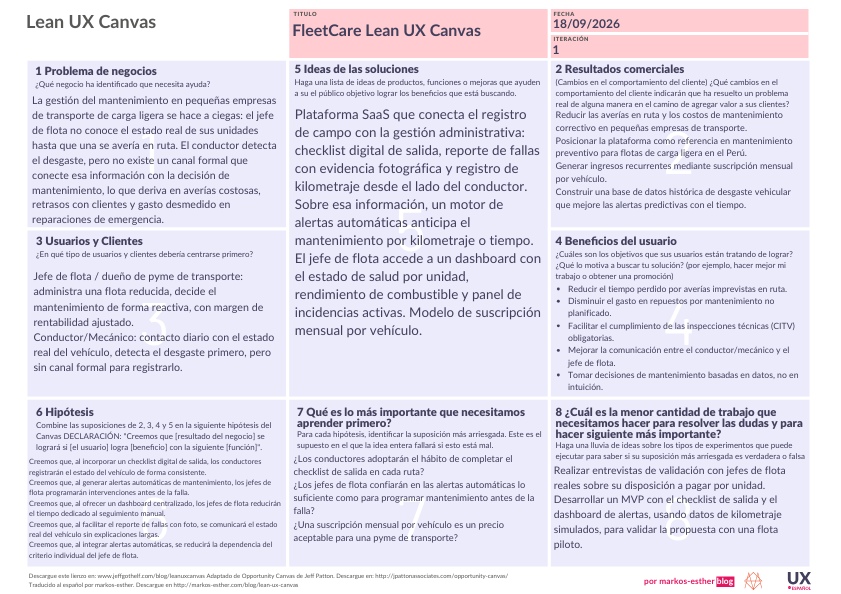
</p>

<div style="page-break-after: always;"></div>

## **1.3. Target Segments**

FleetCare está dirigido a dos segmentos principales que participan directamente en la gestión y operación de pequeñas flotas de transporte de carga ligera. Esta segmentación permite concentrar el desarrollo del producto en las necesidades del jefe de flota, responsable de la gestión y supervisión de los vehículos, y del conductor, responsable de su operación diaria y del registro de información desde campo.

### **Segmento 1: Jefe de flota**

<p style="text-align: justify;">
  El primer segmento objetivo de FleetCare está conformado por jefes de flota de pequeñas empresas dedicadas al transporte y distribución de carga ligera. Estos usuarios son responsables de supervisar el funcionamiento general de la flota y asegurar que los vehículos se encuentren disponibles para cumplir con las rutas y actividades programadas. En este tipo de empresas, la información relacionada con vehículos, mantenimientos, inspecciones, incidencias, kilometraje y combustible suele encontrarse distribuida entre hojas de cálculo, documentos físicos u otros medios, dificultando su seguimiento y actualización.
</p>

<p style="text-align: justify;">
  Entre sus principales responsabilidades se encuentra administrar la información de los vehículos, supervisar su estado operativo, consultar los resultados de las inspecciones, realizar seguimiento a las incidencias reportadas y controlar los mantenimientos requeridos. Asimismo, necesita consultar información relacionada con el kilometraje y consumo de combustible para obtener una visión general del uso y desempeño de las unidades.
</p>

<p style="text-align: justify;">
  Desde una perspectiva conductual, el jefe de flota busca mantener la mayor cantidad posible de vehículos disponibles y reducir situaciones que puedan afectar las operaciones, como fallas inesperadas, incidencias pendientes o mantenimientos realizados fuera del momento adecuado. Una de sus principales dificultades es no disponer de información centralizada y actualizada que le permita conocer rápidamente la situación de cada vehículo. Por ello, valora herramientas que faciliten la supervisión de la flota y permitan consultar información histórica para apoyar la toma de decisiones.
</p>

<p style="text-align: justify;">
  En cuanto a su perfil tecnológico, el jefe de flota utiliza principalmente computadoras y dispositivos móviles para realizar actividades administrativas, revisar información y coordinar las operaciones. Debido a que FleetCare está orientado a pequeñas empresas, se considera que estos usuarios no necesariamente cuentan con personal especializado en tecnologías de información o infraestructura tecnológica avanzada. Por esta razón, la solución debe ofrecer una aplicación web intuitiva y accesible desde un navegador, evitando configuraciones complejas para realizar las principales actividades de gestión.
</p>

### **Segmento 2: Conductor**

<p style="text-align: justify;">
  El segundo segmento objetivo de FleetCare está conformado por conductores de vehículos de carga ligera. Estos usuarios participan directamente en la operación diaria de las unidades y mantienen contacto frecuente con los vehículos, por lo que pueden registrar información relevante sobre su utilización e identificar oportunamente problemas que puedan afectar su funcionamiento.
</p>

<p style="text-align: justify;">
  Entre sus principales actividades dentro de FleetCare se encuentra realizar inspecciones preoperacionales antes de iniciar una ruta, completar listas de verificación, registrar observaciones y evidencias, reportar incidencias detectadas durante la operación y registrar información relacionada con el kilometraje y los abastecimientos de combustible. De esta manera, el conductor proporciona información operativa que posteriormente puede ser consultada por el jefe de flota para realizar el seguimiento de los vehículos.
</p>

<p style="text-align: justify;">
  Desde una perspectiva conductual, el conductor prioriza la rapidez y facilidad de uso, debido a que el registro de información forma parte de una jornada principalmente operativa y no debería representar una carga administrativa adicional. Por ello, FleetCare debe reducir la cantidad de pasos necesarios para completar las operaciones frecuentes y facilitar acciones como completar una inspección, registrar el kilometraje, registrar un abastecimiento de combustible o reportar una incidencia con evidencia fotográfica.
</p>

<p style="text-align: justify;">
  En cuanto a su perfil tecnológico, el conductor utiliza principalmente dispositivos móviles durante sus actividades diarias, debido a que gran parte de sus interacciones con FleetCare pueden realizarse antes, durante o después de la operación del vehículo. Por esta razón, la interfaz debe adaptarse a diferentes tamaños de pantalla y permitir que las principales operaciones de registro puedan realizarse de manera sencilla desde un navegador web.
</p>

<div style="page-break-after: always;"></div>

# **Chapter II: Requirements Elicitation & Analysis**
## **2.1. Competitors**

### **2.1.1. Competitive Analysis**

**Why conduct this analysis?**

<p style="text-align: justify;">

  Identificar las principales barreras de entrada y las capacidades ofrecidas por soluciones de gestión de flotas y mantenimiento con presencia o alcance en el mercado peruano, como Wisetrack, Fracttal y Fleetio. Este análisis permitirá reconocer oportunidades dentro del segmento de pequeñas empresas de transporte de carga ligera y posicionar a FleetCare como una alternativa especializada, de fácil adopción y enfocada en centralizar el control de vehículos, mantenimiento preventivo, kilometraje, combustible e incidencias.

</p>

<table style="text-align: justify;" border="1">
<thead>
  <tr>
    <th style="text-align: center;">
      Attribute
    </th>
    <th style="text-align: center;">
      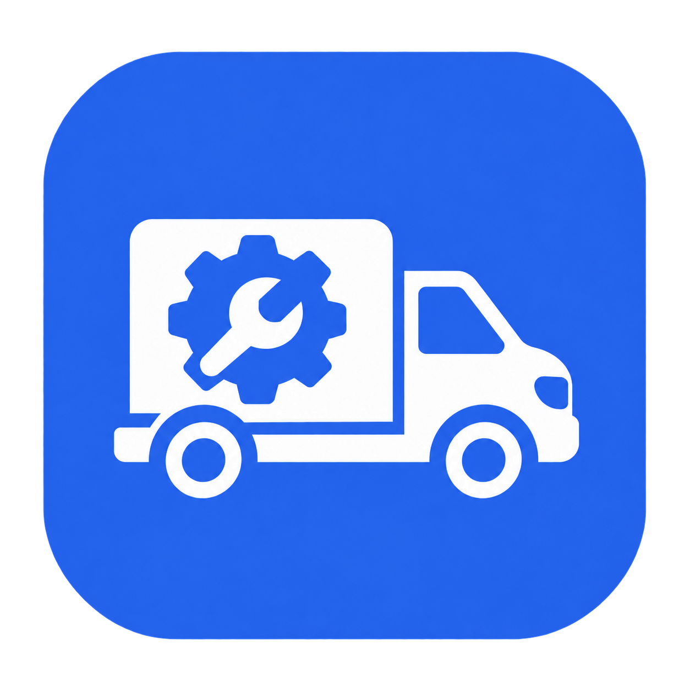
      <br>
      FleetCare
    </th>
    <th style="text-align: center;">
      
      <br>
      Wisetrack
    </th>
    <th style="text-align: center;">
      
      <br>
      Fracttal
    </th>
    <th style="text-align: center;">
      
      <br>
      Fleetio
    </th>
  </tr>
</thead>
  <tbody>
    <tr>
      <td style="text-align: center;">
        <b>Overview</b>
      </td>
      <td style="vertical-align: top;">
        Plataforma SaaS B2B desarrollada por TeamTrack para centralizar la gestión y el mantenimiento preventivo de flotas de transporte de carga ligera.
      </td>
      <td style="vertical-align: top;">
        Plataforma de gestión y monitoreo de flotas con presencia en Perú, orientada al control de vehículos, telemetría, planificación de viajes y seguimiento de operaciones logísticas.
      </td>
      <td style="vertical-align: top;">
        Plataforma de gestión inteligente del mantenimiento de activos que permite administrar vehículos, mantenimientos, órdenes de trabajo e incidencias desde la nube.
      </td>
      <td style="vertical-align: top;">
        Plataforma SaaS especializada en administración y mantenimiento de flotas que centraliza vehículos, conductores, combustible, inspecciones, mantenimiento y costos operativos.
      </td>
    </tr>
    <tr>
      <td style="text-align: center;">
        <b>Competitive Advantage</b>
      </td>
      <td style="vertical-align: top;">
        Solución enfocada específicamente en pequeñas empresas de transporte de carga ligera, buscando integrar mantenimiento preventivo, kilometraje, combustible, inspecciones e incidencias mediante una experiencia sencilla.
      </td>
      <td style="vertical-align: top;">
        Amplia capacidad de monitoreo mediante GPS y telemetría, acompañada de herramientas para planificación de viajes, seguimiento logístico, control de combustible y análisis de conducción.
      </td>
      <td style="vertical-align: top;">
        Especialización en mantenimiento preventivo y predictivo, con gestión detallada de activos, órdenes de trabajo, historial de mantenimiento y posibilidades de integración con tecnologías IoT.
      </td>
      <td style="vertical-align: top;">
        Amplio conjunto de funcionalidades específicas para flotas dentro de una plataforma cloud, incluyendo mantenimiento, inspecciones, combustible, costos, vehículos y aplicaciones móviles.
      </td>
    </tr>
    <tr>
      <td style="text-align: center;">
        <b>Target Market</b>
      </td>
      <td style="vertical-align: top;">
        Pequeñas empresas de transporte y logística que operan flotas de vehículos de carga ligera.
      </td>
      <td style="vertical-align: top;">
        Empresas de transporte, logística y otras organizaciones que requieren monitoreo, telemetría, seguridad y control operativo de sus flotas.
      </td>
      <td style="vertical-align: top;">
        Empresas de diferentes industrias que necesitan administrar el mantenimiento de vehículos, maquinaria, instalaciones y otros activos.
      </td>
      <td style="vertical-align: top;">
        Empresas con flotas de diferentes tamaños que requieren centralizar la gestión de vehículos, mantenimiento y operaciones relacionadas.
      </td>
    </tr>
    <tr>
      <td style="text-align: center;">
        <b>Marketing Strategies</b>
      </td>
      <td style="vertical-align: top;">
        Estrategia B2B orientada a pequeñas empresas de transporte, destacando la reducción de fallas inesperadas, la organización del mantenimiento y la facilidad de adopción de la plataforma.
      </td>
      <td style="vertical-align: top;">
        Venta B2B basada en soluciones especializadas por industria, destacando eficiencia operativa, seguridad, telemetría y reducción de costos logísticos.
      </td>
      <td style="vertical-align: top;">
        Marketing B2B apoyado en contenido especializado sobre mantenimiento, webinars, guías técnicas, demostraciones del producto y casos de éxito.
      </td>
      <td style="vertical-align: top;">
        Marketing digital B2B basado en demostraciones, pruebas del producto, contenido especializado sobre gestión de flotas y comparación de soluciones.
      </td>
    </tr>
    <tr>
      <td style="text-align: center;">
        <b>Products and Services</b>
      </td>
      <td style="vertical-align: top;">
        Aplicación web para gestión de vehículos, registro de kilometraje, mantenimiento preventivo, consumo de combustible, checklists de inspección, reporte de incidencias, alertas y dashboard de gestión.
      </td>
      <td style="vertical-align: top;">
        Plataforma FLEET, telemetría, Dispatcher para planificación y seguimiento de viajes, aplicaciones móviles, GPS y diferentes soluciones de monitoreo y seguridad.
      </td>
      <td style="vertical-align: top;">
        Fracttal One para gestión de activos, planes de mantenimiento, órdenes de trabajo, incidencias, checklists, historial de mantenimiento, monitoreo e integraciones IoT.
      </td>
      <td style="vertical-align: top;">
        Plataforma web Fleetio y aplicación Fleetio Go para mantenimiento, inspecciones, registro de combustible, vehículos, órdenes de trabajo, incidencias, costos y otros procesos de gestión de flotas.
      </td>
    </tr>
    <tr>
      <td style="text-align: center;">
        <b>Prices and Costs</b>
      </td>
      <td style="vertical-align: top;">
        Se plantea un modelo SaaS mediante suscripción, orientado a mantener un costo accesible para pequeñas empresas y adaptable al tamaño de la flota.
      </td>
      <td style="vertical-align: top;">
        Precio sujeto a cotización según las soluciones, dispositivos y características requeridas por cada operación.
      </td>
      <td style="vertical-align: top;">
        Precio sujeto al plan y a las necesidades de la organización, con contratación comercial de acuerdo con las funcionalidades requeridas.
      </td>
      <td style="vertical-align: top;">
        Modelo SaaS basado en planes y tamaño de la flota, con diferentes niveles de funcionalidades de acuerdo con las necesidades de cada organización.
      </td>
    </tr>
    <tr>
      <td style="text-align: center;">
        <b>Distribution Channels</b>
      </td>
      <td style="vertical-align: top;">
        Aplicación web SaaS y comercialización directa B2B dirigida a pequeñas empresas de transporte y logística.
      </td>
      <td style="vertical-align: top;">
        Venta directa B2B, plataforma web, aplicaciones móviles y presencia comercial local, incluyendo operaciones en Perú.
      </td>
      <td style="vertical-align: top;">
        Plataforma cloud y aplicación móvil, acompañadas de venta consultiva, demostraciones y atención comercial especializada.
      </td>
      <td style="vertical-align: top;">
        Plataforma web SaaS, aplicación móvil Fleetio Go, demostraciones comerciales y prueba del producto.
      </td>
    </tr>
    <tr>
      <td style="text-align: center;">
        <b>Strengths</b>
      </td>
      <td style="vertical-align: top;">
        Enfoque específico en pequeñas flotas de carga ligera, alcance funcional acotado y una propuesta orientada a simplificar las actividades principales de jefes de flota, conductores y mecánicos.
      </td>
      <td style="vertical-align: top;">
        Presencia en el mercado peruano, experiencia en operaciones logísticas y amplio conjunto de tecnologías para telemetría, GPS, seguridad y monitoreo en tiempo real.
      </td>
      <td style="vertical-align: top;">
        Alto nivel de especialización en mantenimiento, gestión de activos, automatización de tareas, trazabilidad e integración con otros sistemas y dispositivos IoT.
      </td>
      <td style="vertical-align: top;">
        Plataforma madura y especializada en flotas, con numerosas funcionalidades, aplicaciones móviles, integraciones y capacidad de adaptarse a flotas de diferentes tamaños.
      </td>
    </tr>
    <tr>
      <td style="text-align: center;">
        <b>Opportunities</b>
      </td>
      <td style="vertical-align: top;">
        Atender a pequeñas empresas de transporte que todavía administran sus vehículos mediante procesos manuales o herramientas dispersas y que necesitan una solución más sencilla y accesible.
      </td>
      <td style="vertical-align: top;">
        Incrementar la adopción de telemetría y análisis de datos en empresas peruanas que buscan optimizar combustible, seguridad y eficiencia de sus operaciones.
      </td>
      <td style="vertical-align: top;">
        Expandir el uso del mantenimiento basado en datos, automatización, inteligencia artificial e IoT en empresas de transporte y otros sectores.
      </td>
      <td style="vertical-align: top;">
        Continuar ampliando integraciones con sistemas de telemática, combustible y datos de fabricantes para ofrecer una visión cada vez más completa de las operaciones de una flota.
      </td>
    </tr>
    <tr>
      <td style="text-align: center;">
        <b>Weaknesses</b>
      </td>
      <td style="vertical-align: top;">
        Producto en etapa inicial, sin reconocimiento de marca y con menor cantidad de funcionalidades e integraciones que las plataformas consolidadas del mercado.
      </td>
      <td style="vertical-align: top;">
        Su propuesta incorpora tecnologías y servicios de monitoreo más amplios que pueden resultar innecesarios para pequeñas empresas que únicamente buscan una gestión básica de mantenimiento.
      </td>
      <td style="vertical-align: top;">
        Su enfoque general de gestión de activos y mantenimiento puede incluir funcionalidades más complejas de las necesarias para una pequeña empresa que únicamente administra vehículos de carga ligera.
      </td>
      <td style="vertical-align: top;">
        Su amplitud funcional puede superar las necesidades de pequeñas flotas que buscan una herramienta sencilla; además, algunas funcionalidades y servicios asociados presentan disponibilidad condicionada por mercado.
      </td>
    </tr>
    <tr>
      <td style="text-align: center;">
        <b>Threats</b>
      </td>
      <td style="vertical-align: top;">
        Competencia de plataformas consolidadas de gestión de flotas, GPS y mantenimiento, además de la resistencia de pequeñas empresas a reemplazar procesos manuales por una nueva plataforma.
      </td>
      <td style="vertical-align: top;">
        Aparición de soluciones SaaS más simples y económicas que permitan a pequeñas empresas gestionar sus flotas sin adquirir infraestructura avanzada de telemetría.
      </td>
      <td style="vertical-align: top;">
        Crecimiento de plataformas especializadas exclusivamente en flotas que puedan ofrecer una experiencia más adaptada a conductores y empresas de transporte.
      </td>
      <td style="vertical-align: top;">
        Competencia de proveedores regionales con soporte local y soluciones adaptadas a las necesidades, regulaciones y condiciones comerciales de mercados específicos como Perú.
      </td>
    </tr>
  </tbody>
</table>

<div style="page-break-after: always;"></div>

### **2.1.2. Strategies and Tactics Against Competitors**

**Offensive Strategies**

<p style="text-align: justify;">
  <i>Penetración mediante especialización y accesibilidad</i><br>
  Aprovechando el enfoque de FleetCare en pequeñas empresas de transporte y logística, la estrategia ofensiva se orientará a ofrecer una solución SaaS accesible y enfocada en las necesidades operativas de este segmento. Mientras otras alternativas pueden incorporar funcionalidades complejas o estar orientadas a flotas de mayor tamaño, FleetCare buscará facilitar la gestión de vehículos, mantenimientos, inspecciones, incidencias, kilometraje y combustible desde una plataforma centralizada. La táctica será ofrecer una solución sencilla de adoptar que permita a estas empresas digitalizar progresivamente la gestión de su flota sin requerir infraestructura tecnológica compleja.
</p>

**Adaptive Strategies**

<p style="text-align: justify;">
  <i>Adaptación a las necesidades operativas de pequeñas flotas</i><br>
  Para enfrentar la baja presencia inicial de la marca y adaptarse a un mercado donde muchas pequeñas empresas todavía gestionan sus vehículos mediante registros manuales o herramientas dispersas, FleetCare buscará acercarse directamente a empresas de transporte y logística para comprender sus procesos y validar la solución. La táctica será realizar pruebas piloto con potenciales usuarios, recopilar retroalimentación y ajustar progresivamente las funcionalidades de la plataforma de acuerdo con las necesidades identificadas, priorizando aquellas relacionadas con mantenimiento preventivo, inspecciones y control operativo de los vehículos.
</p>

**Defensive Strategies**

<p style="text-align: justify;">
  <i>Diferenciación mediante facilidad de uso y enfoque en la gestión preventiva</i><br>
  Frente a competidores con mayor reconocimiento o plataformas de gestión de flotas con un alcance funcional más amplio, FleetCare buscará diferenciarse mediante una experiencia sencilla y orientada a las actividades cotidianas de pequeñas flotas. La táctica será mantener procesos claros para registrar vehículos, realizar inspecciones preoperacionales, reportar incidencias, programar mantenimientos y registrar kilometraje y combustible. De esta manera, la facilidad de uso y el enfoque en la prevención de fallas se convierten en elementos de diferenciación frente a soluciones más complejas.
</p>

**Survival Strategies**<br>

<p style="text-align: justify;">
  <i>Validación temprana y desarrollo progresivo del producto</i><br>
  La combinación de ser una solución nueva y competir con herramientas ya establecidas representa uno de los principales riesgos para FleetCare. Para reducir este riesgo, la estrategia será validar tempranamente la propuesta con pequeñas empresas de transporte y logística antes de ampliar significativamente el alcance del producto. La táctica será desarrollar inicialmente las funcionalidades principales, realizar pruebas con usuarios potenciales y utilizar la información obtenida para mejorar la plataforma de manera progresiva. Esto permitirá concentrar los recursos en necesidades reales del mercado y generar evidencia sobre la utilidad de FleetCare antes de realizar una expansión mayor.
</p>

<div style="page-break-after: always;"></div>

## **2.2. Interviews**

### **2.2.1. Interview Design**

 **Segmento 1: Jefe de flota**

<ol style="text-align: justify;">

  <li>
    ¿Podrías indicarnos tu nombre, edad, distrito o ciudad donde resides y contarnos brevemente sobre ti?
  </li>

  <li>
    ¿Cuál es tu puesto o responsabilidad dentro de la empresa y cuánto tiempo llevas trabajando en el sector de transporte o logística?
  </li>

  <li>
    ¿Cuántos vehículos aproximadamente gestionan actualmente y qué tipo de operaciones de transporte realizan?
  </li>

  <li>
    En tu trabajo diario, ¿qué dispositivos y herramientas tecnológicas utilizas con mayor frecuencia para gestionar la operación de la flota?
  </li>

  <li>
    ¿Cómo realizan actualmente el seguimiento del estado de los vehículos, kilometraje, mantenimientos y consumo de combustible?
  </li>

  <li>
    ¿Cómo determinan cuándo un vehículo necesita mantenimiento preventivo y qué dificultades encuentran en este proceso?
  </li>

  <li>
    Cuéntanos sobre la última vez que uno de sus vehículos presentó una falla inesperada durante una operación. ¿Qué ocurrió y cómo afectó al servicio?
  </li>

  <li>
    ¿Cómo registran y hacen seguimiento a las fallas o incidencias reportadas por conductores y mecánicos?
  </li>

  <li>
    ¿Qué información sobre la flota consideras más importante tener disponible para tomar decisiones rápidamente?
  </li>

  <li>
    Si contaras con una plataforma que centralice la información de tus vehículos, ¿qué funcionalidades considerarías indispensables?
  </li>

  <li>
    ¿Qué tipo de alertas te resultarían más útiles, por ejemplo, próximos mantenimientos, kilometraje alcanzado, fallas reportadas o consumo de combustible?
  </li>

  <li>
    ¿Qué tendría que ofrecer una plataforma de gestión de flotas para que consideres utilizarla regularmente en tu empresa?
  </li>

</ol>


**Segment 2: Conductor de carga ligera**

<ol style="text-align: justify;">

  <li>
    ¿Podrías indicarnos tu nombre, edad, distrito o ciudad donde resides y contarnos brevemente sobre ti?
  </li>

  <li>
    ¿Cuál es tu función actual y cuánto tiempo llevas trabajando como conductor, mecánico o en actividades relacionadas con vehículos de transporte?
  </li>

  <li>
    ¿Qué dispositivos tecnológicos utilizas normalmente durante tu jornada de trabajo, como smartphone, tablet o computadora?
  </li>

  <li>
    Antes de utilizar un vehículo o iniciar una ruta, ¿qué revisiones o inspecciones realizas normalmente?
  </li>

  <li>
    ¿Cómo registras actualmente información como kilometraje, estado del vehículo, inspecciones o mantenimientos realizados?
  </li>

  <li>
    Cuando detectas una falla o problema en un vehículo, ¿cómo lo reportas actualmente y a quién se lo comunicas?
  </li>

  <li>
    Cuéntanos sobre alguna ocasión en la que hayas detectado una falla durante una inspección o mientras utilizabas un vehículo. ¿Cómo se gestionó?
  </li>

  <li>
    ¿Qué dificultades encuentras al momento de registrar o comunicar problemas relacionados con los vehículos?
  </li>

  <li>
    ¿Consideras útil utilizar un checklist digital para realizar las inspecciones de los vehículos? ¿Qué información debería incluir?
  </li>

  <li>
    ¿Te resultaría útil poder adjuntar fotografías al momento de reportar una falla? ¿En qué situaciones lo utilizarías?
  </li>

  <li>
    Si utilizaras una aplicación para registrar estas actividades, ¿qué características debería tener para que puedas utilizarla rápidamente durante tu jornada?
  </li>

  <li>
    ¿Hay algún otro problema relacionado con la operación o mantenimiento de los vehículos que consideres importante mencionar?
  </li>

</ol>

<div style="page-break-after: always;"></div>


### **2.2.2. Interview Recording**

**Segmento 1: Jefe de flota**

<ul style="text-align: justify;">
  <li>
    <b>Interview 1:</b> Carlos Gutierrez
    <ul>
      <li>
        <b>Starts at:</b> 00:00
      </li>
      <li>
        <b>Length:</b> 05:43
      </li>
      <li>
        <b>Screenshot:</b><br>
        <div style="text-align: center;">
          
          <p style="text-align: center;">
  <a href="https://upcedupe-my.sharepoint.com/:v:/g/personal/u202411843_upc_edu_pe/IQBOxWeERzY2SokYgZIaEU8FAes-glIEijNV6VIkjgoWyIM?e=5eNUU3" target="_blank">
    <b>Link de la entrevista</b>
  </a>
</p>
        </div>
      </li>
      <li>
        <b>Summary:</b> Carlos Gutierre, reside en Lima y trabaja como jefe de flota en una pequeña empresa dedicada al transporte y distribución de mercadería. Cuenta con aproximadamente ocho años de experiencia en operaciones logísticas y actualmente supervisa una flota de 12 vehículos de carga ligera utilizados principalmente para entregas dentro de Lima Metropolitana.<br><br>
        Para gestionar los vehículos utiliza principalmente Excel, WhatsApp y documentos compartidos. El kilometraje es comunicado por los conductores y posteriormente registrado de forma manual, mientras que los mantenimientos se coordinan de acuerdo con el kilometraje acumulado o cuando un conductor informa algún problema. Carlos comenta que una de sus principales dificultades es mantener la información actualizada, ya que los datos se encuentran distribuidos entre mensajes, archivos y documentos físicos.<br><br>
        Recuerda una ocasión en la que uno de los vehículos presentó una falla mecánica durante una entrega, generando retrasos y la necesidad de utilizar otra unidad para completar el servicio. Considera que contar con alertas de próximos mantenimientos y un historial centralizado de cada vehículo ayudaría a prevenir este tipo de situaciones. También considera importante visualizar rápidamente qué vehículos tienen incidencias pendientes, su kilometraje actual y los últimos mantenimientos realizados. Estaría dispuesto a utilizar una plataforma de gestión siempre que sea sencilla, accesible desde una computadora o celular y no requiera un proceso complejo de implementación.
      </li>
    </ul>
  </li>

  <div style="page-break-after: always;"></div>
</ul>

<div style="page-break-after: always;"></div>


**Segment 2: Conductor de carga ligera**

<ul style="text-align: justify;">

  <li>
    <b>Interview 1:</b> Luis Ramírez
    <ul>
      <li>
        <b>Starts at:</b> 00:00
      </li>
      <li>
        <b>Length:</b> 04:21
      </li>
      <li>
        <b>Screenshot:</b><br>
        <div style="text-align: center;">
          
          <p style="text-align: center;">
  <a href="https://upcedupe-my.sharepoint.com/:v:/g/personal/u202411843_upc_edu_pe/IQCG4m_lZPZBS6Sx3ZW3KqjeAc4uvNz7uKLOTlHsfarHdsE?e=letVps" target="_blank">
    <b>Link de la entrevista</b>
  </a>
</p>
        </div>
      </li>
      <li>
        <b>Summary:</b> 
        Luis, conductor de carga ligera con 6 años de experiencia, evidencia que las fallas mecánicas suelen detectarse a tiempo pero se pierden por falta de un canal formal de reporte: avisa de palabra o por WhatsApp y, si no es urgente, muchas veces el reporte se olvida o se posterga por la presión de cumplir la ruta. Esto ya le ha costado quedar varado en carretera por fallas que él mismo había notado antes (vibración del motor, fuga de radiador). No lleva ningún registro de kilometraje ni del estado del vehículo antes de salir, pero se muestra dispuesto a adoptar un checklist si es rápido, especialmente porque valora tener evidencia (como una foto) que lo proteja de ser señalado como responsable de una falla que él reportó a tiempo. También señala que la información del vehículo se pierde entre conductores cuando cambia de unidad.
      </li>
    </ul>
  </li>


  <div style="page-break-after: always;"></div>

  <li>
    <b>Interview 2:</b> Andrei Perez
    <ul>
      <li>
        <b>Starts at:</b> 08:31
      </li>
      <li>
        <b>Length:</b> 09:05
      </li>
      <li>
        <b>Screenshot:</b><br>
        <div style="text-align: center;">
          
          <p style="text-align: center;">
  <a href="https://upcedupe-my.sharepoint.com/:v:/g/personal/u202411843_upc_edu_pe/IQBuowTyNDzrR7VLHgloxsC4AXbNgLGgNKciREEp1o4eNi4?e=TTI6fu" target="_blank">
    <b>Link de la entrevista</b>
  </a>
</p>
        </div>
      </li>
      <li>
        <b>Summary:</b> Andrei, conductor de flota de carga ligera, muestra un patrón muy similar al de Luis: detecta señales de falla con anticipación (chillido en los frenos, fuga de radiador), pero al reportarlas solo de palabra o por WhatsApp, sin evidencia ni urgencia asignada, esas alertas terminan diluyéndose hasta que la falla ya es grave. No lleva ningún registro de kilometraje ni del estado del vehículo antes de salir a ruta, y reconoce que a veces prefiere no reportar por temor a que lo responsabilicen, aunque valora la idea de tener evidencia fotográfica que lo proteja. Se muestra dispuesto a adoptar un checklist siempre que sea rápido, y confirma que la información del vehículo se pierde por completo cuando cambia de turno o de unidad, sin ningún historial disponible para consultar.
      </li>
    </ul>
  </li>

  <li>
    <b>Interview 3:</b> Kevin Lopez
    <ul>
      <li>
        <b>Starts at:</b> 00:01
      </li>
      <li>
        <b>Length:</b> 08:13
      </li>
      <li>
        <b>Screenshot:</b><br>
        <div style="text-align: center;">
          
          <p style="text-align: center;">
  <a href="https://upcedupe-my.sharepoint.com/:v:/g/personal/u202411843_upc_edu_pe/IQCG4m_lZPZBS6Sx3ZW3KqjeAc4uvNz7uKLOTlHsfarHdsE?e=letVps" target="_blank">
    <b>Link de la entrevista</b>
  </a>
</p>
        </div>
      </li>
      <li>
        <b>Summary:</b> Kevin tiene 26 años, reside en el distrito de San Miguel y trabaja como conductor de vehículos de carga ligera. Cuenta con aproximadamente tres años de experiencia realizando actividades de transporte para una empresa. Su función principal consiste en trasladar las cargas asignadas y, antes de iniciar sus rutas, realiza revisiones básicas del vehículo, como verificar el estado y presión de los neumáticos, la correcta colocación de la carga, el nivel de combustible y posibles elementos sueltos.<br><br>
        Explica que actualmente las inspecciones y problemas detectados en los vehículos se registran principalmente de forma manual mediante una hoja de checklist. Durante la conducción suele identificar posibles fallas a través de ruidos o comportamientos inusuales del vehículo y, al finalizar su ruta, comunica las observaciones en la central. Cuando detecta un problema grave, lo reporta inmediatamente mediante una llamada. Considera que este proceso puede dificultar que la información llegue rápidamente y señala que sería útil contar con una herramienta que permita registrar y comunicar las incidencias de manera más directa.<br><br>
        Kevin considera útil implementar un checklist digital que permita registrar información como el nivel de combustible, el estado general del vehículo y la condición de los neumáticos. También considera importante poder adjuntar fotografías como evidencia de las fallas detectadas y consultar el historial de mantenimiento y problemas anteriores del vehículo que le sea asignado. Para utilizar una aplicación durante su jornada, señala que debería ser sencilla, directa y permitir acceder rápidamente a las funciones principales sin tener que navegar por múltiples pantallas.
      </li>
    </ul>
  </li>
</ul>
<div style="page-break-after: always;"></div>

### **2.2.3. Interview Analysis**

**Segmento 1: Jefe de flota**

<ul>

  <li>
    <b>Characteristics</b>
    <ul style="text-align: justify;">
      <li>
        <b>Age:</b> Entre 38 y 42 años.
      </li>
      <li>
        <b>Location:</b> Lima, Perú.
      </li>
      <li>
        <b>Roles:</b> Jefes de flota, administradores o dueños de pequeñas empresas de transporte y distribución.
      </li>
      <li>
        <b>Fleet Size:</b> Aproximadamente entre 8 y 12 vehículos de carga ligera.
      </li>
      <li>
        <b>Devices:</b> Smartphone y computadora.
      </li>
      <li>
        <b>Digital Tools:</b> Excel, WhatsApp, documentos compartidos y herramientas básicas para organizar información.
      </li>
      <li>
        <b>Technology Usage:</b> Utilizan herramientas digitales diariamente, pero gran parte de la información relacionada con la flota continúa siendo registrada y consolidada manualmente.
      </li>
    </ul>
  </li>

  <li>
    <b>Common Goals</b>
    <ul style="text-align: justify;">
      <li>
        Mantener los vehículos disponibles y en condiciones adecuadas para cumplir con las operaciones programadas.
      </li>
      <li>
        Centralizar la información de kilometraje, mantenimientos, combustible e incidencias de cada vehículo.
      </li>
      <li>
        Realizar los mantenimientos preventivos en el momento correspondiente y evitar retrasos en su programación.
      </li>
      <li>
        Identificar rápidamente los vehículos que presentan fallas o incidencias pendientes.
      </li>
      <li>
        Consultar el historial de cada vehículo para tomar mejores decisiones sobre su mantenimiento y operación.
      </li>
    </ul>

  </li>

  <li>
    <b>Common Motivations</b>
    <ul style="text-align: justify;">
      <li>
        Reducir la posibilidad de fallas inesperadas durante las operaciones de transporte.
      </li>
      <li>
        Evitar retrasos en entregas ocasionados por vehículos que no se encuentran disponibles.
      </li>
      <li>
        Tener mayor control sobre los mantenimientos y gastos asociados a cada vehículo.
      </li>
      <li>
        Recibir información y alertas que permitan anticiparse a los próximos mantenimientos.
      </li>
      <li>
        Disponer de una visión general de la flota sin tener que revisar múltiples archivos, mensajes o documentos.
      </li>
    </ul>

  </li>

  <li>
    <b>Common Frustrations</b>
    <ul style="text-align: justify;">
      <li>
        Información distribuida entre hojas de cálculo, mensajes de WhatsApp y documentos físicos.
      </li>
      <li>
        Dificultad para mantener actualizado el kilometraje y estado de todos los vehículos.
      </li>
      <li>
        Mantenimientos que pueden realizarse después de la fecha o kilometraje recomendado.
      </li>
      <li>
        Dificultad para consultar rápidamente los gastos, incidencias e historial de mantenimiento de un vehículo.
      </li>
      <li>
        Fallas inesperadas que pueden generar retrasos y obligar a reorganizar las operaciones.
      </li>
    </ul>
  </li>
</ul>

<div style="page-break-after: always;"></div>


**Segment 2: Conductor de carga ligera**

<ul>

  <li>
    <b>Characteristics</b>
    <ul style="text-align: justify;">
      <li>
        <b>Age:</b> Entre 34 y 45 años.
      </li>
      <li>
        <b>Location:</b> Lima, Perú.
      </li>
      <li>
        <b>Roles:</b> Conductores y mecánicos vinculados directamente con la operación y mantenimiento de vehículos de carga ligera.
      </li>
      <li>
        <b>Experience:</b> Experiencia práctica en conducción, inspección y mantenimiento de vehículos.
      </li>
      <li>
        <b>Devices:</b> Principalmente smartphone durante la jornada de trabajo.
      </li>
      <li>
        <b>Digital Tools:</b> WhatsApp, aplicaciones de ubicación y otras herramientas móviles utilizadas durante las operaciones.
      </li>
      <li>
        <b>Technology Usage:</b> Utilizan herramientas móviles con frecuencia y necesitan realizar registros de manera rápida debido a las características de su trabajo.
      </li>
    </ul>

  </li>

  <li>
    <b>Common Goals</b>
    <ul style="text-align: justify;">
      <li>
        Mantener los vehículos en condiciones adecuadas y detectar posibles problemas antes de iniciar una ruta.
      </li>
      <li>
        Registrar rápidamente el kilometraje, las inspecciones y las incidencias encontradas.
      </li>
      <li>
        Comunicar de manera clara las fallas detectadas al responsable de la flota.
      </li>
      <li>
        Consultar información sobre mantenimientos o problemas anteriores de un vehículo cuando sea necesario.
      </li>
      <li>
        Contar con un proceso sencillo para registrar las actividades realizadas sobre cada unidad.
      </li>
    </ul>

  </li>

  <li>
    <b>Common Motivations</b>
    <ul style="text-align: justify;">
      <li>
        Detectar problemas mecánicos antes de que generen una falla durante una operación.
      </li>
      <li>
        Realizar inspecciones mediante checklists sencillos que permitan verificar los principales componentes del vehículo.
      </li>
      <li>
        Reportar incidencias utilizando fotografías y descripciones que faciliten la evaluación del problema.
      </li>
      <li>
        Tener acceso al historial del vehículo para conocer los trabajos realizados anteriormente.
      </li>
      <li>
        Utilizar una herramienta que pueda ser operada rápidamente desde un smartphone durante la jornada laboral.
      </li>
    </ul>
  </li>

  <li>
    <b>Common Frustrations</b>
    <ul style="text-align: justify;">
      <li>
        Reportes de fallas e incidencias que quedan dispersos entre diferentes conversaciones de WhatsApp.
      </li>
      <li>
        Dificultad para consultar posteriormente fotografías, observaciones o reportes realizados anteriormente.
      </li>
      <li>
        Falta de un historial centralizado sobre los mantenimientos realizados a cada vehículo.
      </li>
      <li>
        Necesidad de consultar documentos, mensajes o preguntar a otras personas para conocer trabajos anteriores.
      </li>
      <li>
        Formularios o procesos extensos que podrían dificultar el registro de información durante una jornada de trabajo.
      </li>
    </ul>
  </li>

</ul>

<div style="page-break-after: always;"></div>

## **2.3. Needfinding**
### **2.3.1. User Personas**
 **Segmento 1: Jefe de flota**
<div style="text-align: center;">
  
</div>
<div style="page-break-after: always;"></div>

**Segment 2: Conductor de carga ligera**
<div style="text-align: center;">
  
</div>
<div style="page-break-after: always;"></div>

### **2.3.2. User Task Matrix**
 **Segmento 1: Jefe de flota**
<table style="margin: auto;">
  <thead>
    <tr>
      <th style="text-align: center;">#</th>
      <th style="text-align: center;">Task</th>
      <th style="text-align: center;">Frequency</th>
      <th style="text-align: center;">Importance</th>
    </tr>
  </thead>
  <tbody>
    <tr>
      <td style="text-align: center;">1</td>
      <td style="text-align: justify;">Supervisar el estado general y disponibilidad de los vehículos</td>
      <td style="text-align: center;">High</td>
      <td style="text-align: center;">Critical</td>
    </tr>
    <tr>
      <td style="text-align: center;">2</td>
      <td style="text-align: justify;">Revisar el kilometraje y programar los próximos mantenimientos preventivos</td>
      <td style="text-align: center;">High</td>
      <td style="text-align: center;">High</td>
    </tr>
    <tr>
      <td style="text-align: center;">3</td>
      <td style="text-align: justify;">Revisar y dar seguimiento a fallas e incidencias reportadas</td>
      <td style="text-align: center;">Medium</td>
      <td style="text-align: center;">Critical</td>
    </tr>
    <tr>
      <td style="text-align: center;">4</td>
      <td style="text-align: justify;">Controlar el consumo y los gastos de combustible de los vehículos</td>
      <td style="text-align: center;">Medium</td>
      <td style="text-align: center;">High</td>
    </tr>
    <tr>
      <td style="text-align: center;">5</td>
      <td style="text-align: justify;">Consultar el historial de mantenimiento e incidencias de cada vehículo</td>
      <td style="text-align: center;">Medium</td>
      <td style="text-align: center;">High</td>
    </tr>
    <tr>
      <td style="text-align: center;">6</td>
      <td style="text-align: justify;">Coordinar la atención de vehículos que requieren mantenimiento o reparación</td>
      <td style="text-align: center;">Medium</td>
      <td style="text-align: center;">Critical</td>
    </tr>
  </tbody>
</table>
<div style="page-break-after: always;"></div>

**Segment 2: Conductor de carga ligera**
<table style="margin: auto;">
  <thead>
    <tr>
      <th style="text-align: center;">#</th>
      <th style="text-align: center;">Task</th>
      <th style="text-align: center;">Frequency</th>
      <th style="text-align: center;">Importance</th>
    </tr>
  </thead>
  <tbody>
    <tr>
      <td style="text-align: center;">1</td>
      <td style="text-align: justify;">Realizar la inspección del vehículo antes de iniciar una operación</td>
      <td style="text-align: center;">High</td>
      <td style="text-align: center;">Critical</td>
    </tr>
    <tr>
      <td style="text-align: center;">2</td>
      <td style="text-align: justify;">Registrar el kilometraje actualizado del vehículo</td>
      <td style="text-align: center;">High</td>
      <td style="text-align: center;">High</td>
    </tr>
    <tr>
      <td style="text-align: center;">3</td>
      <td style="text-align: justify;">Reportar fallas o incidencias detectadas en el vehículo</td>
      <td style="text-align: center;">Medium</td>
      <td style="text-align: center;">Critical</td>
    </tr>
    <tr>
      <td style="text-align: center;">4</td>
      <td style="text-align: justify;">Adjuntar fotografías y observaciones de las fallas encontradas</td>
      <td style="text-align: center;">Medium</td>
      <td style="text-align: center;">High</td>
    </tr>
    <tr>
      <td style="text-align: center;">5</td>
      <td style="text-align: justify;">Registrar los mantenimientos o reparaciones realizadas al vehículo</td>
      <td style="text-align: center;">Medium</td>
      <td style="text-align: center;">High</td>
    </tr>
    <tr>
      <td style="text-align: center;">6</td>
      <td style="text-align: justify;">Consultar el historial de mantenimiento y fallas del vehículo</td>
      <td style="text-align: center;">Medium</td>
      <td style="text-align: center;">Medium</td>
    </tr>
  </tbody>
</table>
<div style="page-break-after: always;"></div>

### **2.3.3. User Journey Mapping**
 **Segmento 1: Jefe de flota**
<div style="text-align: center;">
  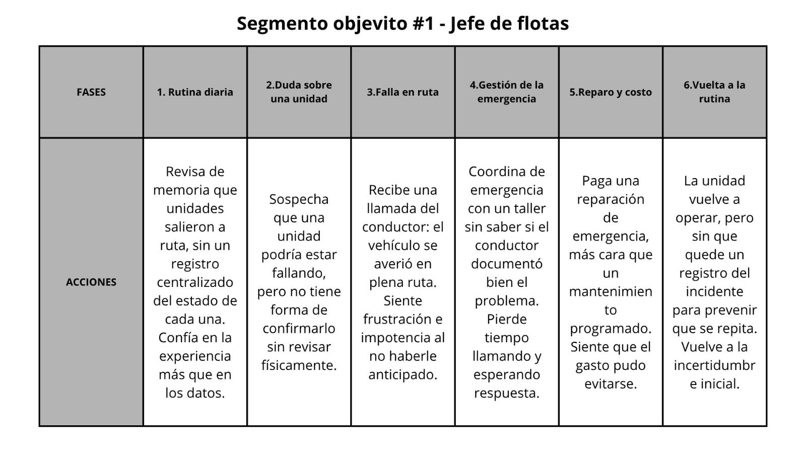
</div>
<div style="page-break-after: always;"></div>

**Segment 2: Conductor de carga ligera**
<div style="text-align: center;">
  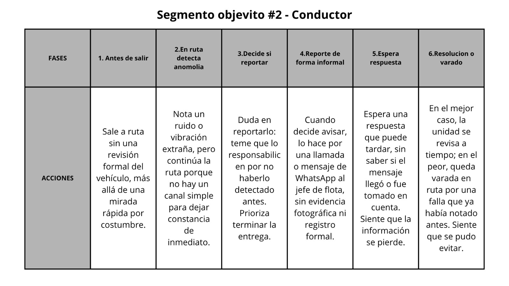
</div>
<div style="page-break-after: always;"></div>

### **2.3.4. Empathy Mapping**
 **Segmento 1: Jefe de flota**
<div style="text-align: center;">
  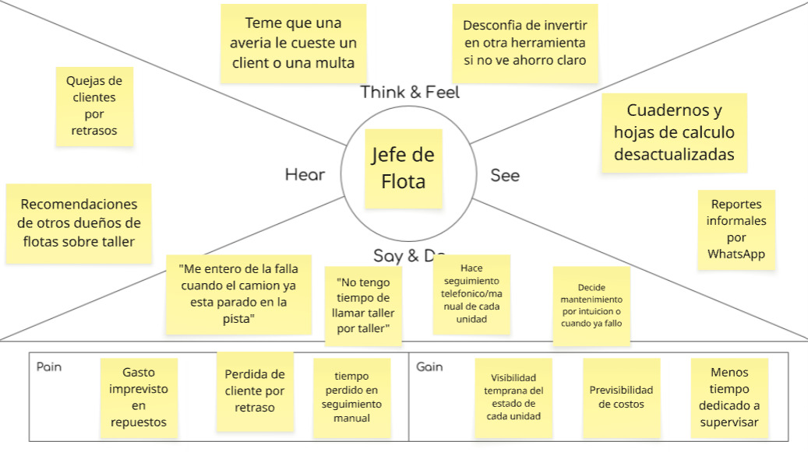
</div>
<div style="page-break-after: always;"></div>

**Segment 2: Conductor de carga ligera**
<div style="text-align: center;">
  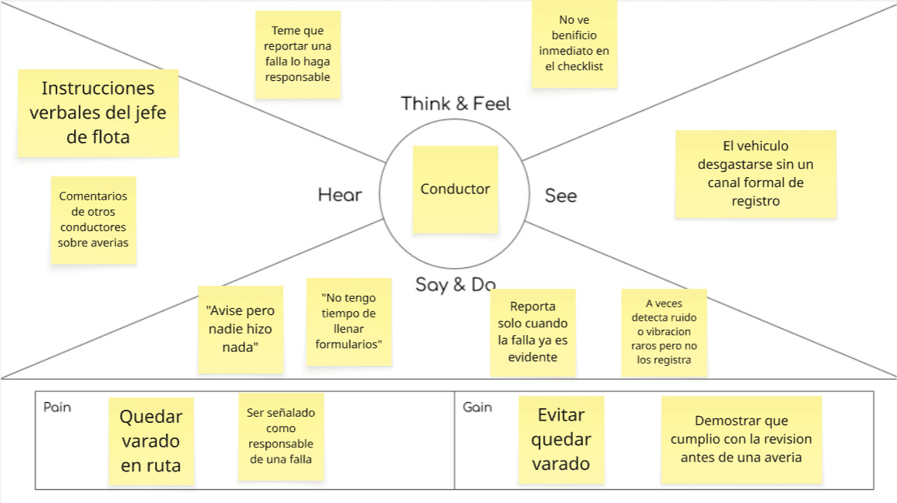
</div>
<div style="page-break-after: always;"></div>

## **2.4. Big Picture Event Storming**

## **2.5. Ubiquitous Language**
<table style="margin: auto;">
  <thead>
    <tr>
      <th style="text-align: center;">Ubiquitous Term</th>
      <th style="text-align: center;">Definition</th>
    </tr>
  </thead>
  <tbody>
    <tr>
      <td style="text-align: center;">Flota</td>
      <td style="text-align: justify;">Conjunto de vehículos de carga ligera administrados por una empresa de transporte o logística y registrados en FleetCare.</td>
    </tr>
    <tr>
      <td style="text-align: center;">Vehículo</td>
      <td style="text-align: justify;">Unidad de transporte perteneciente a una flota sobre la cual se registran datos como kilometraje, estado, mantenimientos, consumo de combustible e incidencias.</td>
    </tr>
    <tr>
      <td style="text-align: center;">Jefe de Flota</td>
      <td style="text-align: justify;">Usuario responsable de supervisar los vehículos de la flota, revisar su estado, controlar los mantenimientos y dar seguimiento a las incidencias reportadas.</td>
    </tr>
    <tr>
      <td style="text-align: center;">Conductor</td>
      <td style="text-align: justify;">Usuario encargado de operar un vehículo y registrar información relacionada con su uso, como kilometraje, inspecciones e incidencias detectadas durante la operación.</td>
    </tr>
    <tr>
      <td style="text-align: center;">Mecánico</td>
      <td style="text-align: justify;">Usuario encargado de realizar y registrar actividades de mantenimiento o reparación sobre los vehículos de la flota.</td>
    </tr>
    <tr>
      <td style="text-align: center;">Kilometraje</td>
      <td style="text-align: justify;">Distancia acumulada recorrida por un vehículo, utilizada como referencia para controlar su nivel de uso y determinar la proximidad de determinados mantenimientos preventivos.</td>
    </tr>
    <tr>
      <td style="text-align: center;">Inspección Vehicular</td>
      <td style="text-align: justify;">Revisión realizada sobre un vehículo para verificar su condición antes o durante su operación e identificar posibles problemas que requieran atención.</td>
    </tr>
    <tr>
      <td style="text-align: center;">Lista de Verificación</td>
      <td style="text-align: justify;">Conjunto estructurado de verificaciones que permite al conductor o responsable revisar elementos importantes del vehículo y registrar el resultado de una inspección.</td>
    </tr>
    <tr>
      <td style="text-align: center;">Incidencia</td>
      <td style="text-align: justify;">Falla, anomalía o problema detectado en un vehículo que debe ser registrado para su evaluación, atención y seguimiento.</td>
    </tr>
    <tr>
      <td style="text-align: center;">Reporte de Incidencia</td>
      <td style="text-align: justify;">Registro de una incidencia detectada en un vehículo que puede incluir una descripción del problema, fotografías, fecha y observaciones proporcionadas por el usuario.</td>
    </tr>
    <tr>
      <td style="text-align: center;">Mantenimiento Preventivo</td>
      <td style="text-align: justify;">Mantenimiento programado de acuerdo con criterios como kilometraje o fecha, realizado para conservar el vehículo en condiciones adecuadas de operación y reducir la posibilidad de fallas.</td>
    </tr>
    <tr>
      <td style="text-align: center;">Mantenimiento Correctivo</td>
      <td style="text-align: justify;">Mantenimiento realizado para corregir una falla o problema identificado en un vehículo y recuperar sus condiciones adecuadas de operación.</td>
    </tr>
    <tr>
      <td style="text-align: center;">Registro de Mantenimiento</td>
      <td style="text-align: justify;">Registro de una actividad de mantenimiento realizada sobre un vehículo, incluyendo información como fecha, kilometraje, tipo de mantenimiento y observaciones.</td>
    </tr>
    <tr>
      <td style="text-align: center;">Historial de Mantenimiento</td>
      <td style="text-align: justify;">Conjunto cronológico de los mantenimientos y reparaciones registrados para un vehículo, utilizado para consultar trabajos anteriores y apoyar la planificación de futuras intervenciones.</td>
    </tr>
    <tr>
      <td style="text-align: center;">Alerta de Mantenimiento</td>
      <td style="text-align: justify;">Notificación generada para informar que un vehículo se aproxima o ha alcanzado una condición definida para realizar un mantenimiento preventivo.</td>
    </tr>
    <tr>
      <td style="text-align: center;">Registro de Combustible</td>
      <td style="text-align: justify;">Registro asociado al abastecimiento de combustible de un vehículo, utilizado para mantener información sobre su consumo y los gastos relacionados.</td>
    </tr>
    <tr>
      <td style="text-align: center;">Estado del Vehículo</td>
      <td style="text-align: justify;">Condición operativa actual de un vehículo que permite identificar si se encuentra disponible, requiere atención o está en mantenimiento.</td>
    </tr>
  </tbody>
</table>
<div style="page-break-after: always;"></div>

# **Chapter III: Requirements Specification**
## **3.1 User Stories**

<p style="text-align: justify;">
  In this section, the system’s functional requirements are presented, defined through User Stories and grouped into Epics based on the analysis carried out in Chapter II.
</p>

<table style="margin: auto;">
  <thead>
    <tr>
      <th style="text-align: center;" colspan="3">
        EPICS
      </th>
    </tr>
    <tr>
      <th style="text-align: center;">
        ID
      </th>
      <th style="text-align: center;">
        Title
      </th>
      <th style="text-align: center;">
        Description
      </th>
    </tr>
  </thead>
  <tbody>
    <tr>
      <td style="text-align: center;">
        EP01
      </td>
      <td style="text-align: center;">
        Fleet Management
      </td>
      <td style="text-align: justify;">
        Permite al jefe de flota registrar y administrar los vehículos de su flota, manteniendo centralizada su identificación, información técnica y estado operativo.
      </td>
    </tr>
    <tr>
      <td style="text-align: center;">
        EP02
      </td>
      <td style="text-align: center;">
        Inspection Management
      </td>
      <td style="text-align: justify;">
        Permite a conductores y mecánicos realizar inspecciones de los vehículos mediante listas de verificación, registrando el estado de los elementos revisados y las observaciones encontradas.
      </td>
    </tr>
    <tr>
      <td style="text-align: center;">
        EP03
      </td>
      <td style="text-align: center;">
        Incident Management
      </td>
      <td style="text-align: justify;">
        Permite a conductores y mecánicos reportar fallas de los vehículos con su descripción y evidencia fotográfica, mientras que el jefe de flota puede consultar y realizar seguimiento a las incidencias reportadas.
      </td>
    </tr>
    <tr>
      <td style="text-align: center;">
        EP04
      </td>
      <td style="text-align: center;">
        Maintenance Management
      </td>
      <td style="text-align: justify;">
        Permite al jefe de flota programar mantenimientos preventivos por fecha o kilometraje y al mecánico registrar los trabajos realizados, manteniendo un historial de mantenimiento por vehículo.
      </td>
    </tr>
    <tr>
      <td style="text-align: center;">
        EP05
      </td>
      <td style="text-align: center;">
        Vehicle Operations Management
      </td>
      <td style="text-align: justify;">
        Permite al conductor registrar el kilometraje y los abastecimientos de combustible de los vehículos, y al jefe de flota consultar su uso, consumo y rendimiento de combustible.
      </td>
    </tr>
    <tr>
      <td style="text-align: center;">
        EP06
      </td>
      <td style="text-align: center;">
        User Access and Roles
      </td>
      <td style="text-align: justify;">
        Permite a los usuarios acceder de forma segura a FleetCare y utilizar las funcionalidades correspondientes a su rol como jefe de flota, conductor o mecánico.
      </td>
    </tr>
  </tbody>
</table>

<div style="page-break-after: always;"></div>

<table style="margin: auto;">
<thead>
<tr><th style="text-align: center;" colspan="4">USER STORIES</th></tr>
<tr><th style="text-align: center;">ID</th><th style="text-align: center;">Title</th><th style="text-align: center;">Description</th><th style="text-align: center;">Epic</th></tr>
</thead>
<tbody>
<!-- EP01 - Fleet Management -->
<tr><td style="text-align: center;">US01</td><td style="text-align: center;">Registrar vehículo</td><td style="text-align: justify;">Como jefe de flota, deseo registrar un vehículo indicando placa, marca, modelo, año y tipo de combustible para incorporarlo a la flota que administro.</td><td style="text-align: center;">EP01</td></tr>
<tr><td style="text-align: center;">US02</td><td style="text-align: center;">Consultar vehículos de la flota</td><td style="text-align: justify;">Como jefe de flota, deseo consultar los vehículos registrados con su placa, marca, modelo y estado operativo para conocer las unidades que conforman mi flota.</td><td style="text-align: center;">EP01</td></tr>
<tr><td style="text-align: center;">US03</td><td style="text-align: center;">Consultar detalle del vehículo</td><td style="text-align: justify;">Como jefe de flota, deseo consultar la ficha de un vehículo con sus datos técnicos y estado operativo para conocer su información actual.</td><td style="text-align: center;">EP01</td></tr>
<tr><td style="text-align: center;">US04</td><td style="text-align: center;">Actualizar información del vehículo</td><td style="text-align: justify;">Como jefe de flota, deseo actualizar los datos técnicos y administrativos de un vehículo para mantener vigente la información de la unidad.</td><td style="text-align: center;">EP01</td></tr>
<tr><td style="text-align: center;">US05</td><td style="text-align: center;">Actualizar estado operativo del vehículo</td><td style="text-align: justify;">Como jefe de flota, deseo cambiar el estado de un vehículo entre disponible, requiere atención y fuera de servicio para reflejar su disponibilidad operativa.</td><td style="text-align: center;">EP01</td></tr>
<tr><td style="text-align: center;">US06</td><td style="text-align: center;">Buscar vehículo por placa</td><td style="text-align: justify;">Como jefe de flota, deseo buscar un vehículo mediante su placa para localizar rápidamente una unidad específica.</td><td style="text-align: center;">EP01</td></tr>
<tr><td style="text-align: center;">US07</td><td style="text-align: center;">Filtrar vehículos por estado operativo</td><td style="text-align: justify;">Como jefe de flota, deseo filtrar los vehículos según su estado operativo para identificar las unidades disponibles o aquellas que requieren atención.</td><td style="text-align: center;">EP01</td></tr>
<!-- EP02 - Inspection Management -->
<tr><td style="text-align: center;">US08</td><td style="text-align: center;">Iniciar inspección preoperacional</td><td style="text-align: justify;">Como conductor, deseo iniciar una inspección preoperacional del vehículo que utilizaré para verificar sus condiciones antes de salir a ruta.</td><td style="text-align: center;">EP02</td></tr>
<tr><td style="text-align: center;">US09</td><td style="text-align: center;">Completar lista de verificación</td><td style="text-align: justify;">Como conductor, deseo registrar como conforme o no conforme el estado de frenos, neumáticos, luces, fluidos y otros elementos del checklist para dejar constancia de los componentes revisados.</td><td style="text-align: center;">EP02</td></tr>
<tr><td style="text-align: center;">US10</td><td style="text-align: center;">Registrar observación de inspección</td><td style="text-align: justify;">Como conductor, deseo registrar una observación sobre un elemento no conforme para describir el problema encontrado durante la inspección.</td><td style="text-align: center;">EP02</td></tr>
<tr><td style="text-align: center;">US11</td><td style="text-align: center;">Adjuntar evidencia de inspección</td><td style="text-align: justify;">Como conductor, deseo adjuntar fotografías a un elemento no conforme para dejar evidencia visual de la condición encontrada durante la inspección.</td><td style="text-align: center;">EP02</td></tr>
<tr><td style="text-align: center;">US12</td><td style="text-align: center;">Finalizar inspección preoperacional</td><td style="text-align: justify;">Como conductor, deseo finalizar una inspección para registrar su fecha, vehículo, elementos revisados y resultado obtenido antes de iniciar la operación.</td><td style="text-align: center;">EP02</td></tr>
<tr><td style="text-align: center;">US13</td><td style="text-align: center;">Consultar historial de inspecciones</td><td style="text-align: justify;">Como jefe de flota, deseo consultar las inspecciones realizadas a un vehículo ordenadas por fecha para conocer los resultados de sus revisiones anteriores.</td><td style="text-align: center;">EP02</td></tr>
<tr><td style="text-align: center;">US14</td><td style="text-align: center;">Consultar detalle de inspección</td><td style="text-align: justify;">Como jefe de flota, deseo consultar los elementos revisados, resultados, observaciones y evidencias de una inspección para conocer las condiciones reportadas.</td><td style="text-align: center;">EP02</td></tr>
<tr><td style="text-align: center;">US15</td><td style="text-align: center;">Consultar inspecciones con observaciones</td><td style="text-align: justify;">Como jefe de flota, deseo consultar las inspecciones que presentan elementos no conformes para identificar vehículos que requieren atención.</td><td style="text-align: center;">EP02</td></tr>
<!-- EP03 - Incident Management -->
<tr><td style="text-align: center;">US16</td><td style="text-align: center;">Reportar incidencia del vehículo</td><td style="text-align: justify;">Como conductor, deseo reportar una falla indicando vehículo, tipo de problema, severidad y descripción para informar al jefe de flota sobre un problema detectado durante la operación.</td><td style="text-align: center;">EP03</td></tr>
<tr><td style="text-align: center;">US17</td><td style="text-align: center;">Adjuntar evidencia de incidencia</td><td style="text-align: justify;">Como conductor, deseo adjuntar fotografías a una incidencia para proporcionar evidencia visual de la falla detectada en el vehículo.</td><td style="text-align: center;">EP03</td></tr>
<tr><td style="text-align: center;">US18</td><td style="text-align: center;">Registrar ubicación de incidencia</td><td style="text-align: justify;">Como conductor, deseo registrar mi ubicación al reportar una incidencia para indicar dónde se encuentra el vehículo afectado.</td><td style="text-align: center;">EP03</td></tr>
<tr><td style="text-align: center;">US19</td><td style="text-align: center;">Consultar incidencias activas</td><td style="text-align: justify;">Como jefe de flota, deseo consultar las incidencias pendientes con su vehículo, severidad, estado y fecha de reporte para identificar las fallas que requieren atención.</td><td style="text-align: center;">EP03</td></tr>
<tr><td style="text-align: center;">US20</td><td style="text-align: center;">Consultar detalle de incidencia</td><td style="text-align: justify;">Como jefe de flota, deseo consultar la descripción, severidad, fotografías, ubicación y estado de una incidencia para evaluar el problema reportado.</td><td style="text-align: center;">EP03</td></tr>
<tr><td style="text-align: center;">US21</td><td style="text-align: center;">Actualizar estado de incidencia</td><td style="text-align: justify;">Como jefe de flota, deseo cambiar una incidencia entre reportada, en atención y resuelta para mantener actualizado el seguimiento de la falla.</td><td style="text-align: center;">EP03</td></tr>
<tr><td style="text-align: center;">US22</td><td style="text-align: center;">Registrar resolución de incidencia</td><td style="text-align: justify;">Como jefe de flota, deseo registrar la solución aplicada al resolver una incidencia para dejar constancia de cómo fue atendida la falla.</td><td style="text-align: center;">EP03</td></tr>
<tr><td style="text-align: center;">US23</td><td style="text-align: center;">Consultar historial de incidencias</td><td style="text-align: justify;">Como jefe de flota, deseo consultar las incidencias anteriores de un vehículo con su tipo, severidad y resolución para identificar problemas que se hayan presentado previamente.</td><td style="text-align: center;">EP03</td></tr>
<!-- EP04 - Maintenance Management -->
<tr><td style="text-align: center;">US24</td><td style="text-align: center;">Programar mantenimiento por fecha</td><td style="text-align: justify;">Como jefe de flota, deseo programar un mantenimiento indicando vehículo, tipo de servicio y fecha objetivo para controlar cuándo debe realizarse.</td><td style="text-align: center;">EP04</td></tr>
<tr><td style="text-align: center;">US25</td><td style="text-align: center;">Programar mantenimiento por kilometraje</td><td style="text-align: justify;">Como jefe de flota, deseo programar un mantenimiento indicando vehículo, tipo de servicio y kilometraje objetivo para controlar servicios que dependen del uso de la unidad.</td><td style="text-align: center;">EP04</td></tr>
<tr><td style="text-align: center;">US26</td><td style="text-align: center;">Consultar mantenimientos próximos</td><td style="text-align: justify;">Como jefe de flota, deseo consultar los mantenimientos próximos con su vehículo, tipo y fecha o kilometraje objetivo para organizar su atención.</td><td style="text-align: center;">EP04</td></tr>
<tr><td style="text-align: center;">US27</td><td style="text-align: center;">Identificar mantenimientos vencidos</td><td style="text-align: justify;">Como jefe de flota, deseo identificar los mantenimientos que superaron su fecha o kilometraje objetivo para priorizar las unidades que requieren servicio.</td><td style="text-align: center;">EP04</td></tr>
<tr><td style="text-align: center;">US28</td><td style="text-align: center;">Registrar mantenimiento realizado</td><td style="text-align: justify;">Como mecánico, deseo registrar un mantenimiento realizado indicando vehículo, tipo de servicio, fecha y kilometraje para dejar constancia de la intervención.</td><td style="text-align: center;">EP04</td></tr>
<tr><td style="text-align: center;">US29</td><td style="text-align: center;">Registrar trabajos de mantenimiento</td><td style="text-align: justify;">Como mecánico, deseo registrar los trabajos efectuados durante un mantenimiento para detallar las intervenciones realizadas al vehículo.</td><td style="text-align: center;">EP04</td></tr>
<tr><td style="text-align: center;">US30</td><td style="text-align: center;">Registrar repuestos utilizados</td><td style="text-align: justify;">Como mecánico, deseo registrar los repuestos reemplazados durante un mantenimiento para conservar el detalle de los componentes utilizados.</td><td style="text-align: center;">EP04</td></tr>
<tr><td style="text-align: center;">US31</td><td style="text-align: center;">Registrar costo de mantenimiento</td><td style="text-align: justify;">Como jefe de flota, deseo registrar el costo de un mantenimiento realizado para mantener un historial de gastos de mantenimiento del vehículo.</td><td style="text-align: center;">EP04</td></tr>
<tr><td style="text-align: center;">US32</td><td style="text-align: center;">Consultar historial de mantenimientos</td><td style="text-align: justify;">Como jefe de flota, deseo consultar los mantenimientos realizados a un vehículo con su fecha, kilometraje, tipo y costo para conocer sus intervenciones anteriores.</td><td style="text-align: center;">EP04</td></tr>
<tr><td style="text-align: center;">US33</td><td style="text-align: center;">Consultar detalle de mantenimiento</td><td style="text-align: justify;">Como mecánico, deseo consultar los trabajos, repuestos, observaciones y costos registrados en un mantenimiento para conocer el detalle de las intervenciones realizadas al vehículo.</td><td style="text-align: center;">EP04</td></tr>
<!-- EP05 - Vehicle Operations Management -->
<tr><td style="text-align: center;">US34</td><td style="text-align: center;">Registrar kilometraje diario</td><td style="text-align: justify;">Como conductor, deseo registrar el kilometraje actual del vehículo al finalizar mi jornada para mantener actualizado su recorrido acumulado.</td><td style="text-align: center;">EP05</td></tr>
<tr><td style="text-align: center;">US35</td><td style="text-align: center;">Consultar historial de kilometraje</td><td style="text-align: justify;">Como jefe de flota, deseo consultar los registros de kilometraje de un vehículo ordenados por fecha para conocer la evolución de su uso.</td><td style="text-align: center;">EP05</td></tr>
<tr><td style="text-align: center;">US36</td><td style="text-align: center;">Consultar distancia recorrida</td><td style="text-align: justify;">Como jefe de flota, deseo consultar la distancia recorrida por un vehículo durante un periodo a partir de sus registros de kilometraje para conocer su nivel de utilización.</td><td style="text-align: center;">EP05</td></tr>
<tr><td style="text-align: center;">US37</td><td style="text-align: center;">Registrar abastecimiento de combustible</td><td style="text-align: justify;">Como conductor, deseo registrar un abastecimiento indicando vehículo, fecha, litros, costo y kilometraje para mantener el historial de combustible de la unidad.</td><td style="text-align: center;">EP05</td></tr>
<tr><td style="text-align: center;">US38</td><td style="text-align: center;">Consultar historial de abastecimientos</td><td style="text-align: justify;">Como jefe de flota, deseo consultar los abastecimientos de un vehículo con su fecha, litros, costo y kilometraje para controlar sus registros de combustible.</td><td style="text-align: center;">EP05</td></tr>
<tr><td style="text-align: center;">US39</td><td style="text-align: center;">Consultar consumo de combustible</td><td style="text-align: justify;">Como jefe de flota, deseo consultar los litros abastecidos a un vehículo durante un periodo para conocer su consumo de combustible.</td><td style="text-align: center;">EP05</td></tr>
<tr><td style="text-align: center;">US40</td><td style="text-align: center;">Consultar gasto de combustible</td><td style="text-align: justify;">Como jefe de flota, deseo consultar el costo acumulado de los abastecimientos de un vehículo durante un periodo para controlar sus gastos de combustible.</td><td style="text-align: center;">EP05</td></tr>
<tr><td style="text-align: center;">US41</td><td style="text-align: center;">Consultar rendimiento de combustible</td><td style="text-align: justify;">Como jefe de flota, deseo consultar el rendimiento de un vehículo en kilómetros por litro a partir de sus registros de kilometraje y abastecimiento para evaluar su eficiencia de combustible.</td><td style="text-align: center;">EP05</td></tr>
<tr><td style="text-align: center;">US42</td><td style="text-align: center;">Comparar rendimiento de vehículos</td><td style="text-align: justify;">Como jefe de flota, deseo comparar el rendimiento de combustible de los vehículos de mi flota para identificar las unidades que presentan mayor consumo.</td><td style="text-align: center;">EP05</td></tr>
<tr><td style="text-align: center;">US43</td><td style="text-align: center;">Consultar resumen operativo del vehículo</td><td style="text-align: justify;">Como jefe de flota, deseo consultar el kilometraje recorrido, combustible abastecido y gasto de combustible de un vehículo durante un periodo para revisar su nivel de uso y costo operativo.</td><td style="text-align: center;">EP05</td></tr>
<!-- EP06 - User Access and Roles -->
<tr><td style="text-align: center;">US44</td><td style="text-align: center;">Registrar cuenta de jefe de flota</td><td style="text-align: justify;">Como jefe de flota, deseo crear una cuenta proporcionando mis datos y credenciales para acceder a FleetCare y comenzar a gestionar mi flota.</td><td style="text-align: center;">EP06</td></tr>
<tr><td style="text-align: center;">US45</td><td style="text-align: center;">Iniciar sesión</td><td style="text-align: justify;">Como usuario registrado, deseo iniciar sesión mediante mi correo electrónico y contraseña para acceder de forma segura a FleetCare.</td><td style="text-align: center;">EP06</td></tr>
<tr><td style="text-align: center;">US46</td><td style="text-align: center;">Recuperar contraseña</td><td style="text-align: justify;">Como usuario registrado, deseo solicitar la recuperación de mi contraseña mediante mi correo electrónico para recuperar el acceso a mi cuenta.</td><td style="text-align: center;">EP06</td></tr>
<tr><td style="text-align: center;">US47</td><td style="text-align: center;">Restablecer contraseña</td><td style="text-align: justify;">Como usuario que solicitó recuperar su cuenta, deseo establecer una nueva contraseña mediante un enlace de recuperación válido para volver a acceder a FleetCare.</td><td style="text-align: center;">EP06</td></tr>
<tr><td style="text-align: center;">US48</td><td style="text-align: center;">Cerrar sesión</td><td style="text-align: justify;">Como usuario autenticado, deseo cerrar mi sesión para impedir que otras personas accedan a FleetCare utilizando mi sesión actual.</td><td style="text-align: center;">EP06</td></tr>
<tr><td style="text-align: center;">US49</td><td style="text-align: center;">Registrar miembro de la flota</td><td style="text-align: justify;">Como jefe de flota, deseo registrar a un conductor o mecánico con sus datos y rol para incorporarlo como usuario autorizado de mi flota.</td><td style="text-align: center;">EP06</td></tr>
<tr><td style="text-align: center;">US50</td><td style="text-align: center;">Acceder según rol de usuario</td><td style="text-align: justify;">Como usuario autenticado, deseo acceder únicamente a las funcionalidades correspondientes a mi rol de jefe de flota, conductor o mecánico para utilizar FleetCare de acuerdo con mis responsabilidades.</td><td style="text-align: center;">EP06</td></tr>
<!-- EP07 - Landing Page -->
<tr><td style="text-align: center;">US51</td><td style="text-align: center;">Conocer la propuesta de FleetCare</td><td style="text-align: justify;">Como visitante, deseo consultar en la página de inicio la propuesta de FleetCare y sus principales funcionalidades para comprender cómo puede ayudar en la gestión de una flota de transporte.</td><td style="text-align: center;">EP07</td></tr>
<tr><td style="text-align: center;">US52</td><td style="text-align: center;">Acceder a FleetCare desde la página de inicio</td><td style="text-align: justify;">Como visitante, deseo acceder desde la página de inicio a las opciones de registro e inicio de sesión para comenzar a utilizar FleetCare.</td><td style="text-align: center;">EP07</td></tr>
</tbody>
</table>
<div style="page-break-after: always;"></div>

<!-- ===================== HU01 ===================== -->
<!-- ===================== US01 ===================== -->
<br><br>

<table style="margin: auto; table-layout: fixed; width: 80%;">
<tr style="background-color: #d9d9d9;"><td><b>Number:</b></td><td style="text-align: center;">US01</td><td><b>User:</b></td><td style="text-align: center;">Jefe de flota</td></tr>
<tr><td><b>Story Name:</b></td><td style="text-align: center;" colspan="3">Registrar vehículo</td></tr>
<tr><td><b>Business Priority:</b></td><td colspan="3">High</td></tr>
<tr><td><b>Developer:</b></td><td colspan="3">To be defined</td></tr>
<tr><td><b>Description:</b></td><td style="text-align: justify;" colspan="3"><i>Como</i> jefe de flota, <i>deseo</i> registrar un vehículo indicando placa, marca, modelo, año y tipo de combustible <i>para</i> incorporarlo a la flota que administro.</td></tr>
<tr><td><b>Acceptance Criteria:</b></td><td style="text-align: justify;" colspan="3">
<div style="text-align: center;"><b>Escenario 1: Registro exitoso del vehículo</b></div>
<b>Given</b> el jefe de flota proporciona una placa no registrada, marca, modelo, año y tipo de combustible válidos
<br><b>When</b> solicita registrar el vehículo
<br><b>Then</b> el sistema registra el vehículo y lo incorpora a su flota
<br><br>
<div style="text-align: center;"><b>Escenario 2: Datos obligatorios incompletos</b></div>
<b>Given</b> el jefe de flota no proporciona la placa, marca, modelo, año o tipo de combustible
<br><b>When</b> solicita registrar el vehículo
<br><b>Then</b> el sistema rechaza el registro e indica que existen datos obligatorios pendientes
<br><br>
<div style="text-align: center;"><b>Escenario 3: Placa duplicada</b></div>
<b>Given</b> existe un vehículo registrado con la misma placa
<br><b>When</b> el jefe de flota solicita registrar el vehículo
<br><b>Then</b> el sistema rechaza el registro e informa que la placa ya se encuentra registrada
<br><br>
<div style="text-align: center;"><b>Escenario 4: Año del vehículo inválido</b></div>
<b>Given</b> el jefe de flota proporciona un año de vehículo que no cumple con las reglas de validación
<br><b>When</b> solicita registrar el vehículo
<br><b>Then</b> el sistema rechaza el registro e informa que el año ingresado no es válido
</td></tr>
</table>

<br><br>

<!-- ===================== US02 ===================== -->
<table style="margin: auto; table-layout: fixed; width: 80%;">
<tr style="background-color: #d9d9d9;"><td><b>Number:</b></td><td style="text-align: center;">US02</td><td><b>User:</b></td><td style="text-align: center;">Jefe de flota</td></tr>
<tr><td><b>Story Name:</b></td><td style="text-align: center;" colspan="3">Consultar vehículos de la flota</td></tr>
<tr><td><b>Business Priority:</b></td><td colspan="3">High</td></tr>
<tr><td><b>Developer:</b></td><td colspan="3">To be defined</td></tr>
<tr><td><b>Description:</b></td><td style="text-align: justify;" colspan="3"><i>Como</i> jefe de flota, <i>deseo</i> consultar los vehículos registrados con su placa, marca, modelo y estado operativo <i>para</i> conocer las unidades que conforman mi flota.</td></tr>
<tr><td><b>Acceptance Criteria:</b></td><td style="text-align: justify;" colspan="3">
<div style="text-align: center;"><b>Escenario 1: Consulta de vehículos registrados</b></div>
<b>Given</b> el jefe de flota tiene uno o más vehículos registrados
<br><b>When</b> consulta los vehículos de su flota
<br><b>Then</b> el sistema muestra cada vehículo con su placa, marca, modelo y estado operativo
<br><br>
<div style="text-align: center;"><b>Escenario 2: Flota sin vehículos registrados</b></div>
<b>Given</b> el jefe de flota no tiene vehículos registrados
<br><b>When</b> consulta los vehículos de su flota
<br><b>Then</b> el sistema informa que no existen vehículos registrados
<br><br>
<div style="text-align: center;"><b>Escenario 3: Consulta de vehículos de la flota correspondiente</b></div>
<b>Given</b> existen vehículos registrados en diferentes flotas
<br><b>When</b> el jefe de flota consulta los vehículos de su flota
<br><b>Then</b> el sistema muestra únicamente los vehículos pertenecientes a la flota que administra
</td></tr>
</table>

<div style="page-break-after: always;"></div>

<!-- ===================== US03 ===================== -->
<table style="margin: auto; table-layout: fixed; width: 80%;">
<tr style="background-color: #d9d9d9;"><td><b>Number:</b></td><td style="text-align: center;">US03</td><td><b>User:</b></td><td style="text-align: center;">Jefe de flota</td></tr>
<tr><td><b>Story Name:</b></td><td style="text-align: center;" colspan="3">Consultar detalle del vehículo</td></tr>
<tr><td><b>Business Priority:</b></td><td colspan="3">High</td></tr>
<tr><td><b>Developer:</b></td><td colspan="3">To be defined</td></tr>
<tr><td><b>Description:</b></td><td style="text-align: justify;" colspan="3"><i>Como</i> jefe de flota, <i>deseo</i> consultar la ficha de un vehículo con su placa, marca, modelo, año, tipo de combustible y estado operativo <i>para</i> conocer la información actual de una unidad específica de mi flota.</td></tr>
<tr><td><b>Acceptance Criteria:</b></td><td style="text-align: justify;" colspan="3">
<div style="text-align: center;"><b>Escenario 1: Consulta exitosa del detalle del vehículo</b></div>
<b>Given</b> existe un vehículo registrado que pertenece a la flota administrada por el jefe de flota
<br><b>When</b> solicita consultar el detalle del vehículo
<br><b>Then</b> el sistema muestra su placa, marca, modelo, año, tipo de combustible y estado operativo
<br><br>
<div style="text-align: center;"><b>Escenario 2: Vehículo inexistente</b></div>
<b>Given</b> el vehículo solicitado no se encuentra registrado
<br><b>When</b> el jefe de flota solicita consultar su detalle
<br><b>Then</b> el sistema informa que el vehículo no fue encontrado
<br><br>
<div style="text-align: center;"><b>Escenario 3: Vehículo perteneciente a otra flota</b></div>
<b>Given</b> el vehículo solicitado pertenece a una flota diferente a la administrada por el jefe de flota
<br><b>When</b> solicita consultar el detalle del vehículo
<br><b>Then</b> el sistema impide el acceso a la información del vehículo
</td></tr>
</table>


<div style="page-break-after: always;"></div>

## **3.2. Impact Mapping**

<p style="text-align: justify;">
  El Impact Mapping ha sido elaborado utilizando la herramienta Miro. El tablero puede ser consultado en el siguiente enlace:
</p>

> **Link:** [Impact Mapping Board](https://miro.com/app/board/uXjVGhw33Ew=/)

<p style="text-align: justify;">
  Los siguientes Impact Maps muestran cómo los objetivos de FleetCare se relacionan con las necesidades de sus dos principales segmentos de usuario: jefes de flota y conductores. Cada mapa permite identificar los impactos esperados en cada segmento y las funcionalidades e historias de usuario que contribuyen a mejorar la gestión de los vehículos, el mantenimiento preventivo, las inspecciones, el reporte de incidencias y el control operativo de la flota.
</p>

- **Jefe de flota:**
  <br>
  <div style="text-align: center;">
    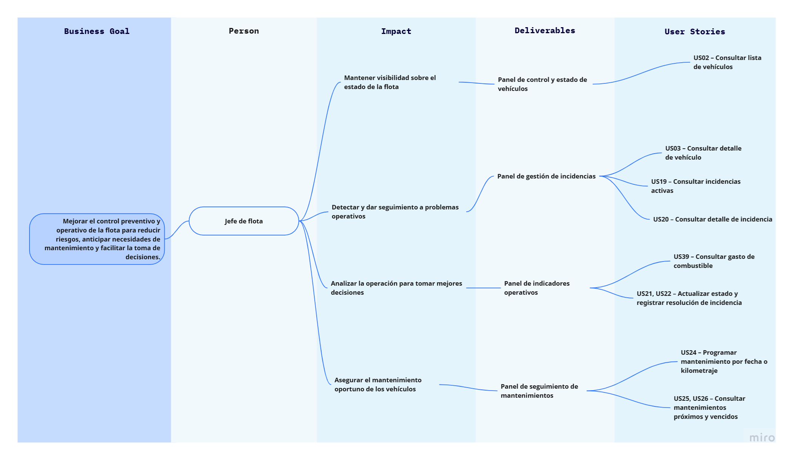
  </div>

<br>

- **Conductor:**
  <br>
  <div style="text-align: center;">
    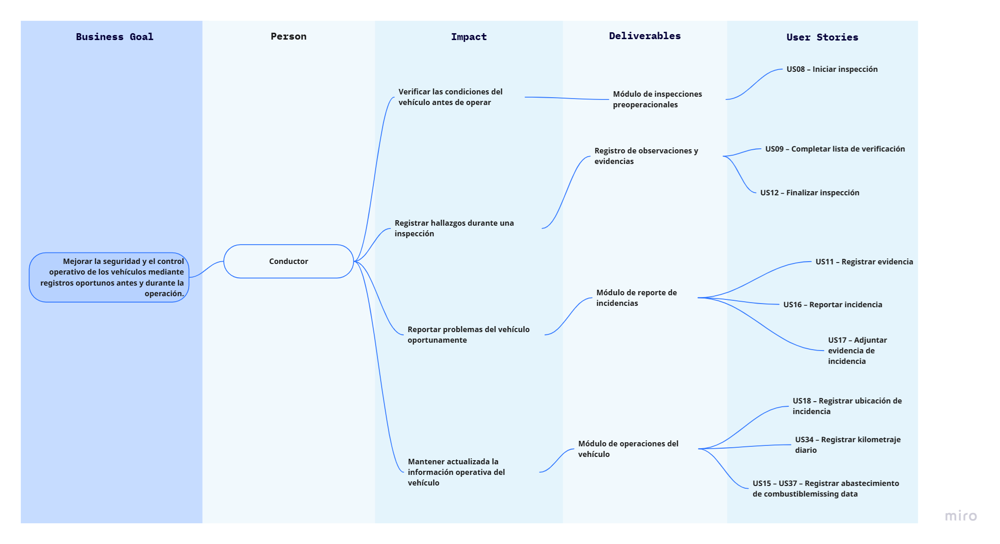
  </div>

<div style="page-break-after: always;"></div>

## **3.3. Product Backlog**

<p style="text-align: justify;">
  El Product Backlog de FleetCare se presenta a continuación. Las User Stories han sido priorizadas considerando el valor que aportan a los principales usuarios del producto y las dependencias funcionales necesarias para construir progresivamente la solución. La estimación del esfuerzo se realiza mediante Story Points utilizando la escala de Fibonacci de 1, 2, 3, 5 y 8 puntos.
</p>

<table style="margin: auto;">
<thead>
<tr>
<th style="text-align: center;"># Orden</th>
<th style="text-align: center;">User Story ID</th>
<th style="text-align: center;">Título</th>
<th style="text-align: center;">Descripción</th>
<th style="text-align: center;">Story Points</th>
</tr>
</thead>
<tbody>
<tr><td style="text-align: center;">01</td><td style="text-align: center;">US51</td><td style="text-align: center;">Conocer la propuesta de FleetCare</td><td style="text-align: justify;">Como visitante, deseo consultar en la página de inicio la propuesta de FleetCare y sus principales funcionalidades para comprender cómo puede ayudar en la gestión de una flota de transporte.</td><td style="text-align: center;">2</td></tr>
<tr><td style="text-align: center;">02</td><td style="text-align: center;">US52</td><td style="text-align: center;">Acceder a FleetCare desde la página de inicio</td><td style="text-align: justify;">Como visitante, deseo acceder desde la página de inicio a las opciones de registro e inicio de sesión para comenzar a utilizar FleetCare.</td><td style="text-align: center;">1</td></tr>
<tr><td style="text-align: center;">03</td><td style="text-align: center;">US44</td><td style="text-align: center;">Registrar cuenta de jefe de flota</td><td style="text-align: justify;">Como jefe de flota, deseo crear una cuenta proporcionando mis datos y credenciales para acceder a FleetCare y comenzar a gestionar mi flota.</td><td style="text-align: center;">5</td></tr>
<tr><td style="text-align: center;">04</td><td style="text-align: center;">US45</td><td style="text-align: center;">Iniciar sesión</td><td style="text-align: justify;">Como usuario registrado, deseo iniciar sesión mediante mi correo electrónico y contraseña para acceder de forma segura a FleetCare.</td><td style="text-align: center;">3</td></tr>
<tr><td style="text-align: center;">05</td><td style="text-align: center;">US01</td><td style="text-align: center;">Registrar vehículo</td><td style="text-align: justify;">Como jefe de flota, deseo registrar un vehículo indicando placa, marca, modelo, año y tipo de combustible para incorporarlo a la flota que administro.</td><td style="text-align: center;">3</td></tr>
<tr><td style="text-align: center;">06</td><td style="text-align: center;">US02</td><td style="text-align: center;">Consultar vehículos de la flota</td><td style="text-align: justify;">Como jefe de flota, deseo consultar los vehículos registrados con su placa, marca, modelo y estado operativo para conocer las unidades que conforman mi flota.</td><td style="text-align: center;">3</td></tr>
<tr><td style="text-align: center;">07</td><td style="text-align: center;">US03</td><td style="text-align: center;">Consultar detalle del vehículo</td><td style="text-align: justify;">Como jefe de flota, deseo consultar la ficha de un vehículo con sus datos técnicos y estado operativo para conocer su información actual.</td><td style="text-align: center;">2</td></tr>
<tr><td style="text-align: center;">08</td><td style="text-align: center;">US08</td><td style="text-align: center;">Iniciar inspección preoperacional</td><td style="text-align: justify;">Como conductor, deseo iniciar una inspección preoperacional del vehículo que utilizaré para verificar sus condiciones antes de salir a ruta.</td><td style="text-align: center;">3</td></tr>
<tr><td style="text-align: center;">09</td><td style="text-align: center;">US09</td><td style="text-align: center;">Completar lista de verificación</td><td style="text-align: justify;">Como conductor, deseo registrar como conforme o no conforme el estado de frenos, neumáticos, luces, fluidos y otros elementos del checklist para dejar constancia de los componentes revisados.</td><td style="text-align: center;">5</td></tr>
<tr><td style="text-align: center;">10</td><td style="text-align: center;">US12</td><td style="text-align: center;">Finalizar inspección preoperacional</td><td style="text-align: justify;">Como conductor, deseo finalizar una inspección para registrar su fecha, vehículo, elementos revisados y resultado obtenido antes de iniciar la operación.</td><td style="text-align: center;">3</td></tr>
<tr><td style="text-align: center;">11</td><td style="text-align: center;">US16</td><td style="text-align: center;">Reportar incidencia del vehículo</td><td style="text-align: justify;">Como conductor, deseo reportar una falla indicando vehículo, tipo de problema, severidad y descripción para informar al jefe de flota sobre un problema detectado durante la operación.</td><td style="text-align: center;">5</td></tr>
<tr><td style="text-align: center;">12</td><td style="text-align: center;">US19</td><td style="text-align: center;">Consultar incidencias activas</td><td style="text-align: justify;">Como jefe de flota, deseo consultar las incidencias pendientes con su vehículo, severidad, estado y fecha de reporte para identificar las fallas que requieren atención.</td><td style="text-align: center;">3</td></tr>
<tr><td style="text-align: center;">13</td><td style="text-align: center;">US20</td><td style="text-align: center;">Consultar detalle de incidencia</td><td style="text-align: justify;">Como jefe de flota, deseo consultar la descripción, severidad, fotografías, ubicación y estado de una incidencia para evaluar el problema reportado.</td><td style="text-align: center;">3</td></tr>
<tr><td style="text-align: center;">14</td><td style="text-align: center;">US21</td><td style="text-align: center;">Actualizar estado de incidencia</td><td style="text-align: justify;">Como jefe de flota, deseo cambiar una incidencia entre reportada, en atención y resuelta para mantener actualizado el seguimiento de la falla.</td><td style="text-align: center;">3</td></tr>
<tr><td style="text-align: center;">15</td><td style="text-align: center;">US24</td><td style="text-align: center;">Programar mantenimiento por fecha</td><td style="text-align: justify;">Como jefe de flota, deseo programar un mantenimiento indicando vehículo, tipo de servicio y fecha objetivo para controlar cuándo debe realizarse.</td><td style="text-align: center;">3</td></tr>
<tr><td style="text-align: center;">16</td><td style="text-align: center;">US25</td><td style="text-align: center;">Programar mantenimiento por kilometraje</td><td style="text-align: justify;">Como jefe de flota, deseo programar un mantenimiento indicando vehículo, tipo de servicio y kilometraje objetivo para controlar servicios que dependen del uso de la unidad.</td><td style="text-align: center;">5</td></tr>
<tr><td style="text-align: center;">17</td><td style="text-align: center;">US26</td><td style="text-align: center;">Consultar mantenimientos próximos</td><td style="text-align: justify;">Como jefe de flota, deseo consultar los mantenimientos próximos con su vehículo, tipo y fecha o kilometraje objetivo para organizar su atención.</td><td style="text-align: center;">3</td></tr>
<tr><td style="text-align: center;">18</td><td style="text-align: center;">US28</td><td style="text-align: center;">Registrar mantenimiento realizado</td><td style="text-align: justify;">Como mecánico, deseo registrar un mantenimiento realizado indicando vehículo, tipo de servicio, fecha y kilometraje para dejar constancia de la intervención.</td><td style="text-align: center;">5</td></tr>
<tr><td style="text-align: center;">19</td><td style="text-align: center;">US34</td><td style="text-align: center;">Registrar kilometraje diario</td><td style="text-align: justify;">Como conductor, deseo registrar el kilometraje actual del vehículo al finalizar mi jornada para mantener actualizado su recorrido acumulado.</td><td style="text-align: center;">3</td></tr>
<tr><td style="text-align: center;">20</td><td style="text-align: center;">US37</td><td style="text-align: center;">Registrar abastecimiento de combustible</td><td style="text-align: justify;">Como conductor, deseo registrar un abastecimiento indicando vehículo, fecha, litros, costo y kilometraje para mantener el historial de combustible de la unidad.</td><td style="text-align: center;">3</td></tr>
<tr><td style="text-align: center;">21</td><td style="text-align: center;">US35</td><td style="text-align: center;">Consultar historial de kilometraje</td><td style="text-align: justify;">Como jefe de flota, deseo consultar los registros de kilometraje de un vehículo ordenados por fecha para conocer la evolución de su uso.</td><td style="text-align: center;">2</td></tr>
<tr><td style="text-align: center;">22</td><td style="text-align: center;">US38</td><td style="text-align: center;">Consultar historial de abastecimientos</td><td style="text-align: justify;">Como jefe de flota, deseo consultar los abastecimientos de un vehículo con su fecha, litros, costo y kilometraje para controlar sus registros de combustible.</td><td style="text-align: center;">2</td></tr>
<tr><td style="text-align: center;">23</td><td style="text-align: center;">US04</td><td style="text-align: center;">Actualizar información del vehículo</td><td style="text-align: justify;">Como jefe de flota, deseo actualizar los datos técnicos y administrativos de un vehículo para mantener vigente la información de la unidad.</td><td style="text-align: center;">3</td></tr>
<tr><td style="text-align: center;">24</td><td style="text-align: center;">US05</td><td style="text-align: center;">Actualizar estado operativo del vehículo</td><td style="text-align: justify;">Como jefe de flota, deseo cambiar el estado de un vehículo entre disponible, requiere atención y fuera de servicio para reflejar su disponibilidad operativa.</td><td style="text-align: center;">2</td></tr>
<tr><td style="text-align: center;">25</td><td style="text-align: center;">US06</td><td style="text-align: center;">Buscar vehículo por placa</td><td style="text-align: justify;">Como jefe de flota, deseo buscar un vehículo mediante su placa para localizar rápidamente una unidad específica.</td><td style="text-align: center;">2</td></tr>
<tr><td style="text-align: center;">26</td><td style="text-align: center;">US07</td><td style="text-align: center;">Filtrar vehículos por estado operativo</td><td style="text-align: justify;">Como jefe de flota, deseo filtrar los vehículos según su estado operativo para identificar las unidades disponibles o aquellas que requieren atención.</td><td style="text-align: center;">2</td></tr>
<tr><td style="text-align: center;">27</td><td style="text-align: center;">US10</td><td style="text-align: center;">Registrar observación de inspección</td><td style="text-align: justify;">Como conductor, deseo registrar una observación sobre un elemento no conforme para describir el problema encontrado durante la inspección.</td><td style="text-align: center;">2</td></tr>
<tr><td style="text-align: center;">28</td><td style="text-align: center;">US11</td><td style="text-align: center;">Adjuntar evidencia de inspección</td><td style="text-align: justify;">Como conductor, deseo adjuntar fotografías a un elemento no conforme para dejar evidencia visual de la condición encontrada durante la inspección.</td><td style="text-align: center;">5</td></tr>
<tr><td style="text-align: center;">29</td><td style="text-align: center;">US13</td><td style="text-align: center;">Consultar historial de inspecciones</td><td style="text-align: justify;">Como jefe de flota, deseo consultar las inspecciones realizadas a un vehículo ordenadas por fecha para conocer los resultados de sus revisiones anteriores.</td><td style="text-align: center;">3</td></tr>
<tr><td style="text-align: center;">30</td><td style="text-align: center;">US14</td><td style="text-align: center;">Consultar detalle de inspección</td><td style="text-align: justify;">Como jefe de flota, deseo consultar los elementos revisados, resultados, observaciones y evidencias de una inspección para conocer las condiciones reportadas.</td><td style="text-align: center;">3</td></tr>
<tr><td style="text-align: center;">31</td><td style="text-align: center;">US15</td><td style="text-align: center;">Consultar inspecciones con observaciones</td><td style="text-align: justify;">Como jefe de flota, deseo consultar las inspecciones que presentan elementos no conformes para identificar vehículos que requieren atención.</td><td style="text-align: center;">3</td></tr>
<tr><td style="text-align: center;">32</td><td style="text-align: center;">US17</td><td style="text-align: center;">Adjuntar evidencia de incidencia</td><td style="text-align: justify;">Como conductor, deseo adjuntar fotografías a una incidencia para proporcionar evidencia visual de la falla detectada en el vehículo.</td><td style="text-align: center;">5</td></tr>
<tr><td style="text-align: center;">33</td><td style="text-align: center;">US18</td><td style="text-align: center;">Registrar ubicación de incidencia</td><td style="text-align: justify;">Como conductor, deseo registrar mi ubicación al reportar una incidencia para indicar dónde se encuentra el vehículo afectado.</td><td style="text-align: center;">5</td></tr>
<tr><td style="text-align: center;">34</td><td style="text-align: center;">US22</td><td style="text-align: center;">Registrar resolución de incidencia</td><td style="text-align: justify;">Como jefe de flota, deseo registrar la solución aplicada al resolver una incidencia para dejar constancia de cómo fue atendida la falla.</td><td style="text-align: center;">3</td></tr>
<tr><td style="text-align: center;">35</td><td style="text-align: center;">US23</td><td style="text-align: center;">Consultar historial de incidencias</td><td style="text-align: justify;">Como jefe de flota, deseo consultar las incidencias anteriores de un vehículo con su tipo, severidad y resolución para identificar problemas que se hayan presentado previamente.</td><td style="text-align: center;">3</td></tr>
<tr><td style="text-align: center;">36</td><td style="text-align: center;">US27</td><td style="text-align: center;">Identificar mantenimientos vencidos</td><td style="text-align: justify;">Como jefe de flota, deseo identificar los mantenimientos que superaron su fecha o kilometraje objetivo para priorizar las unidades que requieren servicio.</td><td style="text-align: center;">5</td></tr>
<tr><td style="text-align: center;">37</td><td style="text-align: center;">US29</td><td style="text-align: center;">Registrar trabajos de mantenimiento</td><td style="text-align: justify;">Como mecánico, deseo registrar los trabajos efectuados durante un mantenimiento para detallar las intervenciones realizadas al vehículo.</td><td style="text-align: center;">3</td></tr>
<tr><td style="text-align: center;">38</td><td style="text-align: center;">US30</td><td style="text-align: center;">Registrar repuestos utilizados</td><td style="text-align: justify;">Como mecánico, deseo registrar los repuestos reemplazados durante un mantenimiento para conservar el detalle de los componentes utilizados.</td><td style="text-align: center;">3</td></tr>
<tr><td style="text-align: center;">39</td><td style="text-align: center;">US31</td><td style="text-align: center;">Registrar costo de mantenimiento</td><td style="text-align: justify;">Como jefe de flota, deseo registrar el costo de un mantenimiento realizado para mantener un historial de gastos de mantenimiento del vehículo.</td><td style="text-align: center;">2</td></tr>
<tr><td style="text-align: center;">40</td><td style="text-align: center;">US32</td><td style="text-align: center;">Consultar historial de mantenimientos</td><td style="text-align: justify;">Como jefe de flota, deseo consultar los mantenimientos realizados a un vehículo con su fecha, kilometraje, tipo y costo para conocer sus intervenciones anteriores.</td><td style="text-align: center;">3</td></tr>
<tr><td style="text-align: center;">41</td><td style="text-align: center;">US33</td><td style="text-align: center;">Consultar detalle de mantenimiento</td><td style="text-align: justify;">Como mecánico, deseo consultar los trabajos, repuestos, observaciones y costos registrados en un mantenimiento para conocer el detalle de las intervenciones realizadas al vehículo.</td><td style="text-align: center;">3</td></tr>
<tr><td style="text-align: center;">42</td><td style="text-align: center;">US36</td><td style="text-align: center;">Consultar distancia recorrida</td><td style="text-align: justify;">Como jefe de flota, deseo consultar la distancia recorrida por un vehículo durante un periodo a partir de sus registros de kilometraje para conocer su nivel de utilización.</td><td style="text-align: center;">3</td></tr>
<tr><td style="text-align: center;">43</td><td style="text-align: center;">US39</td><td style="text-align: center;">Consultar consumo de combustible</td><td style="text-align: justify;">Como jefe de flota, deseo consultar los litros abastecidos a un vehículo durante un periodo para conocer su consumo de combustible.</td><td style="text-align: center;">3</td></tr>
<tr><td style="text-align: center;">44</td><td style="text-align: center;">US40</td><td style="text-align: center;">Consultar gasto de combustible</td><td style="text-align: justify;">Como jefe de flota, deseo consultar el costo acumulado de los abastecimientos de un vehículo durante un periodo para controlar sus gastos de combustible.</td><td style="text-align: center;">3</td></tr>
<tr><td style="text-align: center;">45</td><td style="text-align: center;">US41</td><td style="text-align: center;">Consultar rendimiento de combustible</td><td style="text-align: justify;">Como jefe de flota, deseo consultar el rendimiento de un vehículo en kilómetros por litro a partir de sus registros de kilometraje y abastecimiento para evaluar su eficiencia de combustible.</td><td style="text-align: center;">5</td></tr>
<tr><td style="text-align: center;">46</td><td style="text-align: center;">US42</td><td style="text-align: center;">Comparar rendimiento de vehículos</td><td style="text-align: justify;">Como jefe de flota, deseo comparar el rendimiento de combustible de los vehículos de mi flota para identificar las unidades que presentan mayor consumo.</td><td style="text-align: center;">5</td></tr>
<tr><td style="text-align: center;">47</td><td style="text-align: center;">US43</td><td style="text-align: center;">Consultar resumen operativo del vehículo</td><td style="text-align: justify;">Como jefe de flota, deseo consultar el kilometraje recorrido, combustible abastecido y gasto de combustible de un vehículo durante un periodo para revisar su nivel de uso y costo operativo.</td><td style="text-align: center;">5</td></tr>
<tr><td style="text-align: center;">48</td><td style="text-align: center;">US49</td><td style="text-align: center;">Registrar miembro de la flota</td><td style="text-align: justify;">Como jefe de flota, deseo registrar a un conductor o mecánico con sus datos y rol para incorporarlo como usuario autorizado de mi flota.</td><td style="text-align: center;">5</td></tr>
<tr><td style="text-align: center;">49</td><td style="text-align: center;">US50</td><td style="text-align: center;">Acceder según rol de usuario</td><td style="text-align: justify;">Como usuario autenticado, deseo acceder únicamente a las funcionalidades correspondientes a mi rol de jefe de flota, conductor o mecánico para utilizar FleetCare de acuerdo con mis responsabilidades.</td><td style="text-align: center;">5</td></tr>
<tr><td style="text-align: center;">50</td><td style="text-align: center;">US46</td><td style="text-align: center;">Recuperar contraseña</td><td style="text-align: justify;">Como usuario registrado, deseo solicitar la recuperación de mi contraseña mediante mi correo electrónico para recuperar el acceso a mi cuenta.</td><td style="text-align: center;">3</td></tr>
<tr><td style="text-align: center;">51</td><td style="text-align: center;">US47</td><td style="text-align: center;">Restablecer contraseña</td><td style="text-align: justify;">Como usuario que solicitó recuperar su cuenta, deseo establecer una nueva contraseña mediante un enlace de recuperación válido para volver a acceder a FleetCare.</td><td style="text-align: center;">3</td></tr>
<tr><td style="text-align: center;">52</td><td style="text-align: center;">US48</td><td style="text-align: center;">Cerrar sesión</td><td style="text-align: justify;">Como usuario autenticado, deseo cerrar mi sesión para impedir que otras personas accedan a FleetCare utilizando mi sesión actual.</td><td style="text-align: center;">1</td></tr>
</tbody>
</table>

<div style="page-break-after: always;"></div>

# **Chapter IV: Product Design**
## **4.1. Style Guidelines**

### **4.1.1. General Style Guidelines**
### **4.1.2. Web Style Guidelines**

## **4.2. Information Architecture**

### **4.2.1. Organization Systems**

<p style="text-align: justify;">
  La arquitectura de información de FleetCare sigue una <b>organización jerárquica</b> complementada con una <b>navegación basada en tareas</b>. La información se estructura de acuerdo con los principales dominios funcionales de la plataforma: Fleet Management, Inspection Management, Incident Management, Maintenance Management y Vehicle Operations Management. Adicionalmente, User Access and Roles proporciona capacidades compartidas relacionadas con autenticación, usuarios y permisos, mientras que el Dashboard funciona como una vista transversal que consolida información proveniente de los diferentes Bounded Contexts.
</p>

**Primary Organization Structure:**

**I. Hierarchical Organization (Main Structure)**

```text
FleetCare Platform
│
├── Dashboard
│   └── Fleet Overview
│
├── Fleet Management
│   ├── Vehicles
│   ├── Vehicle Details
│   └── Operational Status
│
├── Inspection Management
│   ├── Pre-operational Inspections
│   ├── Checklists
│   ├── Inspection Details
│   └── Inspection History
│
├── Incident Management
│   ├── Report Incident
│   ├── Active Incidents
│   ├── Incident Details
│   └── Incident History
│
├── Maintenance Management
│   ├── Scheduled Maintenance
│   ├── Upcoming Maintenance
│   ├── Overdue Maintenance
│   ├── Maintenance Details
│   └── Maintenance History
│
├── Vehicle Operations Management
│   ├── Mileage
│   │   ├── Mileage Records
│   │   └── Distance Traveled
│   │
│   └── Fuel
│       ├── Fuel Records
│       ├── Fuel Consumption
│       ├── Fuel Expenses
│       └── Fuel Efficiency
│
└── User Access and Roles
    ├── Account Access
    ├── User Profile
    ├── Fleet Members
    └── Roles & Permissions
```

<p style="text-align: justify;">
  Esta estructura mantiene una correspondencia directa con los cinco Bounded Contexts principales de FleetCare. Dashboard se ubica fuera de ellos debido a que funciona como una composición transversal de información y no administra información de dominio propia. De manera similar, User Access and Roles se considera una capacidad compartida de soporte y no un Bounded Context principal.
</p>

<div style="page-break-after: always;"></div>

**II. Chronological Organization**

<p style="text-align: justify;">
  La organización cronológica se aplica a la información cuya evolución depende del tiempo y que requiere ser consultada de acuerdo con la fecha en que fue registrada, programada o completada.
</p>

- **Inspections:** Las inspecciones pueden ordenarse desde las más recientes y consultarse considerando su fecha y el vehículo asociado.

- **Incidents:** Las incidencias se organizan cronológicamente para facilitar la consulta de los problemas reportados y su evolución hasta la resolución.

- **Maintenance Records:** Los mantenimientos se organizan considerando la fecha programada, la fecha de realización y, cuando corresponda, el kilometraje objetivo.

- **Mileage Records:** Los registros de kilometraje se organizan cronológicamente para consultar la evolución del uso y la distancia recorrida por cada vehículo.

- **Fuel Records:** Los abastecimientos de combustible se organizan cronológicamente para consultar el historial de consumo y gasto asociado a cada vehículo.

<div style="page-break-after: always;"></div>

**III. Sequential Organization**

<p style="text-align: justify;">
  La organización secuencial se utiliza en los procesos donde el usuario debe realizar diferentes actividades siguiendo un orden lógico hasta completar una operación.
</p>

- **Pre-operational Inspection:** Seleccionar vehículo → Iniciar inspección → Completar checklist → Registrar observaciones o evidencia → Finalizar inspección.

- **Incident Management:** Reportar incidencia → Adjuntar evidencia y ubicación → Consultar incidencia → Actualizar estado → Registrar resolución.

- **Maintenance Management:** Programar mantenimiento por fecha o kilometraje → Identificar mantenimiento próximo o vencido → Realizar mantenimiento → Registrar trabajos, repuestos y costo → Consultar registro de mantenimiento.

- **Vehicle Registration:** Registrar vehículo → Validar información → Incorporar vehículo a la flota → Consultar información registrada.

- **Mileage Registration:** Seleccionar vehículo → Registrar kilometraje → Validar información → Incorporar registro al historial del vehículo.

- **Fuel Registration:** Seleccionar vehículo → Registrar abastecimiento → Registrar cantidad y costo → Incorporar registro al historial de combustible.

- **Account Recovery:** Solicitar recuperación de contraseña → Acceder al mecanismo de recuperación → Restablecer contraseña → Iniciar sesión.

<div style="page-break-after: always;"></div>

**IV. Topic-Based Organization**

<p style="text-align: justify;">
  El contenido de FleetCare se agrupa de acuerdo con los principales dominios funcionales definidos para la plataforma. Esta organización permite mantener una separación clara de responsabilidades y facilita que cada módulo evolucione de manera independiente.
</p>

- **Fleet Management:** Comprende el registro, consulta y actualización de vehículos, su información técnica, estado operativo, búsqueda por placa y filtrado dentro de la flota.

- **Inspection Management:** Comprende las inspecciones preoperacionales, checklists, observaciones, evidencias, resultados e historial de inspecciones realizadas sobre los vehículos.

- **Incident Management:** Comprende el reporte de incidencias, evidencias, ubicación, consulta de incidencias activas, seguimiento de estados, resolución e historial de incidencias.

- **Maintenance Management:** Comprende la programación de mantenimientos por fecha o kilometraje, identificación de mantenimientos próximos o vencidos, registro de intervenciones, trabajos realizados, repuestos utilizados, costos e historial de mantenimiento.

- **Vehicle Operations Management:** Comprende el registro y consulta del kilometraje y los abastecimientos de combustible, así como el análisis de distancia recorrida, consumo, gasto y rendimiento de combustible.

- **User Access and Roles:** Comprende el registro y autenticación de usuarios, recuperación y restablecimiento de contraseña, gestión de sesiones, incorporación de miembros de la flota y control de acceso según el rol.

<p style="text-align: justify;">
  Dashboard complementa esta organización presentando información resumida proveniente de los diferentes dominios. Su función es facilitar la consulta general del estado y operación de la flota, sin convertirse en propietario de los datos presentados.
</p>

<div style="page-break-after: always;"></div>

**Content Categorization:**

**By User Role:**

- **Fleet Manager:** Accede al Dashboard y administra principalmente las funcionalidades relacionadas con Fleet Management. También consulta inspecciones, realiza seguimiento de incidencias, programa y supervisa mantenimientos, consulta información de Vehicle Operations Management y administra los miembros de la flota.

- **Driver:** Accede principalmente a Inspection Management para realizar inspecciones preoperacionales, a Incident Management para reportar incidencias y a Vehicle Operations Management para registrar kilometraje y abastecimientos de combustible.

- **Mechanic:** Accede principalmente a Maintenance Management para consultar mantenimientos y registrar las intervenciones realizadas, incluyendo trabajos efectuados, repuestos utilizados y demás información correspondiente al mantenimiento.

- **Visitor:** Accede a la Landing Page para conocer la propuesta de FleetCare y utilizar las opciones disponibles para registrarse o acceder a la plataforma.

<p style="text-align: justify;">
  Las funcionalidades visibles para cada usuario dependen de su rol y permisos. La inclusión de Mechanic como rol funcional no modifica la definición de Fleet Manager y Driver como los dos segmentos principales utilizados en el Impact Mapping.
</p>

**By Priority:**

- **Critical:** Vehículos fuera de servicio, incidencias activas de alta severidad y mantenimientos vencidos que requieren atención prioritaria.

- **High:** Vehículos que requieren atención, incidencias activas, mantenimientos próximos e inspecciones que presentan elementos no conformes.

- **Medium:** Registros recientes de kilometraje, abastecimientos de combustible, inspecciones completadas y mantenimientos realizados utilizados para el seguimiento operativo.

- **Low:** Información histórica, incidencias resueltas y registros anteriores utilizados principalmente para consulta y análisis.

<div style="page-break-after: always;"></div>

### **4.2.2. Labeling Systems**

<p style="text-align: justify;">
  FleetCare emplea un sistema de etiquetado claro y consistente para facilitar la identificación de las funcionalidades disponibles y de la información relacionada con la gestión de vehículos, inspecciones, incidencias, mantenimientos y operaciones de la flota. Las etiquetas mantienen una terminología alineada con los diferentes dominios funcionales de la plataforma y con las responsabilidades de cada tipo de usuario.
</p>

**Navigation Labels:**

| Label | Context | Description |
|-------|---------|-------------|
| **Dashboard** | Main navigation | Presenta una vista general de la información relevante de la flota obtenida desde los diferentes módulos |
| **Vehículos** / **Vehicles** | Fleet Management | Permite consultar y gestionar los vehículos registrados en la flota |
| **Inspecciones** / **Inspections** | Inspection Management | Permite realizar y consultar inspecciones preoperacionales de los vehículos |
| **Incidencias** / **Incidents** | Incident Management | Permite reportar, consultar y realizar seguimiento de las incidencias asociadas a los vehículos |
| **Mantenimientos** / **Maintenance** | Maintenance Management | Permite programar mantenimientos y consultar las intervenciones realizadas sobre los vehículos |
| **Kilometraje** / **Mileage** | Vehicle Operations Management | Permite registrar y consultar el historial de kilometraje de los vehículos |
| **Combustible** / **Fuel** | Vehicle Operations Management | Permite registrar abastecimientos y consultar información relacionada con consumo, gasto y rendimiento de combustible |
| **Miembros de Flota** / **Fleet Members** | User Access and Roles | Permite al Fleet Manager administrar los usuarios asociados a la flota |
| **Perfil** / **Profile** | User menu | Permite consultar la información asociada a la cuenta del usuario |
| **Cerrar Sesión** / **Logout** | User menu | Permite finalizar la sesión actual del usuario |

<p style="text-align: justify;">
  Dashboard se presenta como una opción principal de navegación, pero funciona como una vista transversal y no constituye un Bounded Context independiente. De manera similar, Mileage y Fuel se presentan como opciones diferenciadas para facilitar su acceso, aunque ambas pertenecen a Vehicle Operations Management.
</p>

<div style="page-break-after: always;"></div>

**Action Labels:**

| Label | Action Type | Usage |
|-------|-------------|-------|
| **Ver Detalles** / **View Details** | Read | Permite acceder a la información detallada de un registro |
| **Editar** / **Edit** | Update | Permite modificar información cuando la operación se encuentre disponible para el registro y rol correspondiente |
| **Registrar** / **Register** | Create | Permite crear un nuevo registro dentro del módulo correspondiente |
| **Guardar** / **Save** | Submit | Permite guardar la información ingresada o las modificaciones realizadas |
| **Cancelar** / **Cancel** | Dismiss | Permite cancelar la operación actual y descartar los cambios no guardados |
| **Buscar** / **Search** | Search | Permite localizar registros utilizando un término de búsqueda |
| **Filtrar** / **Filter** | Search | Permite restringir la información mostrada mediante criterios específicos |
| **Limpiar Filtros** / **Clear Filters** | Search | Permite retirar los filtros aplicados y regresar al conjunto completo de resultados |
| **Iniciar Inspección** / **Start Inspection** | Create | Permite al Driver iniciar una inspección preoperacional de un vehículo |
| **Finalizar Inspección** / **Finish Inspection** | Complete | Permite completar una inspección preoperacional y registrar su resultado |
| **Reportar Incidencia** / **Report Incident** | Create | Permite al Driver registrar una falla o problema detectado en un vehículo |
| **Actualizar Estado** / **Update Status** | Update | Permite actualizar el estado operativo de un vehículo o el estado de atención de una incidencia, según el contexto |
| **Resolver Incidencia** / **Resolve Incident** | Complete | Permite registrar una incidencia como resuelta |
| **Programar Mantenimiento** / **Schedule Maintenance** | Create | Permite al Fleet Manager programar un mantenimiento por fecha o kilometraje |
| **Registrar Mantenimiento** / **Register Maintenance** | Create | Permite al Mechanic registrar una intervención de mantenimiento realizada |
| **Registrar Kilometraje** / **Register Mileage** | Create | Permite al Driver registrar el kilometraje de un vehículo |
| **Registrar Abastecimiento** / **Register Fueling** | Create | Permite al Driver registrar un abastecimiento de combustible |

<div style="page-break-after: always;"></div>

**Status Labels:**

<p style="text-align: justify;">
  Los estados utilizados en FleetCare dependen del dominio funcional al que pertenece cada registro. De esta manera se evita utilizar una misma etiqueta con significados diferentes dentro de la aplicación.
</p>

| Label | Context | Color Code | Meaning |
|-------|---------|------------|---------|
| **Disponible** / **Available** | Fleet Management | Emerald 600 | El vehículo se encuentra disponible para operar |
| **Requiere Atención** / **Requires Attention** | Fleet Management | Amber 500 | El vehículo presenta una condición que requiere revisión o atención |
| **Fuera de Servicio** / **Out of Service** | Fleet Management | Red 600 | El vehículo no se encuentra disponible para operar |
| **Conforme** / **Compliant** | Inspection Management | Emerald 600 | El elemento evaluado durante una inspección cumple con la condición esperada |
| **No Conforme** / **Non-Compliant** | Inspection Management | Amber 500 | El elemento evaluado presenta una condición u observación que requiere atención |
| **Reportada** / **Reported** | Incident Management | Amber 500 | La incidencia ha sido registrada y se encuentra pendiente de atención |
| **En Atención** / **Under Review** | Incident Management | Blue 600 | La incidencia se encuentra en proceso de atención |
| **Resuelta** / **Resolved** | Incident Management | Emerald 600 | La incidencia ha sido atendida y registrada como resuelta |
| **Próximo** / **Upcoming** | Maintenance Management | Blue 600 | El mantenimiento se encuentra próximo a alcanzar su fecha o kilometraje objetivo |
| **Vencido** / **Overdue** | Maintenance Management | Red 600 | El mantenimiento ha superado su fecha o kilometraje objetivo |
| **Completado** / **Completed** | Maintenance Management | Slate 600 | El mantenimiento ha sido realizado y registrado |

<div style="page-break-after: always;"></div>

**Field Labels (Forms):**

<p style="text-align: justify;">
  Las etiquetas utilizadas en los formularios se mantienen consistentes entre las diferentes vistas. Cada campo se encuentra asociado al Bounded Context responsable de administrar la información correspondiente.
</p>

| Label | Context | Field Type | Description |
|-------|---------|------------|-------------|
| **Placa** / **License Plate** | Fleet Management | Text input | Identifica al vehículo mediante su placa |
| **Marca** / **Brand** | Fleet Management | Text input | Permite registrar la marca del vehículo |
| **Modelo** / **Model** | Fleet Management | Text input | Permite registrar el modelo del vehículo |
| **Año** / **Year** | Fleet Management | Number input | Permite registrar el año correspondiente al vehículo |
| **Tipo de Combustible** / **Fuel Type** | Fleet Management | Dropdown | Permite seleccionar el tipo de combustible utilizado por el vehículo |
| **Estado Operativo** / **Operational Status** | Fleet Management | Dropdown | Permite identificar o actualizar el estado operativo del vehículo |
| **Kilometraje** / **Mileage** | Vehicle Operations Management | Number input | Permite registrar el kilometraje del vehículo |
| **Resultado de Inspección** / **Inspection Result** | Inspection Management | Selection | Permite identificar el resultado obtenido durante una inspección |
| **Observación** / **Observation** | Inspection Management | Text area | Permite registrar información adicional detectada durante una inspección |
| **Tipo de Problema** / **Problem Type** | Incident Management | Dropdown | Permite seleccionar el tipo de problema asociado a una incidencia |
| **Severidad** / **Severity** | Incident Management | Dropdown | Permite indicar el nivel de severidad de una incidencia |
| **Descripción** / **Description** | Incident Management | Text area | Permite describir la falla o problema reportado |
| **Fotografía** / **Photo** | Inspection / Incident Management | File input | Permite adjuntar evidencia fotográfica asociada a una inspección o incidencia |
| **Ubicación** / **Location** | Incident Management | Location/Text | Permite registrar la ubicación asociada a una incidencia |
| **Tipo de Mantenimiento** / **Maintenance Type** | Maintenance Management | Dropdown | Permite seleccionar el tipo de mantenimiento del vehículo |
| **Fecha Programada** / **Scheduled Date** | Maintenance Management | Date input | Permite definir la fecha prevista para realizar un mantenimiento |
| **Kilometraje Objetivo** / **Target Mileage** | Maintenance Management | Number input | Permite establecer el kilometraje en el que debe realizarse un mantenimiento |
| **Trabajos Realizados** / **Work Performed** | Maintenance Management | Text area | Permite registrar los trabajos efectuados durante una intervención |
| **Repuestos Utilizados** / **Spare Parts Used** | Maintenance Management | Text area | Permite registrar los repuestos utilizados durante un mantenimiento |
| **Costo de Mantenimiento** / **Maintenance Cost** | Maintenance Management | Number input | Permite registrar el costo asociado al mantenimiento realizado |
| **Fecha** / **Date** | Vehicle Operations Management | Date input | Permite registrar la fecha correspondiente al kilometraje o abastecimiento |
| **Litros** / **Liters** | Vehicle Operations Management | Number input | Permite registrar la cantidad de combustible abastecido |
| **Costo de Combustible** / **Fuel Cost** | Vehicle Operations Management | Number input | Permite registrar el costo correspondiente al abastecimiento de combustible |

<div style="page-break-after: always;"></div>

**Bilingual Support:**

<p style="text-align: justify;">
  FleetCare considera español como idioma principal y mantiene equivalencias en inglés para las etiquetas utilizadas dentro de la aplicación. Esta convención permite conservar una terminología consistente entre las diferentes vistas y facilita la adaptación de la interfaz a ambos idiomas.
</p>

- Los elementos de navegación se muestran de acuerdo con el idioma seleccionado por el usuario.

- Las etiquetas relacionadas con Fleet Management, Inspection Management, Incident Management, Maintenance Management y Vehicle Operations Management mantienen equivalencias consistentes en español e inglés.

- Los estados, acciones, campos de formularios, mensajes informativos y mensajes de validación mantienen la misma terminología en las diferentes vistas.

- Los formatos de fecha y hora pueden ajustarse de acuerdo con la configuración regional correspondiente (`es-PE`, `en-US`).

- Los formatos numéricos respetan las convenciones regionales correspondientes, incluyendo separadores decimales y de miles.

<div style="page-break-after: always;"></div>

### **4.2.3. SEO Tags and Meta Tags**

<p style="text-align: justify;">
  FleetCare utiliza etiquetas SEO y metadatos para mejorar la visibilidad de su Landing Page en motores de búsqueda y proporcionar información adecuada cuando el sitio es compartido en diferentes plataformas. Debido a que las funcionalidades principales de FleetCare requieren autenticación, las estrategias de posicionamiento se concentran principalmente en las páginas públicas, mientras que las vistas internas de la aplicación se mantienen fuera de la indexación de los motores de búsqueda.
</p>

**Landing Page Meta Tags:**

```html
<!-- Primary Meta Tags -->

<title>FleetCare - Gestión de Mantenimiento y Control de Flotas</title>

<meta name="title" content="FleetCare - Gestión de Mantenimiento y Control de Flotas">

<meta name="description" content="Plataforma web para la gestión de flotas de transporte ligero. Centraliza vehículos, mantenimiento preventivo, inspecciones, incidencias, kilometraje y consumo de combustible.">

<meta name="keywords" content="gestión de flotas, mantenimiento preventivo, control de vehículos, inspecciones vehiculares, incidencias vehiculares, kilometraje, consumo de combustible, flotas de transporte, logística, FleetCare">

<meta name="author" content="TeamTrack">

<meta name="robots" content="index, follow">

<meta name="language" content="Spanish">

<meta name="geo.region" content="PE">

<!-- Open Graph -->

<meta property="og:type" content="website">

<meta property="og:url" content="FLEETCARE_DEPLOYMENT_URL">

<meta property="og:title" content="FleetCare - Gestión de Mantenimiento y Control de Flotas">

<meta property="og:description" content="Centraliza la gestión de vehículos, mantenimientos, inspecciones, incidencias, kilometraje y combustible de tu flota.">

<meta property="og:image" content="FLEETCARE_DEPLOYMENT_URL/assets/og-image.jpg">

<meta property="og:image:width" content="1200">

<meta property="og:image:height" content="630">

<meta property="og:site_name" content="FleetCare">

<meta property="og:locale" content="es_PE">

<meta property="og:locale:alternate" content="en_US">

<!-- Twitter -->

<meta name="twitter:card" content="summary_large_image">

<meta name="twitter:title" content="FleetCare - Gestión de Mantenimiento y Control de Flotas">

<meta name="twitter:description" content="Centraliza la gestión de vehículos, mantenimientos, inspecciones, incidencias, kilometraje y combustible de tu flota.">

<meta name="twitter:image" content="FLEETCARE_DEPLOYMENT_URL/assets/og-image.jpg">

<!-- Mobile Optimization -->

<meta name="viewport" content="width=device-width, initial-scale=1.0, maximum-scale=5.0">

<meta name="theme-color" content="#4F46E5">

<meta name="apple-mobile-web-app-capable" content="yes">

<meta name="apple-mobile-web-app-title" content="FleetCare">

<!-- Favicon & Icons -->

<link rel="icon" type="image/png" sizes="32x32" href="/assets/favicon-32x32.png">

<link rel="icon" type="image/png" sizes="16x16" href="/assets/favicon-16x16.png">

<link rel="apple-touch-icon" sizes="180x180" href="/assets/apple-touch-icon.png">
```

> **Nota:** `FLEETCARE_DEPLOYMENT_URL` representa la URL pública de referencia y deberá reemplazarse por la dirección definitiva cuando se realice el despliegue de FleetCare.

<div style="page-break-after: always;"></div>

**Web Application Meta Tags:**

<p style="text-align: justify;">
  A diferencia de la Landing Page, las vistas correspondientes a Fleet Management, Inspection Management, Incident Management, Maintenance Management, Vehicle Operations Management y User Access and Roles forman parte de una aplicación privada que requiere autenticación. Por ello, estas páginas no están orientadas al posicionamiento público y deben evitar su indexación por los motores de búsqueda.
</p>

```html
<!-- Application Meta -->

<title>Dashboard | FleetCare Platform</title>

<meta name="description" content="Panel de gestión y control operativo de la flota">

<meta name="robots" content="noindex, nofollow">

<meta name="application-name" content="FleetCare Platform">

<!-- Mobile Support -->

<meta name="viewport" content="width=device-width, initial-scale=1.0, maximum-scale=5.0">

<meta name="theme-color" content="#4F46E5">

<meta name="mobile-web-app-capable" content="yes">

<meta name="apple-mobile-web-app-capable" content="yes">

<meta name="apple-mobile-web-app-title" content="FleetCare">
```

<p style="text-align: justify;">
  Las políticas relacionadas con Content Security Policy, protección contra inclusión no autorizada en frames, control de tipos de contenido y otras medidas basadas en cabeceras HTTP deben configurarse principalmente desde la infraestructura y los servicios backend correspondientes. De esta manera, la seguridad de la aplicación no depende únicamente de etiquetas incluidas en el documento HTML.
</p>

<div style="page-break-after: always;"></div>

**Dynamic Page Titles (SPA):**

<p style="text-align: justify;">
  Al tratarse de una Single Page Application desarrollada con Vue.js, FleetCare utiliza títulos dinámicos para identificar la vista en la que se encuentra el usuario. Estos títulos mantienen una correspondencia con los módulos funcionales de la plataforma y facilitan la identificación de cada página dentro del navegador.
</p>

```javascript
// Pattern: [Page Name] | FleetCare

const pageTitles = {
  dashboard: "Dashboard | FleetCare",

  // Fleet Management
  vehicles: "Vehicles | FleetCare",
  vehicleDetail: "Vehicle Details | FleetCare",

  // Inspection Management
  inspections: "Inspections | FleetCare",
  inspectionDetail: "Inspection Details | FleetCare",

  // Incident Management
  incidents: "Incidents | FleetCare",
  incidentDetail: "Incident Details | FleetCare",

  // Maintenance Management
  maintenance: "Maintenance | FleetCare",
  maintenanceDetail: "Maintenance Details | FleetCare",

  // Vehicle Operations Management
  mileage: "Mileage | FleetCare",
  fuel: "Fuel | FleetCare",

  // User Access and Roles
  users: "Fleet Members | FleetCare",
  profile: "User Profile | FleetCare"
};
```

<p style="text-align: justify;">
  Aunque Mileage y Fuel cuentan con vistas independientes dentro de la interfaz, ambas funcionalidades pertenecen a Vehicle Operations Management. De manera similar, Fleet Members y User Profile corresponden a capacidades compartidas relacionadas con User Access and Roles y no representan Bounded Contexts adicionales.
</p>

<div style="page-break-after: always;"></div>

**Structured Data (JSON-LD) - Landing Page:**

<p style="text-align: justify;">
  La Landing Page puede incorporar datos estructurados mediante JSON-LD para proporcionar a los motores de búsqueda información sobre FleetCare como aplicación de software. Los datos describen las principales capacidades definidas para el producto y evitan incorporar precios, valoraciones, promociones u otra información comercial que todavía no haya sido establecida.
</p>

```json
{
  "@context": "https://schema.org",
  "@type": "SoftwareApplication",
  "name": "FleetCare",
  "applicationCategory": "BusinessApplication",
  "applicationSubCategory": "Fleet Management Software",
  "operatingSystem": "Web Browser",
  "url": "FLEETCARE_DEPLOYMENT_URL",
  "description": "Plataforma web para la gestión de flotas de transporte ligero, orientada al mantenimiento preventivo, inspecciones, incidencias y control operativo de vehículos.",
  "author": {
    "@type": "Organization",
    "name": "TeamTrack"
  },
  "publisher": {
    "@type": "Organization",
    "name": "TeamTrack"
  },
  "featureList": [
    "Gestión de vehículos de la flota",
    "Inspecciones preoperacionales",
    "Reporte y seguimiento de incidencias",
    "Programación de mantenimiento preventivo",
    "Registro de trabajos de mantenimiento",
    "Historial de mantenimiento de vehículos",
    "Registro e historial de kilometraje",
    "Registro de abastecimientos de combustible",
    "Consulta del consumo y gasto de combustible",
    "Consulta del rendimiento de combustible"
  ]
}
```

> **Nota:** La URL incluida en los datos estructurados deberá actualizarse cuando se defina la dirección definitiva de despliegue de FleetCare.

<div style="page-break-after: always;"></div>

**Structured Data - Organization:**

<p style="text-align: justify;">
  También se puede definir información estructurada para identificar a TeamTrack como la organización responsable del desarrollo de FleetCare. En esta etapa no se incorporan redes sociales, números telefónicos, correos electrónicos u otros datos de contacto que todavía no hayan sido definidos por el equipo.
</p>

```json
{
  "@context": "https://schema.org",
  "@type": "Organization",
  "name": "TeamTrack",
  "description": "TeamTrack desarrolla FleetCare, una plataforma web orientada a facilitar la gestión operativa y el mantenimiento de flotas de transporte ligero.",
  "areaServed": "PE"
}
```

<div style="page-break-after: always;"></div>

**Sitemap Structure:**

<p style="text-align: justify;">
  El sitemap considera únicamente las páginas públicas de FleetCare que pueden ser indexadas por los motores de búsqueda. Las vistas correspondientes a Dashboard, Vehicles, Inspections, Incidents, Maintenance, Mileage, Fuel y Fleet Members no se incluyen debido a que forman parte de la aplicación autenticada.
</p>

```xml
<?xml version="1.0" encoding="UTF-8"?>

<urlset xmlns="http://www.sitemaps.org/schemas/sitemap/0.9">

  <url>
    <loc>FLEETCARE_DEPLOYMENT_URL/</loc>
    <changefreq>weekly</changefreq>
    <priority>1.0</priority>
  </url>

</urlset>
```

<p style="text-align: justify;">
  Si la Landing Page implementa posteriormente rutas públicas adicionales, estas podrán incorporarse al sitemap. Por ejemplo, secciones como Features o About únicamente deben añadirse cuando existan como páginas públicas independientes y cuenten con una URL propia.
</p>

> **Nota:** La estructura presentada corresponde a una propuesta de diseño. Las rutas públicas y la URL deberán ajustarse de acuerdo con la implementación y el despliegue definitivo de FleetCare.

<div style="page-break-after: always;"></div>


### **4.2.4. Searching Systems**

<p style="text-align: justify;">
  FleetCare implementa mecanismos de búsqueda y filtrado orientados a facilitar la localización de vehículos y registros asociados a los diferentes Bounded Contexts. El alcance de los resultados depende del rol y de los permisos del usuario, manteniendo la separación funcional entre Fleet Management, Inspection Management, Incident Management, Maintenance Management y Vehicle Operations Management.
</p>

**Global Search (Header)**

- **Location:** Barra superior de navegación, disponible en las principales vistas de la aplicación.

- **Scope:** Realiza búsquedas sobre la información accesible para el usuario según su rol y permisos.

- **Input:** Campo de texto con icono de búsqueda y placeholder: `"Buscar vehículos, inspecciones, incidencias..."`.

- **Minimum Characters:** 2 caracteres para iniciar la búsqueda.

- **Debounce Delay:** 300ms para evitar solicitudes innecesarias mientras el usuario escribe.

**Features:**

- **Real-time suggestions:** Presenta sugerencias mientras el usuario ingresa el término de búsqueda.

- **Search categories:** Vehicles, Inspections, Incidents y Maintenance.

- **Recent searches:** Puede mostrar las últimas búsquedas realizadas durante la sesión del usuario.

- **Keyboard shortcut:** `Cmd/Ctrl + K` permite enfocar el campo de búsqueda desde Desktop.

- **Clear button:** El icono `X` permite limpiar el término ingresado y los resultados mostrados.

<p style="text-align: justify;">
  La búsqueda global funciona como un mecanismo transversal de consulta y no constituye un Bounded Context independiente. Cada resultado mantiene una referencia al módulo responsable de la información encontrada.
</p>

**Search Results Display:**

```text
┌─────────────────────────────────────────────┐
│ [🚚] Vehicle | ABC-123                     │
│       Toyota Hilux                         │
│       Home > Vehicles                      │
├─────────────────────────────────────────────┤
│ [⚠] Incident | INC-001                    │
│       Falla reportada en ABC-123           │
│       Home > Incidents                     │
├─────────────────────────────────────────────┤
│ [🔧] Maintenance | MNT-015                │
│       Mantenimiento de ABC-123             │
│       Home > Maintenance                   │
└─────────────────────────────────────────────┘
              [Ver todos los resultados]
```

<div style="page-break-after: always;"></div>

**Search Result Priority:**

1. Coincidencias exactas, principalmente identificadores y placas de vehículos.
2. Coincidencias exactas con nombres o identificadores de registros.
3. Coincidencias por prefijo.
4. Coincidencias que contienen el término buscado.
5. Coincidencias aproximadas, cuando esta capacidad se encuentre implementada.

**Filtered Search (Module-Specific)**

<p style="text-align: justify;">
  Además de la búsqueda global, cada Bounded Context proporciona filtros específicos de acuerdo con la información que administra. Los filtros permiten reducir progresivamente los resultados sin mezclar las responsabilidades de los diferentes dominios.
</p>

**I. Fleet Management Search & Filtering:**

**Available Filters:**

- **License Plate** (text input)
  - Permite buscar un vehículo por su placa.
  - Prioriza coincidencias exactas.

- **Brand** (text input/dropdown)
  - Permite filtrar los vehículos según su marca.

- **Model** (text input)
  - Permite buscar vehículos de acuerdo con su modelo.

- **Operational Status** (multi-select)
  - Available
  - Requires Attention
  - Out of Service

**Search Behavior:**

- Los filtros pueden combinarse para reducir los resultados.
- La búsqueda por placa permite localizar directamente un vehículo.
- Los resultados pueden actualizarse al aplicar o retirar filtros.
- La opción **Clear All Filters** permite regresar al listado completo.

<div style="page-break-after: always;"></div>

**II. Inspection Management Search & Filtering:**

**Available Filters:**

- **Vehicle** (search/select)
  - Permite localizar las inspecciones correspondientes a un vehículo.

- **Inspection Date** (date range)
  - Today
  - Last 7 days
  - Last 30 days
  - Custom range

- **Inspection Result** (multi-select)
  - Compliant
  - Non-Compliant

- **Observations** (selection)
  - All
  - With Observations
  - Without Observations

**Additional Search Fields:**

- Inspection ID.
- License Plate.

**Search Behavior:**

- Los filtros pueden combinarse para localizar inspecciones específicas.
- El Fleet Manager puede consultar inspecciones realizadas dentro de un periodo determinado.
- Se puede filtrar el historial para identificar inspecciones que contienen observaciones.
- El Driver puede consultar los registros disponibles de acuerdo con sus permisos.

<div style="page-break-after: always;"></div>

**III. Incident Management Search & Filtering:**

**Available Filters:**

- **Vehicle** (search/select)
  - Permite consultar las incidencias asociadas a un vehículo.

- **Incident Status** (multi-select)
  - Reported
  - Under Review
  - Resolved

- **Date Range** (date picker)
  - Today
  - Last 7 days
  - Last 30 days
  - Custom range

- **Problem Type** (dropdown)
  - Permite filtrar las incidencias según la clasificación utilizada al momento del registro.

- **Severity** (dropdown/multi-select)
  - Permite filtrar las incidencias de acuerdo con el nivel de severidad registrado.

**Additional Search Fields:**

- Incident ID.
- License Plate.
- Description.

**Sorting Options:**

- Newest.
- Oldest.
- Status.
- Severity.

<p style="text-align: justify;">
  Estos filtros permiten principalmente al Fleet Manager identificar incidencias activas y realizar seguimiento a los problemas reportados por los conductores.
</p>

<div style="page-break-after: always;"></div>

**IV. Maintenance Management Search & Filtering:**

**Available Filters:**

- **Vehicle** (search/select)
  - Permite consultar los mantenimientos relacionados con un vehículo.

- **Maintenance Type** (dropdown)
  - Permite seleccionar el tipo de mantenimiento registrado.

- **Maintenance Status** (multi-select)
  - Upcoming
  - Overdue
  - Completed

- **Scheduled Date** (date range)
  - Permite localizar mantenimientos según la fecha programada.

- **Target Mileage** (number/range)
  - Permite consultar mantenimientos programados de acuerdo con el kilometraje objetivo.

**Additional Search Fields:**

- Maintenance ID.
- License Plate.

**Sorting Options:**

- Scheduled Date.
- Target Mileage.
- Status.
- Newest / Oldest.

<p style="text-align: justify;">
  La búsqueda permite al Fleet Manager identificar mantenimientos próximos o vencidos, mientras que el Mechanic puede localizar los registros necesarios para consultar o registrar las intervenciones correspondientes.
</p>

<div style="page-break-after: always;"></div>

**V. Vehicle Operations Management Search & Filtering:**

<p style="text-align: justify;">
  Vehicle Operations Management administra principalmente información relacionada con Mileage y Fuel. Debido a que ambos tipos de registro pertenecen al mismo Bounded Context, sus mecanismos de búsqueda se organizan dentro de este módulo, aunque pueden presentarse en vistas independientes.
</p>

**Mileage Filters:**

- **Vehicle** (search/select)
  - Permite consultar los registros correspondientes a un vehículo.

- **Date Range** (date picker)
  - Today
  - Last 7 days
  - Last 30 days
  - Custom range

- **Mileage Range** (number range)
  - Permite restringir los registros según el kilometraje.

**Additional Mileage Search Fields:**

- Mileage Record ID.
- License Plate.

**Fuel Filters:**

- **Vehicle** (search/select)
  - Permite consultar los abastecimientos correspondientes a un vehículo.

- **Date Range** (date picker)
  - Today
  - Last 7 days
  - Last 30 days
  - Custom range

- **Fuel Quantity** (number range)
  - Permite filtrar los registros según la cantidad de litros abastecidos.

- **Cost Range** (number range)
  - Permite consultar abastecimientos dentro de un determinado rango de gasto.

**Additional Fuel Search Fields:**

- Fuel Record ID.
- License Plate.

**Sorting Options:**

- Newest.
- Oldest.
- Mileage.
- Fuel Quantity.
- Cost.

<div style="page-break-after: always;"></div>

**Search Algorithms & Behavior:**

<p style="text-align: justify;">
  FleetCare utiliza mecanismos de búsqueda de diferente nivel de precisión según el tipo de información consultada. Las capacidades más avanzadas pueden incorporarse progresivamente de acuerdo con las necesidades del producto.
</p>

**I. Exact Match (Highest Priority):**

- Vehicle IDs.
- License Plates.
- Inspection IDs.
- Incident IDs.
- Maintenance IDs.
- Mileage Record IDs.
- Fuel Record IDs.

- **Pattern:** Comparación exacta sin diferenciar entre mayúsculas y minúsculas cuando corresponda.

**II. Prefix Match:**

- License Plates.
- Vehicle Brand and Model.
- Record identifiers.

- Utilizado principalmente para proporcionar sugerencias mientras el usuario escribe.

- **Pattern:** `query*`

**III. Full-Text Search:**

- Incident descriptions.
- Inspection observations.
- Maintenance descriptions or work performed.

- Permite localizar registros que contienen el término ingresado dentro de campos descriptivos.

- Esta capacidad puede utilizar campos indexados para mejorar el rendimiento cuando el volumen de información lo requiera.

**IV. Fuzzy Match (Optional):**

- Puede aplicarse a determinados campos textuales para tolerar errores menores de escritura.

- Se considera una capacidad complementaria y no es necesaria para el funcionamiento inicial de FleetCare.

- Ejemplo: `"Toyta"` → `"Toyota"`.

**V. Filter-Based Search:**

- Permite combinar criterios específicos como estado, fecha, vehículo o tipo de registro.

- Los filtros de un mismo módulo pueden combinarse mediante lógica `AND` cuando todas las condiciones seleccionadas deben cumplirse.

- Los filtros disponibles dependen del Bounded Context consultado.

<div style="page-break-after: always;"></div>

**Search Performance Optimizations:**

**Pagination:**

- **Default:** 25 resultados por página.

- **Options:** 10, 25, 50.

- En dispositivos móviles puede utilizarse una acción **Load More** cuando resulte conveniente para la experiencia de navegación.

**Sorting Options:**

- Relevance para búsquedas textuales.

- Date (newest/oldest).

- Name (A-Z, Z-A) cuando corresponda.

- Status en módulos que administran estados.

- Mileage para registros operativos y de mantenimiento.

- Cost para registros donde esta información se encuentre disponible.

**Caching:**

- Las búsquedas recientes pueden conservarse temporalmente durante la sesión.

- Los filtros pueden mantenerse mientras el usuario navega dentro del mismo módulo.

**Indexing:**

- Los campos utilizados frecuentemente para búsquedas exactas, como identificadores y placas, pueden utilizar índices en la base de datos.

- Los campos empleados habitualmente como filtros pueden ser indexados cuando el volumen de información y las necesidades de rendimiento lo justifiquen.

- Las capacidades de búsqueda textual avanzada pueden incorporarse progresivamente sin modificar la responsabilidad de los Bounded Contexts.

<div style="page-break-after: always;"></div>

**No Results State:**

Cuando una búsqueda o combinación de filtros no encuentra registros, FleetCare presenta un estado vacío que permite al usuario comprender el resultado y modificar los criterios utilizados.

```text
┌─────────────────────────────────────┐
│       [Magnifying Glass Icon]       │
│                                     │
│   No se encontraron resultados      │
│   para "término de búsqueda"        │
│                                     │
│   Sugerencias:                      │
│   • Verifica la información         │
│     ingresada                       │
│   • Intenta con otro término        │
│   • Reduce el número de filtros     │
│                                     │
│      [Limpiar todos los filtros]    │
└─────────────────────────────────────┘
```

<div style="page-break-after: always;"></div>

**Search Analytics (Admin Only):**

<p style="text-align: justify;">
  Como una mejora futura, FleetCare puede incorporar métricas relacionadas con el uso de los mecanismos de búsqueda para identificar oportunidades de mejora en la experiencia del usuario. Esta capacidad es complementaria y no forma parte de los Bounded Contexts principales ni del alcance funcional inicial.
</p>

- **Most Searched Terms:** Identificar los términos utilizados con mayor frecuencia.

- **Zero-Result Queries:** Identificar búsquedas que no producen resultados.

- **Average Time to Result Click:** Analizar el tiempo transcurrido entre una búsqueda y la selección de un resultado.

- **Filter Usage Statistics:** Identificar los filtros utilizados con mayor frecuencia dentro de cada módulo.

<div style="page-break-after: always;"></div>


### **4.2.5. Navigation Systems**

<p style="text-align: justify;">
  FleetCare implementa un sistema de navegación por niveles, adaptado a diferentes tamaños de pantalla y a los principales flujos de trabajo de los usuarios. La navegación se organiza de manera coherente con los dominios funcionales definidos para la plataforma: Fleet Management, Inspection Management, Incident Management, Maintenance Management y Vehicle Operations Management. Adicionalmente, User Access and Roles proporciona las funcionalidades compartidas relacionadas con usuarios, roles y acceso al sistema, mientras que el Dashboard funciona como una vista transversal que consolida información proveniente de los diferentes módulos.
</p>

**Primary Navigation (Desktop)**

**Left Sidebar Navigation:**

**Structure:**

- **Width:** 240px expanded, 64px collapsed (icon-only)

- **Position:** Fixed left, full viewport height

- **Background:** Linear gradient from Indigo 600 to Indigo 700

- **Collapse Toggle:** Hamburger icon at top for space-saving

**Layout:**

```text
┌─────────────────────────────┐
│ [☰] FleetCare Logo          │
├─────────────────────────────┤
│                             │
│ GENERAL                     │
│ [📊] Dashboard              │
│                             │
│ FLEET MANAGEMENT            │
│ [🚚] Vehicles               │
│                             │
│ INSPECTION MANAGEMENT       │
│ [✓] Inspections             │
│                             │
│ INCIDENT MANAGEMENT         │
│ [⚠] Incidents              │
│                             │
│ MAINTENANCE MANAGEMENT      │
│ [🔧] Maintenance            │
│                             │
│ VEHICLE OPERATIONS          │
│ [📍] Mileage                │
│ [⛽] Fuel                   │
│                             │
│ ACCESS & ROLES              │
│ [👥] Fleet Members          │
│                             │
│            ↓                │
│                             │
├─────────────────────────────┤
│ [👤] Desarrollador X        │
│      Fleet Manager          │
└─────────────────────────────┘
```

<p style="text-align: justify;">
  La estructura del menú refleja los principales dominios funcionales de FleetCare sin requerir que cada Bounded Context se presente como una única opción de navegación. Por ejemplo, Mileage y Fuel son funcionalidades pertenecientes a Vehicle Operations Management. Asimismo, las opciones disponibles pueden variar según el rol del usuario autenticado.
</p>

<div style="page-break-after: always;"></div>

**Navigation States:**

**Active State:**

- **Background:** Indigo 800

- **Text:** White (bold 600)

- **Left border:** 4px Emerald 400

- **Shadow:** Subtle inset shadow

**Hover State (non-active):**

- **Background:** Indigo 600

- **Text:** White

- **Cursor:** Pointer

- **Transition:** 150ms ease-in-out

**Collapsed State (icon-only):**

- **Width:** 64px

- Muestra únicamente los iconos correspondientes a cada opción.

- Al posicionar el cursor sobre un icono se muestra un tooltip con su etiqueta.

- La opción activa mantiene un indicador visual que permite identificar la ubicación actual del usuario.

**Top Header Navigation (Desktop):**

**Structure:**

- **Height:** 64px

- **Position:** Fixed top, full width (minus sidebar)

- **Background:** White with subtle bottom shadow

**Layout:**

```text
┌──────────────────────────────────────────────────────────────┐
│ Home > Vehicles > Vehicle Details       [🔍 Search] [👤]     │
│                                                              │
│ ← Breadcrumb                            Global     User       │
│                                        Search      Menu       │
└──────────────────────────────────────────────────────────────┘
```

**Components:**

1. **Breadcrumb Navigation**
   - Representa la ubicación actual dentro de la jerarquía de navegación.
   - Sigue el patrón `Home > Module > Detail`.
   - Los niveles anteriores permiten regresar a vistas superiores.
   - El último elemento representa la página actual y no funciona como enlace.
   - Cuando la ruta es extensa, los niveles intermedios pueden reducirse para evitar ocupar demasiado espacio.

2. **Global Search Bar**
   - Permite realizar búsquedas sobre la información disponible para el usuario.
   - Puede utilizarse principalmente para localizar vehículos y registros relacionados con los diferentes módulos.
   - Los resultados mostrados dependen de los permisos y del rol del usuario.
   - Su alcance puede ampliarse progresivamente de acuerdo con las funcionalidades de búsqueda implementadas en FleetCare.

3. **User Profile Dropdown**
   - Muestra el usuario autenticado y su rol.
   - Permite acceder a las principales opciones relacionadas con la cuenta.

```text
Mi Perfil
────────────
Cerrar Sesión
```

<div style="page-break-after: always;"></div>

**Mobile Navigation (< 768px)**

<p style="text-align: justify;">
  En dispositivos móviles, FleetCare prioriza las funcionalidades utilizadas con mayor frecuencia durante las operaciones de campo. La navegación se simplifica mediante una barra inferior y un menú adicional, y las opciones disponibles pueden adaptarse al rol del usuario.
</p>

**Bottom Tab Bar:**

**Structure:**

- **Height:** 56px

- **Position:** Fixed bottom, full width

- **Background:** White with top shadow

- **Layout:** Hasta cinco accesos principales de acuerdo con el rol del usuario


**Fleet Manager Example:**

|  |  |  |  |  |
|:---:|:---:|:---:|:---:|:---:|
|  |  |  |  |  |
| **Home** | **Vehicles** | **Incidents** | **Maintenance** | **More** |

**Driver Example:**

|  |  |  |  |  |
|:---:|:---:|:---:|:---:|:---:|
|  |  |  |  |  |
| **Home** | **Inspections** | **Incident** | **Mileage** | **More** |

**Tab Configuration:**

- **Home:** Permite acceder a la vista principal correspondiente al usuario.

- **Vehicles:** Facilita el acceso a la información de los vehículos de acuerdo con los permisos del usuario.

- **Inspections:** Proporciona principalmente al Driver acceso a las inspecciones preoperacionales.

- **Incidents:** Permite reportar o consultar incidencias de acuerdo con las responsabilidades del usuario.

- **Maintenance:** Facilita al Fleet Manager la planificación de mantenimientos y al Mechanic el registro de las intervenciones realizadas.

- **Mileage:** Permite principalmente al Driver registrar kilometraje y consultar la información correspondiente.

- **Fuel:** Permite registrar abastecimientos y consultar información relacionada con el consumo de combustible.

- **More:** Agrupa las funcionalidades secundarias que no se muestran directamente en la barra inferior.

**Active Tab Indicator:**

- **Icon color:** Indigo 600

- **Label color:** Indigo 600 (bold)

- **Underline:** 3px Indigo 600

<div style="page-break-after: always;"></div>

**Mobile Top Bar:**


|  | **FleetCare** |  |  |
|:---:|:---:|:---:|:---:|


- **Hamburger Menu:** Abre el menú con las opciones de navegación disponibles según el rol.

- **Logo:** Identifica a FleetCare y permite regresar a la vista principal.

- **Search Icon:** Proporciona acceso a la búsqueda cuando esta funcionalidad se encuentre disponible.

- **User Icon:** Permite acceder al perfil y a las acciones relacionadas con la sesión.

**Tablet Navigation (768px - 1023px)**

**Collapsible Sidebar:**

- **Default:** 64px (icon-only) con las etiquetas ocultas.

- **Expanded:** Puede ampliarse hasta 240px para mostrar las etiquetas completas.

- **Sticky Expand:** Permite mantener el menú expandido durante la navegación.

**Header:**

- Mantiene los principales componentes utilizados en Desktop.

- El espacio entre elementos se reduce para adaptarse al tamaño disponible.

- La información secundaria puede ocultarse cuando el ancho disponible sea limitado.

<div style="page-break-after: always;"></div>

**Contextual Navigation**

<p style="text-align: justify;">
  Además de la navegación principal, FleetCare utiliza navegación contextual para relacionar la información de los diferentes módulos con un vehículo específico. De esta manera, el usuario puede acceder a inspecciones, incidencias, mantenimientos y registros operativos asociados sin perder el contexto del vehículo consultado.
</p>

**1. Vehicle Detail Page Tabs:**

```text
┌───────────────────────────────────────────────────────────┐
│ ABC-123 - Vehicle Details                                 │
│ ┌────────┬───────────┬──────────┬────────────┬──────────┐  │
│ │Overview│Inspections│Incidents │Maintenance │Operations│  │
│ └────────┴───────────┴──────────┴────────────┴──────────┘  │
│                                                           │
│ [Tab Content Area]                                        │
└───────────────────────────────────────────────────────────┘
```

**Tab Descriptions:**

- **Overview:** Presenta la información técnica y el estado operativo del vehículo administrados por Fleet Management.

- **Inspections:** Permite consultar las inspecciones preoperacionales asociadas al vehículo desde Inspection Management.

- **Incidents:** Muestra las incidencias registradas para el vehículo y su estado de atención desde Incident Management.

- **Maintenance:** Presenta los mantenimientos programados y el historial de intervenciones administrados por Maintenance Management.

- **Operations:** Permite consultar información relacionada con kilometraje y combustible administrada por Vehicle Operations Management.

<p style="text-align: justify;">
  Estas pestañas representan accesos contextuales a información perteneciente a diferentes Bounded Contexts. Vehicle Details no almacena ni duplica esta información, sino que permite consultarla de forma integrada mediante los identificadores y servicios correspondientes.
</p>

**2. Incident Detail Page:**

**Breadcrumb:**

```text
Home > Incidents > Incident Details > INC-001
```

**Action Bar:**

```text
[Update Status] [Resolve] [View Evidence]
```

**Related Information:**

- Vehículo asociado a la incidencia.
- Descripción del problema reportado.
- Evidencias registradas.
- Ubicación reportada.
- Estado actual de la incidencia.
- Información de resolución, cuando corresponda.

**3. Maintenance Detail Page:**

```text
┌──────────────────────────────────────────────────────────┐
│ Maintenance Details                                      │
├───────────────────────┬──────────────────────────────────┤
│ Vehicle Information   │ Maintenance Information          │
│                       │                                  │
│ Plate                 │ Maintenance Type                 │
│ Brand / Model         │ Scheduled Date                   │
│ Mileage               │ Target Mileage                   │
│ Operational Status    │ Work Performed                   │
│                       │ Spare Parts                      │
│                       │ Cost                             │
└───────────────────────┴──────────────────────────────────┘
```

<p style="text-align: justify;">
  La vista relaciona la información administrada por Maintenance Management con los datos básicos del vehículo obtenidos desde Fleet Management. De esta manera se mantiene la separación de responsabilidades entre los Bounded Contexts sin afectar la experiencia de navegación del usuario.
</p>

<div style="page-break-after: always;"></div>

**Navigation Patterns**

**1. Hub-and-Spoke Pattern:**

- **Hub:** Dashboard como punto principal de consulta general.

- **Spokes:** Fleet Management, Inspection Management, Incident Management, Maintenance Management y Vehicle Operations Management pueden ser accedidos desde la navegación principal.

- **Quick Return:** El usuario puede regresar al Dashboard desde la navegación principal.

- **Use Case:** Facilita principalmente al Fleet Manager consultar un resumen de la flota antes de acceder a una funcionalidad específica.

<p style="text-align: justify;">
  El Dashboard funciona como una vista transversal que consolida información proveniente de los diferentes Bounded Contexts. No constituye un Bounded Context independiente ni es propietario de información de dominio.
</p>

**2. Sequential Pattern:**

Utilizado en procesos que requieren completar diferentes actividades siguiendo un orden lógico.

**Inspection Workflow:**

```text
Start Inspection
      ↓
Complete Checklist
      ↓
Add Observations / Evidence
      ↓
Finish Inspection
```

**Incident Workflow:**

```text
Report Incident
      ↓
Review Incident
      ↓
Update Status
      ↓
Resolve Incident
      ↓
Register Resolution
```

**Maintenance Workflow:**

```text
Schedule Maintenance
      ↓
Monitor Date / Mileage
      ↓
Perform Maintenance
      ↓
Register Work / Spare Parts
      ↓
Complete Maintenance
```

**3. Hierarchical Pattern:**

Utilizado para navegar desde información general hasta registros específicos.

```text
Fleet
  ↓
Vehicles
  ↓
Vehicle Details
  ↓
Related Records
```

<p style="text-align: justify;">
  El breadcrumb permite identificar la posición actual dentro de esta jerarquía y regresar a los niveles anteriores sin perder la orientación dentro de la aplicación.
</p>

**4. Flat Pattern:**

Utilizado en vistas que contienen pocas categorías relacionadas, como el perfil del usuario y determinadas opciones asociadas a la cuenta.

<div style="page-break-after: always;"></div>

**Navigation Shortcuts (Keyboard)**

<p style="text-align: justify;">
  Como una mejora de usabilidad para usuarios que trabajan frecuentemente desde Desktop, FleetCare puede incorporar atajos de teclado para acceder rápidamente a determinadas funcionalidades. Estos atajos se consideran una característica complementaria que puede implementarse progresivamente.
</p>

| Shortcut | Action | Context |
|----------|--------|---------|
| `Cmd/Ctrl + K` | Abrir búsqueda global | Any page |
| `G then D` | Ir al Dashboard | Any page |
| `G then V` | Ir a Vehicles | Any page |
| `G then I` | Ir a Inspections | Any page |
| `G then N` | Ir a Incidents | Any page |
| `G then M` | Ir a Maintenance | Any page |
| `Esc` | Cerrar modal o drawer | When modal open |
| `Tab` | Navegar entre elementos | Any page |
| `Enter` | Activar o seleccionar elemento | Focused element |

<div style="page-break-after: always;"></div>

**Navigation Feedback & States**

**1. Loading States:**

- **Page Transition:** Se pueden utilizar skeleton screens para representar temporalmente la estructura del contenido durante la carga.

- **Partial Update:** Las operaciones que actualizan únicamente una sección pueden mostrar un indicador de carga dentro del componente correspondiente.

- **Feedback:** El usuario recibe una indicación visual cuando una navegación o consulta requiere tiempo adicional para completarse.

**2. Active Indicators:**

- **Sidebar:** La opción seleccionada se identifica mediante un fondo diferenciado y un borde lateral.

- **Tabs:** La pestaña activa utiliza un indicador visual y texto destacado.

- **Breadcrumb:** La página actual se presenta como el último elemento y no funciona como enlace.

**3. Breadcrumb Behavior:**

- **Auto-update:** Se actualiza de acuerdo con la ruta actual.

- **Clickable:** Los niveles anteriores permiten regresar a las páginas correspondientes.

- **Current:** El último elemento representa la página actual.

- **Truncation:** Los niveles intermedios pueden reducirse cuando la ruta sea demasiado extensa.

```text
Home > ... > Vehicle > Current
```

**4. Browser Integration:**

- **Back Button:** Permite regresar a la página anterior.

- **Forward Button:** Permite avanzar nuevamente dentro del historial de navegación.

- **Deep Linking:** Las principales vistas cuentan con rutas específicas.

- **Bookmarking:** Las rutas pueden almacenarse cuando la vista y los permisos del usuario lo permitan.

**URL Structure:**

```text
/dashboard

/vehicles
/vehicles/:id

/inspections
/inspections/:id

/incidents
/incidents/:id

/maintenance
/maintenance/:id

/operations/mileage
/operations/fuel

/users
/profile
```

<p style="text-align: justify;">
  La estructura de rutas mantiene una correspondencia directa con los módulos funcionales. En particular, Mileage y Fuel se agrupan bajo <code>/operations</code> debido a que ambas funcionalidades pertenecen a Vehicle Operations Management.
</p>

**5. State Preservation:**

- **Filter State:** Los filtros pueden mantenerse mediante parámetros de consulta cuando resulte conveniente.

- **Scroll Position:** Puede restaurarse al regresar a determinadas vistas.

- **Form Data:** Los formularios extensos pueden conservar temporalmente información no enviada cuando esta característica sea implementada.

- **Session:** La sesión permanece disponible de acuerdo con las políticas de autenticación definidas para FleetCare.

<div style="page-break-after: always;"></div>

**Accessibility Features**

**1. Keyboard Navigation:**

- **Full Tab Order:** Los elementos interactivos pueden recorrerse utilizando el teclado.

- **Skip Links:** Se puede proporcionar un enlace para acceder directamente al contenido principal.

- **Focus Indicators:** Los componentes interactivos muestran visualmente cuándo reciben el foco.

- **Logical Order:** El orden de navegación sigue la jerarquía visual de la página.

**2. ARIA Landmarks:**

```html
<nav aria-label="Main Navigation">...</nav>

<main>...</main>

<aside aria-label="Filters">...</aside>

<footer>...</footer>
```

**3. Screen Reader Support:**

- Los cambios relevantes de estado pueden ser anunciados mediante regiones ARIA.

- Los cambios de ruta pueden comunicar al usuario la nueva página activa.

- Los botones incluyen etiquetas descriptivas cuando su función no puede identificarse únicamente mediante el contenido visible.

**Example:**

```html
<button aria-label="Close dialog">
  <XIcon aria-hidden="true" />
</button>
```

**4. Focus Management:**

- **Modal Open:** El foco permanece dentro del modal mientras este se encuentra abierto.

- **Modal Close:** Al cerrar el modal, el foco regresa al elemento que lo abrió.

- **Page Load:** El foco puede dirigirse al contenido principal después de una navegación.

- **Form Submission:** Después del envío de un formulario, el foco puede dirigirse al mensaje de confirmación o al primer campo que contenga un error.

**5. Touch Targets (Mobile):**

- **Minimum Size:** 44x44px para los elementos interactivos.

- **Spacing:** Se mantiene una separación suficiente entre las acciones táctiles.

- **Tap Feedback:** Los elementos proporcionan una respuesta visual al ser seleccionados.

<div style="page-break-after: always;"></div>

**Navigation Analytics**

<p style="text-align: justify;">
  Como una mejora futura, FleetCare puede incorporar métricas de navegación que permitan analizar cómo los usuarios utilizan la plataforma e identificar oportunidades para mejorar la experiencia. Esta capacidad se considera complementaria y no forma parte de los Bounded Contexts principales ni del núcleo funcional inicial del producto.
</p>

- **Most Visited Pages:** Identificar las funcionalidades utilizadas con mayor frecuencia.

- **Navigation Paths:** Analizar los recorridos más comunes dentro de la aplicación.

- **Dead Ends:** Identificar vistas desde las cuales los usuarios abandonan frecuentemente un flujo.

- **Search → Navigation:** Analizar qué información buscan los usuarios antes de acceder a una funcionalidad.

- **Time Between Navigations:** Detectar procesos que puedan generar dificultades o requerir demasiados pasos.

<div style="page-break-after: always;"></div>

**Mobile-Specific Navigation Features**

<p style="text-align: justify;">
  FleetCare puede incorporar progresivamente características adicionales para mejorar la navegación desde dispositivos móviles, especialmente para Driver y Mechanic, quienes pueden utilizar la plataforma durante actividades operativas fuera de un escritorio.
</p>

**1. Pull-to-Refresh:**

- Puede utilizarse en vistas que muestran información susceptible de actualización.

- Permite solicitar nuevamente la información de la vista actual.

- Proporciona feedback visual durante la actualización.

**2. Swipe Gestures:**

- Pueden utilizarse como accesos rápidos para determinadas acciones.

- El gesto desde el borde izquierdo puede abrir el menú de navegación.

- Las acciones mediante gestos son complementarias y no reemplazan los controles visibles de la interfaz.

**3. Bottom Sheet:**

- Se despliega desde la parte inferior de la pantalla.

- Puede utilizarse para filtros, opciones adicionales o acciones contextuales.

- Puede cerrarse deslizando hacia abajo o seleccionando el área exterior.

**4. Floating Action Button (FAB):**

<p style="text-align: justify;">
  Cuando una vista tenga una acción principal claramente identificable, FleetCare puede utilizar un Floating Action Button para facilitar su acceso desde dispositivos móviles. La acción disponible dependerá del módulo y de los permisos correspondientes al rol del usuario.
</p>

- **Position:** Bottom-right (above tab bar)

- **Color:** Indigo 600

- **Size:** 56x56px

- **Icon:** Context-specific

**Possible Actions:**

- **Fleet Management:** Registrar un nuevo vehículo cuando el Fleet Manager cuente con los permisos correspondientes.

- **Inspection Management:** Iniciar una nueva inspección preoperacional.

- **Incident Management:** Reportar una nueva incidencia.

- **Maintenance Management:** Programar o registrar un mantenimiento según el rol del usuario.

- **Vehicle Operations Management:** Registrar kilometraje o un nuevo abastecimiento de combustible.

<div style="page-break-after: always;"></div>


## **4.3. Landing Page UI Design**
### **4.3.1. Landing Page Wireframe**

<div style="
  width: 100%;
  height: 300px;
  overflow: hidden;
  margin: auto;
  border-radius: 10px;
">
  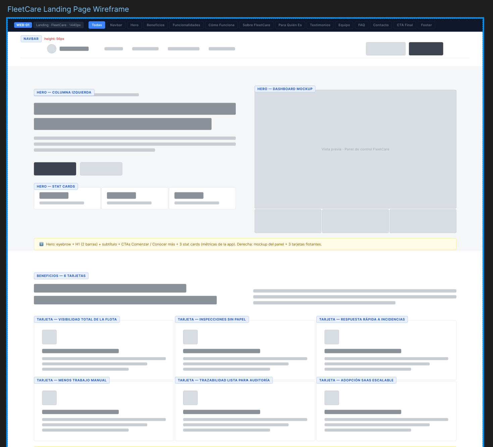
</div>

<br><br>

<p style="text-align: center;">
  Para visualizar el wireframe completo de la Landing Page, acceda al siguiente enlace:
</p>

<p style="text-align: center;">
  <a href="https://www.figma.com/design/2igQelwcvnmJhGW70oj8wd/FleetCare---2026?node-id=0-1&t=aSmGAcbW2VrASOvw-1" target="_blank">
    <b>Enlace Landing Page Wireframe</b>
  </a>
</p>


### **4.3.2. Landing Page Mockup**

<div style="text-align: center;">
  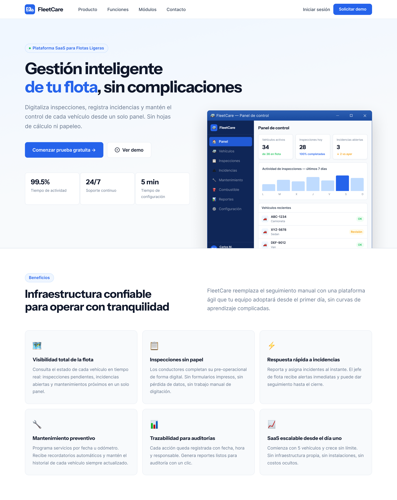
</div>

## **4.4. Web Applications UX/UI Design**
### **4.4.1. Web Applications Wireframes**

<div style="text-align: center;">
  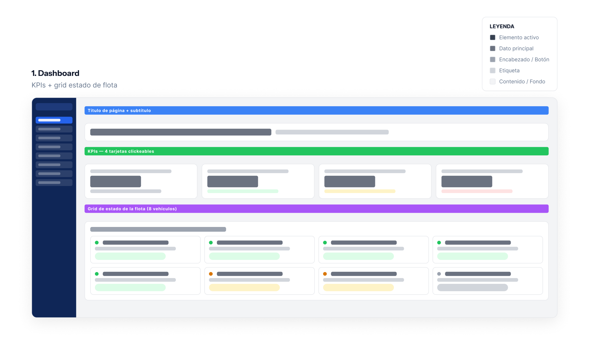
</div>

<br>

<div style="text-align: center;">
  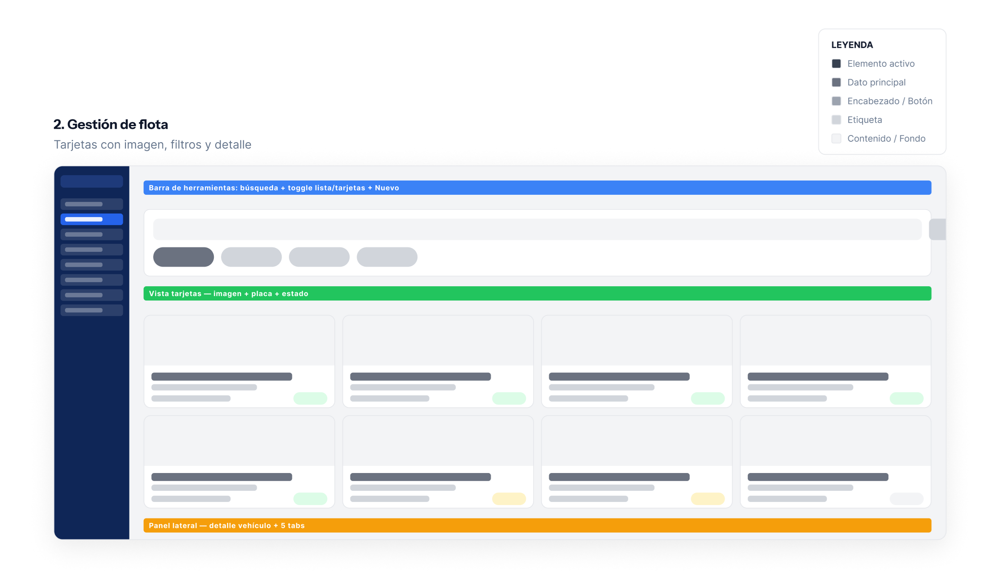
</div>

### **4.4.2. Web Applications Wireflow Diagrams**
### **4.4.3. Web Applications Mock-ups**

<div style="text-align: center;">
  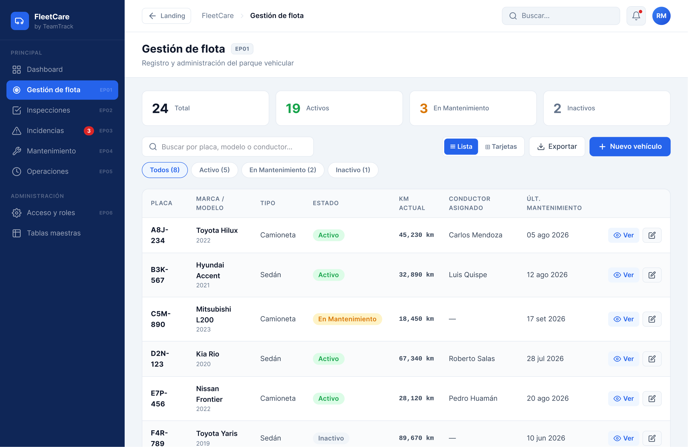
</div>

<br>

<div style="text-align: center;">
  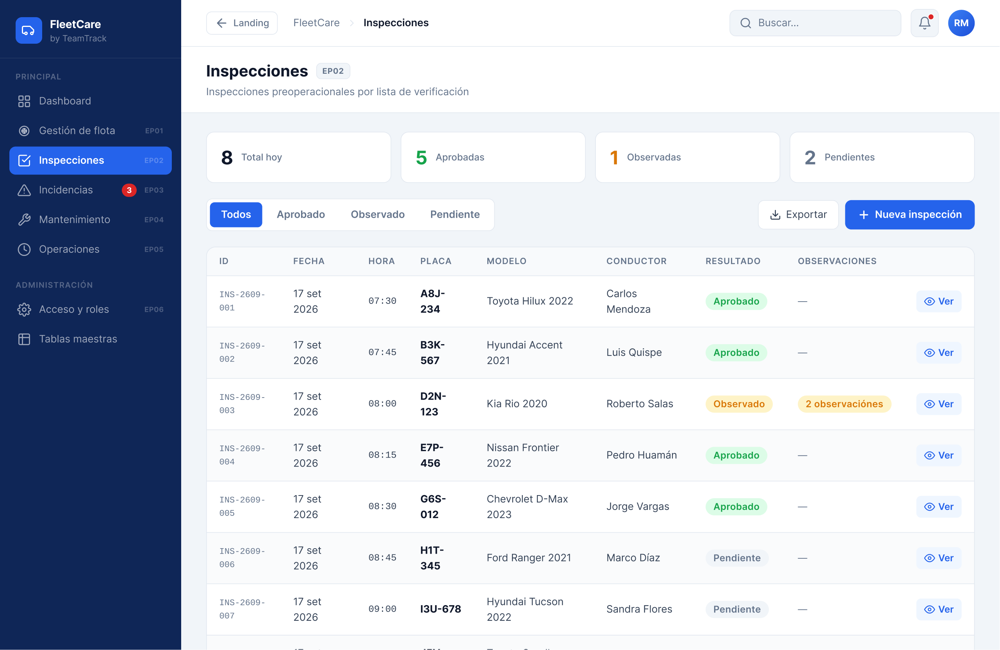
</div>

### **4.4.4. Web Applications User Flow Diagrams**

<div style="text-align: center; vertical-align: middle;"> 
  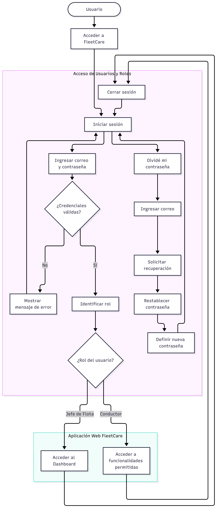
</div>

<br>

<div style="text-align: center; vertical-align: middle;"> 
  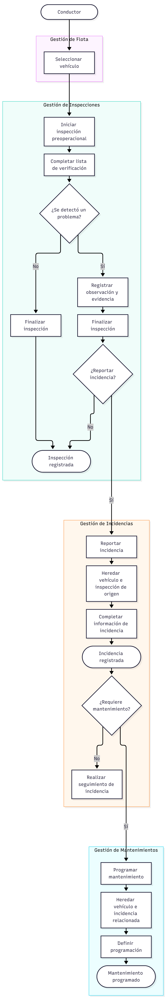
</div>

<br>

<div style="text-align: center; vertical-align: middle;"> 
  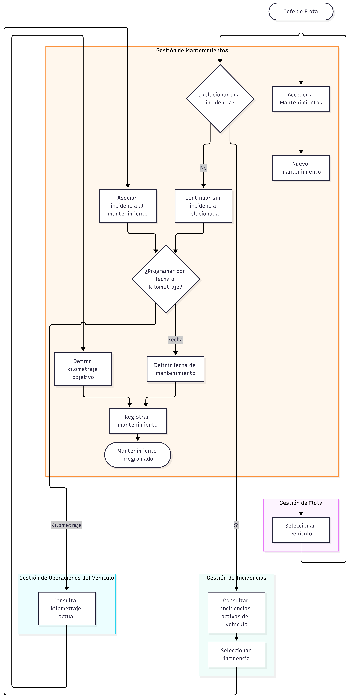
</div>

<br>

<div style="text-align: center; vertical-align: middle;"> 
  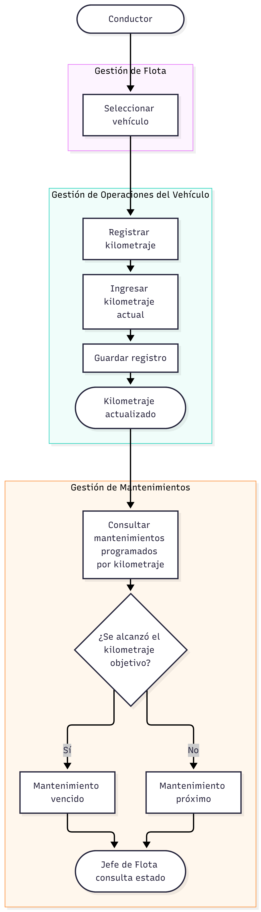
</div>

<br>

<div style="text-align: center; vertical-align: middle;"> 
  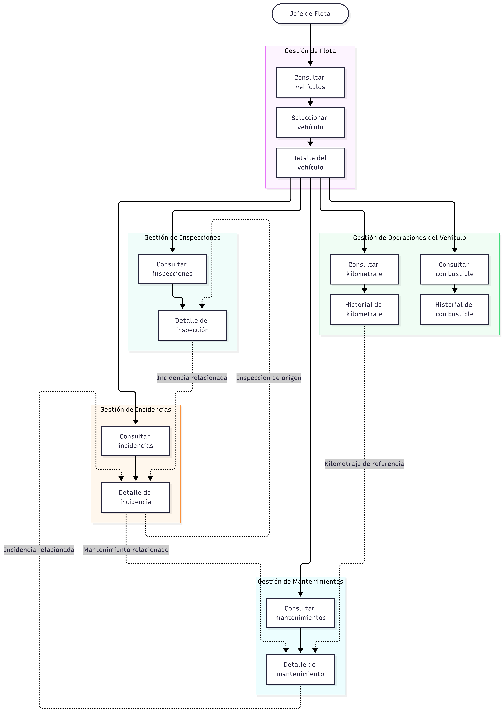
</div>


## **4.5. Web Applications Prototyping**
## **4.6. Domain-Driven Software Architecture**


### **4.6.1. Design-Level EventStorming**
### **4.6.2. Software Architecture Context Diagram**

<div style="text-align: center;">
  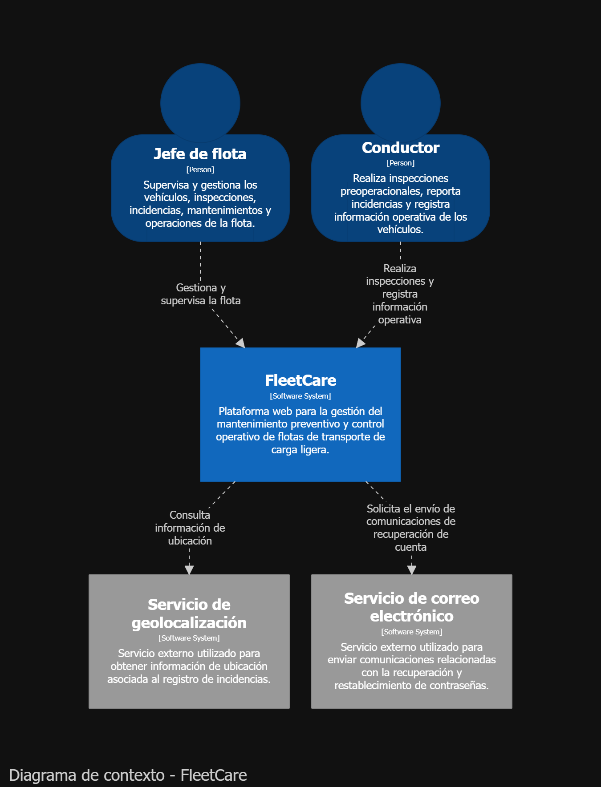
</div>

### **4.6.3. Software Architecture Container Diagrams**

<div style="text-align: center;">
  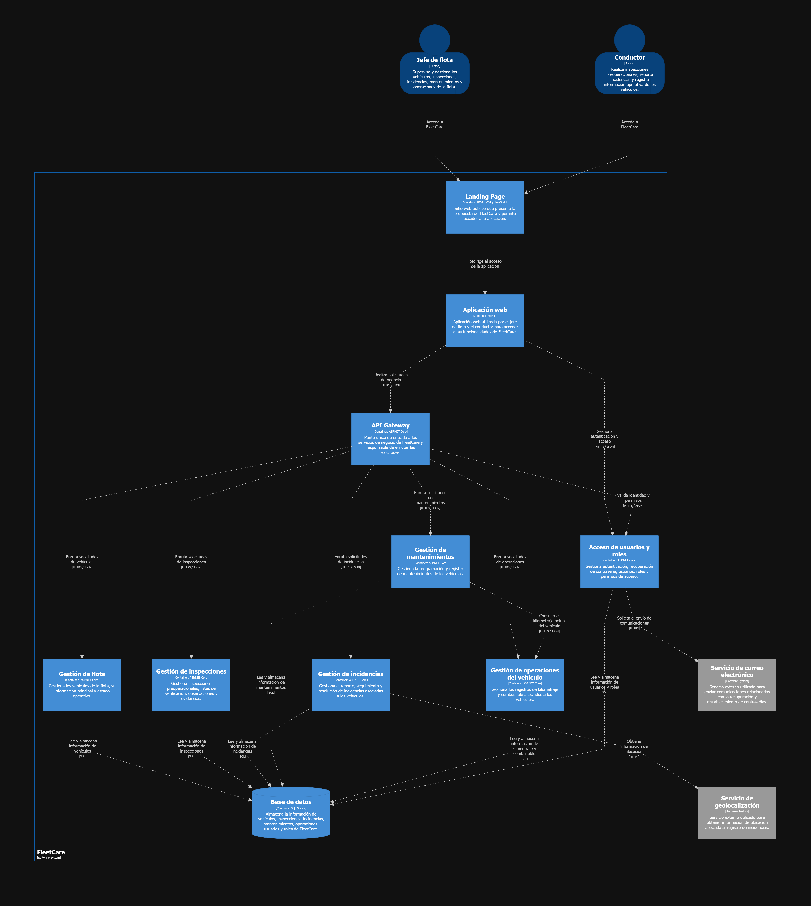
</div>

### **4.6.4. Software Architecture Components Diagrams**

<div style="text-align: center;">
  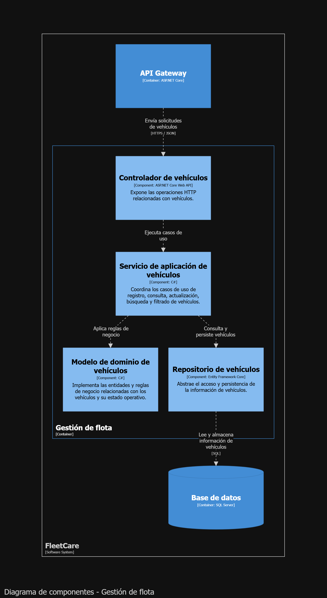
</div>
<br>
<div style="text-align: center;">
  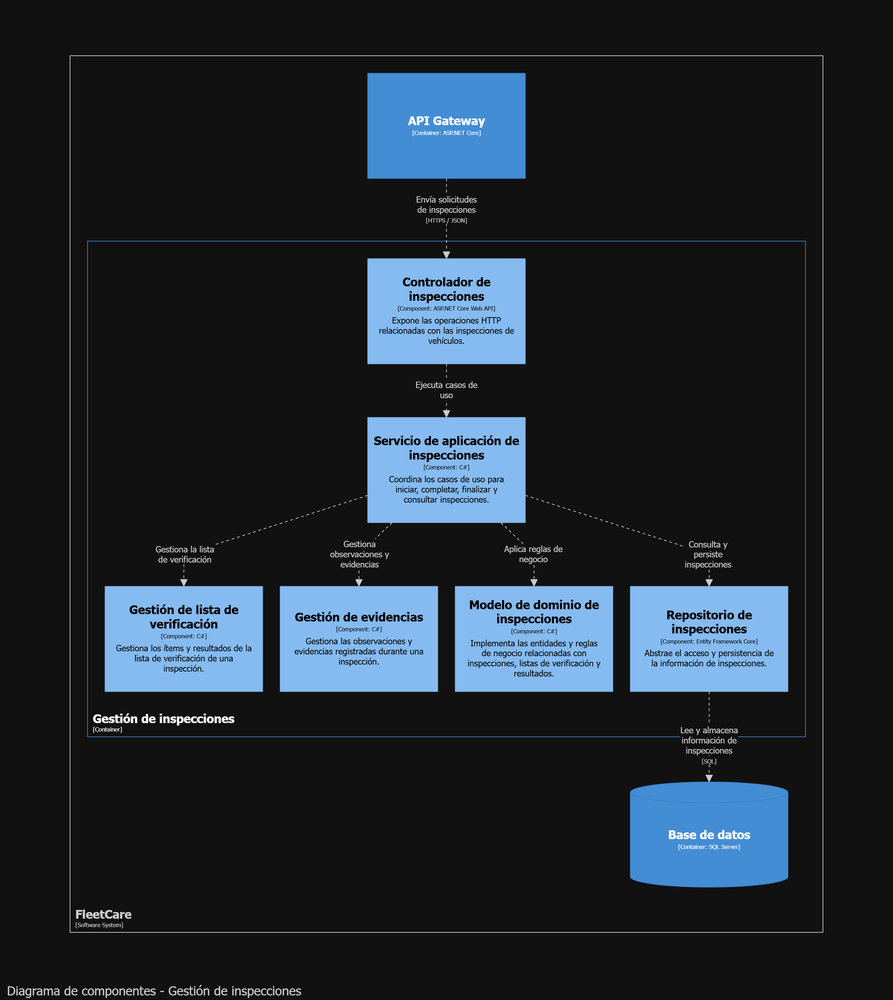
</div>

## **4.7. Object-Oriented Design Software**
### **4.7.1. Class Diagrams**

<div style="text-align: center;">
  
</div>

## **4.8. Database Design**
### **4.8.1. Database Diagrams**

<div style="text-align: center;">
  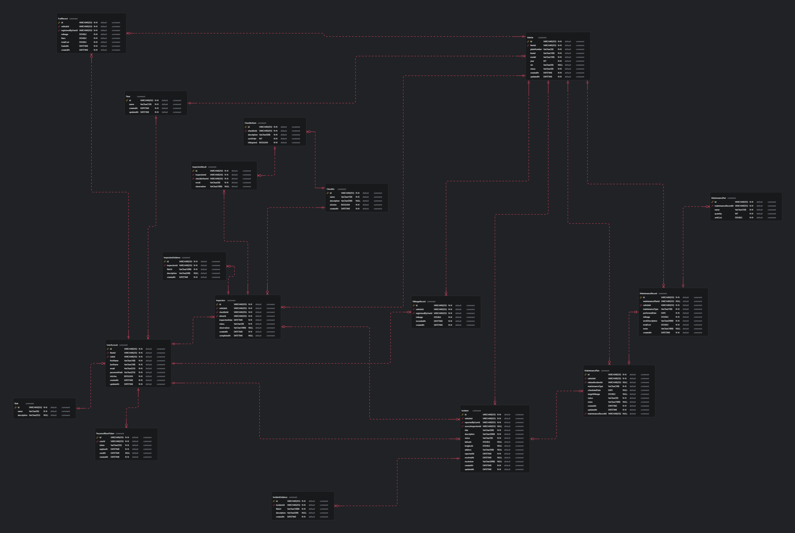
</div>

# **Chapter V: Product Implementation, Validation &amp; Deployment**


## **5.1. Configuration Management Software**

<p style="text-align: justify;">
  Esta sección describe las decisiones de gestión de configuración adoptadas durante el desarrollo de FleetCare, producto desarrollado por la startup TeamTrack. Estas decisiones comprenden el entorno de desarrollo, la gestión del código fuente, las convenciones de programación y la configuración de despliegue de los componentes desarrollados hasta la presente entrega.
</p>

<p style="text-align: justify;">
  En esta etapa, FleetCare comprende una Landing Page desarrollada con HTML, CSS y JavaScript, y una Web Application desarrollada como Single Page Application (SPA) utilizando Vue.js. La implementación de servicios backend no forma parte del alcance de la presente entrega.
</p>

### **5.1.1. Software Development Environment Configuration**

<p style="text-align: justify;">
  Para el entorno de desarrollo de FleetCare se utilizan herramientas orientadas al desarrollo web y al control colaborativo del código fuente. La configuración actual considera las tecnologías utilizadas en los componentes que se encuentran implementados o en desarrollo durante la presente etapa del proyecto.
</p>

<p style="text-align: justify;">
  El entorno de desarrollo incluye Visual Studio Code como editor de código, Git para el control de versiones y GitHub como plataforma para la administración de los repositorios remotos. Para la Landing Page se utilizan HTML, CSS y JavaScript.
</p>

**Development Tools:**

| Tool / Technology | Purpose |
|-------------------|---------|
| **Visual Studio Code** | Editor utilizado para el desarrollo y mantenimiento del código fuente |
| **Git** | Sistema de control de versiones utilizado para registrar y administrar los cambios realizados |
| **GitHub** | Plataforma utilizada para almacenar los repositorios y facilitar el trabajo colaborativo |
| **HTML** | Define la estructura de la Landing Page |
| **CSS** | Define los estilos visuales y el diseño responsive de la Landing Page |
| **JavaScript** | Proporciona el comportamiento e interactividad de la Landing Page |


<p style="text-align: justify;">
  Para la organización de las actividades del equipo se utiliza una herramienta de gestión de tareas que permite distribuir el trabajo entre los integrantes y realizar seguimiento al avance de las actividades correspondientes a cada Sprint. Asimismo, el equipo utiliza canales de comunicación para coordinar las actividades y resolver consultas durante el desarrollo.
</p>

<div style="page-break-after: always;"></div>

### **5.1.2. Source Code Management**

<p style="text-align: justify;">
  La gestión del código fuente de FleetCare se realiza utilizando Git como sistema de control de versiones y GitHub como plataforma para los repositorios remotos. Estas herramientas permiten mantener la trazabilidad de los cambios realizados y facilitar el trabajo colaborativo entre los integrantes de TeamTrack.
</p>

<p style="text-align: justify;">
  Los repositorios del proyecto se organizan de acuerdo con los diferentes entregables desarrollados. Esta separación permite administrar independientemente la documentación, la Landing Page y la Web Application de FleetCare.
</p>

<ul>
  <li>
    <b>Project Report Repository:</b><br>
    Contiene la documentación correspondiente al proyecto y sus diferentes capítulos.<br>
    <code>FLEETCARE_REPORT_REPOSITORY_URL</code>
  </li>
  <li>
    <b>Landing Page Repository:</b><br>
    Contiene el código fuente desarrollado con HTML, CSS y JavaScript para la Landing Page de FleetCare.<br>
    <code>FLEETCARE_LANDING_REPOSITORY_URL</code>
  </li>
</ul>

<p style="text-align: justify;">
  Durante el desarrollo se utiliza una estrategia de commits que permite identificar el propósito principal de cada cambio realizado. Para ello, los mensajes pueden utilizar prefijos que faciliten su clasificación y comprensión dentro del historial del repositorio.
</p>

**Commit Conventions:**

| Prefix | Usage |
|--------|-------|
| **feat** | Incorporación de una nueva funcionalidad |
| **fix** | Corrección de un defecto |
| **docs** | Cambios realizados sobre la documentación |
| **style** | Cambios de formato o estilos que no modifican la lógica |
| **refactor** | Reorganización del código sin modificar su comportamiento esperado |
| **chore** | Actividades de configuración o mantenimiento |
| **deploy** | Cambios relacionados con el despliegue |

**Examples:**

```text
feat: add vehicle list view
feat: implement incident form
fix: correct responsive navigation
docs: update product design section
style: update landing page layout
chore: configure vue project
deploy: publish landing page
```

<p style="text-align: justify;">
  En la presente etapa, los cambios realizados se concentran principalmente en la documentación del proyecto, el desarrollo de la Landing Page y el avance de la Web Application con Vue.js. No se incluyen todavía implementaciones correspondientes a servicios backend.
</p>

<div style="page-break-after: always;"></div>

### **5.1.3. Source Code Style Guide & Conventions**

<p style="text-align: justify;">
  Para mantener consistencia, legibilidad y facilidad de mantenimiento en el código fuente de FleetCare, se establecen convenciones de programación de acuerdo con las tecnologías utilizadas actualmente en el proyecto. Estas convenciones comprenden HTML, CSS y JavaScript para la Landing Page, además de Vue.js y JavaScript para la Web Application.
</p>

**HTML**

- **Standards:**
  - Uso de HTML semántico.
  - Indentación de 2 espacios.
  - Uso de comillas dobles para atributos.
  - Nombres descriptivos para identificadores y clases.
  - Uso apropiado de elementos como `<header>`, `<nav>`, `<main>`, `<section>`, `<article>` y `<footer>`.

**Example:**

```html
<section class="features">
  <h2>Fleet Management</h2>
  <p>Manage your fleet information from one place.</p>
</section>
```

**CSS**

- **Conventions:**
  - Indentación de 2 espacios.
  - Nombres de clases descriptivos.
  - Reutilización de estilos comunes.
  - Organización de estilos por componentes o secciones.
  - Uso de Media Queries para adaptar la interfaz a diferentes tamaños de pantalla.
  - Uso consistente de la paleta de colores y variables visuales definidas para FleetCare.

**Example:**

```css
.vehicle-card {
  display: flex;
  padding: 1rem;
  border-radius: 0.5rem;
}

@media (max-width: 768px) {
  .vehicle-card {
    flex-direction: column;
  }
}
```

**JavaScript**

- **Guidelines:**
  - Variables y funciones utilizando `camelCase`.
  - Uso de `const` como opción principal y `let` cuando el valor debe modificarse.
  - Se evita el uso de `var`.
  - Funciones y variables con nombres descriptivos.
  - Separación de responsabilidades entre funciones.
  - Uso de funciones flecha cuando resulte apropiado.

**Example:**

```javascript
const showVehicleDetails = (vehicleId) => {
  // Display the selected vehicle information
};
```

<div style="page-break-after: always;"></div>

**Vue.js**

<p style="text-align: justify;">
  Para la Web Application se utilizan convenciones orientadas a mantener los componentes organizados de acuerdo con las funcionalidades de FleetCare. La SPA se estructura considerando los principales dominios funcionales definidos para el producto.
</p>

- **Components:** Nombres de componentes utilizando `PascalCase`.

```text
VehicleCard.vue
InspectionForm.vue
IncidentDetail.vue
MaintenanceForm.vue
FuelRecordForm.vue
```

- **Variables and Functions:** Uso de `camelCase`.

```javascript
const selectedVehicle = ref(null);

const registerMileage = () => {
  // Register mileage information
};
```

- **Vue Directives:** Uso de las formas abreviadas cuando corresponda.

```html
<button @click="openVehicle">
  View Details
</button>

<VehicleCard :vehicle="selectedVehicle" />
```

- **Feature Organization:** Los componentes pueden organizarse de acuerdo con los dominios funcionales de FleetCare.

```text
src/
├── components/
│
├── views/
│
├── modules/
│   ├── fleet-management/
│   ├── inspection-management/
│   ├── incident-management/
│   ├── maintenance-management/
│   └── vehicle-operations/
│
├── router/
│
├── assets/
│
└── App.vue
```

<p style="text-align: justify;">
  Esta organización permite mantener una correspondencia entre la estructura de la SPA y los cinco Bounded Contexts definidos para FleetCare. User Access and Roles puede incorporarse como una capacidad compartida, mientras que Dashboard funciona como una vista transversal que consume información de los diferentes módulos.
</p>

**General Best Practices**

- Mantener responsabilidades claramente separadas entre componentes.
- Evitar duplicación innecesaria de código.
- Utilizar nombres descriptivos y consistentes.
- Mantener una estructura organizada de archivos y carpetas.
- Reutilizar componentes cuando representen comportamientos comunes.
- Mantener consistencia entre los nombres utilizados en la interfaz y los dominios funcionales definidos para FleetCare.

<p style="text-align: justify;">
  Estas convenciones permiten mantener una base de código consistente y preparada para evolucionar conforme se incorporen nuevas funcionalidades en posteriores entregas.
</p>

<div style="page-break-after: always;"></div>

### **5.1.4. Software Deployment Configuration**

<p style="text-align: justify;">
  En la presente entrega, la configuración de despliegue considera únicamente los componentes que han alcanzado un nivel de implementación que permite su publicación. La Landing Page puede desplegarse como un sitio web estático compuesto por HTML, CSS y JavaScript. La Web Application desarrollada con Vue.js continúa en desarrollo como SPA, por lo que su configuración de despliegue podrá actualizarse conforme avance su implementación.
</p>

**Landing Page Deployment**

**Deployment Steps:**

1. Clonar o descargar el repositorio correspondiente a la Landing Page.
2. Verificar los archivos HTML, CSS y JavaScript.
3. Publicar los archivos estáticos en el servicio de hosting seleccionado.
4. Verificar la correcta carga de los recursos utilizados por la página.
5. Validar el comportamiento responsive en diferentes tamaños de pantalla.
6. Verificar la correcta visualización de la Landing Page desde la URL pública.

**Repository:**

```text
FLEETCARE_LANDING_REPOSITORY_URL
```

**Deployment URL:**

```text
FLEETCARE_LANDING_DEPLOYMENT_URL
```

<div style="page-break-after: always;"></div>

**Project Report**

<p style="text-align: justify;">
  La documentación del proyecto se mantiene en un repositorio independiente, permitiendo registrar mediante control de versiones los cambios realizados en los diferentes capítulos y entregables académicos.
</p>

**Repository:**

```text
FLEETCARE_REPORT_REPOSITORY_URL
```

<p style="text-align: justify;">
  En el estado actual del proyecto, la Landing Page se desarrolla utilizando HTML, CSS y JavaScript, mientras que la Web Application continúa avanzando como una SPA desarrollada con Vue.js. La implementación y configuración de componentes adicionales, como servicios backend, se documentará únicamente cuando formen parte de una entrega posterior del proyecto.
</p>

<div style="page-break-after: always;"></div>

## **5.2. Landing Page, Services & Applications Implementation**

### **5.2.1. Sprint 1**

<p style="text-align: justify;">
  Sprint 1 de FleetCare estuvo orientado a establecer las bases iniciales del proyecto, avanzar con la documentación del Project Report y desarrollar la Landing Page del producto. Durante esta iteración, el equipo organizó las actividades del proyecto, consolidó los principales contenidos del reporte e implementó la Landing Page utilizando HTML, CSS y JavaScript.
</p>

<p style="text-align: justify;">
  El alcance de este Sprint se concentra exclusivamente en el Project Report y la Landing Page. Por ello, las evidencias de desarrollo, ejecución y despliegue presentadas en esta sección corresponden a estos entregables. La implementación de la Web Application y de otros componentes de software será considerada en los siguientes Sprints.
</p>

### **5.2.1.1. Sprint Planning 1**

<p style="text-align: justify;">
  Durante la planificación de Sprint 1, TeamTrack definió como objetivo avanzar con la documentación del proyecto y desarrollar una primera versión funcional de la Landing Page de FleetCare. Para ello, se organizaron las actividades relacionadas con la elaboración del Project Report, la implementación de la interfaz pública del producto y la preparación de las evidencias correspondientes a la iteración.
</p>

<p style="text-align: justify;">
  Las actividades fueron distribuidas entre los integrantes del equipo considerando las responsabilidades definidas para la Landing Page y el Project Report. Asimismo, se establecieron mecanismos de coordinación y seguimiento para mantener consistencia entre la propuesta del producto, su identidad visual y la documentación académica.
</p>

<div style="page-break-after: always;"></div>

<table style="margin: auto; table-layout: fixed; width: 80%;">
  <tr style="background-color: #d9d9d9;">
    <td>
      <b>Sprint #</b>
    </td>
    <td style="text-align: center;">
      1
    </td>
  </tr>
  <tr>
    <td style="text-align: center;" colspan="2">
      <b>Sprint Planning Background</b>
    </td>
  </tr>
  <tr>
    <td>
      <b>Date</b>
    </td>
    <td>
      09/09/2026
    </td>
  </tr>
  <tr>
    <td>
      <b>Time</b>
    </td>
    <td>
      8 PM
    </td>
  </tr>
  <tr>
    <td>
      <b>Location</b>
    </td>
    <td>
      Reunión virtual por Google Meet
    </td>
  </tr>
  <tr>
    <td>
      <b>Prepared By</b>
    </td>
    <td>
      TeamTrack
    </td>
  </tr>
  <tr>
    <td>
      <b>Attendees</b>
    </td>
    <td>
      TeamTrack Members
    </td>
  </tr>
  <tr>
    <td>
      <b>Sprint 1 Review Summary</b>
    </td>
    <td style="text-align: justify;">
      El Sprint se enfocó en el avance del Project Report y en el desarrollo de la Landing Page de FleetCare, incluyendo su estructura, contenido, diseño responsive e implementación con HTML, CSS y JavaScript.
    </td>
  </tr>
  <tr>
    <td>
      <b>Sprint 1 Retrospective Summary</b>
    </td>
    <td style="text-align: justify;">
      El equipo identificó avances en la organización y documentación del proyecto, así como en la implementación de la Landing Page. También se identificaron oportunidades para mejorar la coordinación de tareas y mantener una mayor consistencia entre los contenidos definidos en el reporte y su representación en la interfaz pública del producto.
    </td>
  </tr>
  <tr>
    <td style="text-align: center;" colspan="2">
      <b>Sprint Goal & User Stories</b>
    </td>
  </tr>
  <tr>
    <td>
      <b>Sprint 1 Goal</b>
    </td>
    <td style="text-align: justify;">
      Desarrollar y publicar la Landing Page de FleetCare para comunicar la propuesta de valor del producto y facilitar el acceso inicial a la plataforma, mientras se avanza con la documentación correspondiente al Project Report.
    </td>
  </tr>
  <tr>
    <td>
      <b>Sprint 1 Velocity</b>
    </td>
    <td>
      TO_BE_DEFINED
    </td>
  </tr>
  <tr>
    <td>
      <b>Sum of Story Points</b>
    </td>
    <td>
      TO_BE_DEFINED
    </td>
  </tr>
</table>

<div style="page-break-after: always;"></div>

### **5.2.1.2. Aspect Leaders and Collaborators**

<p style="text-align: justify;">
  Durante Sprint 1, las responsabilidades del equipo se organizaron considerando los dos principales aspectos trabajados durante la iteración: Landing Page y Project Report. Esta distribución permitió que los integrantes de TeamTrack asumieran responsabilidades específicas y colaboraran en las actividades necesarias para completar los entregables del Sprint.
</p>

<table>
  <thead>
    <tr>
      <th style="text-align: center;">Team Member</th>
      <th style="text-align: center;">Code</th>
      <th style="text-align: center;">Aspect 1: Landing Page</th>
      <th style="text-align: center;">Aspect 2: Project Report</th>
    </tr>
  </thead>
  <tbody>
    <tr>
      <td style="text-align: center;">Desarrollador 1</td>
      <td style="text-align: center;">TO_BE_DEFINED</td>
      <td style="text-align: center;">TO_BE_DEFINED</td>
      <td style="text-align: center;">TO_BE_DEFINED</td>
    </tr>
    <tr>
      <td style="text-align: center;">Desarrollador 2</td>
      <td style="text-align: center;">TO_BE_DEFINED</td>
      <td style="text-align: center;">TO_BE_DEFINED</td>
      <td style="text-align: center;">TO_BE_DEFINED</td>
    </tr>
    <tr>
      <td style="text-align: center;">Desarrollador 3</td>
      <td style="text-align: center;">TO_BE_DEFINED</td>
      <td style="text-align: center;">TO_BE_DEFINED</td>
      <td style="text-align: center;">TO_BE_DEFINED</td>
    </tr>
    <tr>
      <td style="text-align: center;">Desarrollador 4</td>
      <td style="text-align: center;">TO_BE_DEFINED</td>
      <td style="text-align: center;">TO_BE_DEFINED</td>
      <td style="text-align: center;">TO_BE_DEFINED</td>
    </tr>
    <tr>
      <td style="text-align: center;">Desarrollador 5</td>
      <td style="text-align: center;">TO_BE_DEFINED</td>
      <td style="text-align: center;">TO_BE_DEFINED</td>
      <td style="text-align: center;">TO_BE_DEFINED</td>
    </tr>
  </tbody>
</table>

<p style="text-align: justify;">
  Los valores correspondientes a Leader (L) y Collaborator (C) deberán completarse de acuerdo con la distribución final de responsabilidades realizada por TeamTrack durante Sprint 1.
</p>

<div style="page-break-after: always;"></div>

### **5.2.1.3. Sprint Backlog 1**

<p style="text-align: justify;">
  Sprint Backlog 1 reúne las User Stories y tareas seleccionadas para cumplir el objetivo de la primera iteración. El alcance funcional se concentra en la Landing Page de FleetCare, mientras que las actividades relacionadas con el Project Report permiten documentar las decisiones de negocio, requisitos, arquitectura de información, diseño y demás elementos definidos durante esta etapa.
</p>

<p style="text-align: justify;">
  Para la Landing Page se consideran las User Stories definidas para que un visitante pueda conocer la propuesta de FleetCare y acceder a las opciones iniciales de la plataforma. Las tareas específicas, responsables y estados deberán mantenerse alineados con el tablero de trabajo utilizado por TeamTrack.
</p>

<table style="margin: auto;">
  <thead>
    <tr>
      <th style="text-align: center;">User Story ID</th>
      <th style="text-align: center;">Title</th>
      <th style="text-align: center;">Task ID</th>
      <th style="text-align: center;">Task</th>
      <th style="text-align: center;">Description</th>
      <th style="text-align: center;">Assigned</th>
      <th style="text-align: center;">Status</th>
    </tr>
  </thead>
  <tbody>
    <tr>
      <td style="text-align: center;">US51</td>
      <td style="text-align: center;">Conocer la propuesta de FleetCare</td>
      <td style="text-align: center;">T01</td>
      <td style="text-align: center;">Implement Landing Page Content</td>
      <td style="text-align: justify;">
        Implementar las secciones de la Landing Page necesarias para presentar FleetCare, su propuesta de valor y sus principales funcionalidades.
      </td>
      <td style="text-align: center;">Desarrollador X</td>
      <td style="text-align: center;">TO_BE_DEFINED</td>
    </tr>
    <tr>
      <td style="text-align: center;">US51</td>
      <td style="text-align: center;">Conocer la propuesta de FleetCare</td>
      <td style="text-align: center;">T02</td>
      <td style="text-align: center;">Implement Responsive Design</td>
      <td style="text-align: justify;">
        Adaptar la Landing Page para mantener una correcta visualización en diferentes tamaños de pantalla.
      </td>
      <td style="text-align: center;">Desarrollador X</td>
      <td style="text-align: center;">TO_BE_DEFINED</td>
    </tr>
    <tr>
      <td style="text-align: center;">US52</td>
      <td style="text-align: center;">Acceder a FleetCare desde la página de inicio</td>
      <td style="text-align: center;">T03</td>
      <td style="text-align: center;">Implement Access Actions</td>
      <td style="text-align: justify;">
        Incorporar las acciones de acceso definidas en la Landing Page para orientar al visitante hacia el registro o ingreso a FleetCare.
      </td>
      <td style="text-align: center;">Desarrollador X</td>
      <td style="text-align: center;">TO_BE_DEFINED</td>
    </tr>
    <tr>
      <td style="text-align: center;">N/A</td>
      <td style="text-align: center;">Project Report</td>
      <td style="text-align: center;">T04</td>
      <td style="text-align: center;">Update Project Documentation</td>
      <td style="text-align: justify;">
        Elaborar y actualizar las secciones del Project Report correspondientes a los entregables definidos para Sprint 1.
      </td>
      <td style="text-align: center;">Desarrollador X</td>
      <td style="text-align: center;">TO_BE_DEFINED</td>
    </tr>
  </tbody>
</table>

<p style="text-align: justify;">
  Los identificadores de tareas, responsables y estados presentados deberán actualizarse de acuerdo con la información definitiva registrada en el Sprint Backlog del equipo.
</p>

<div style="page-break-after: always;"></div>

### **5.2.1.4. Development Evidence for Sprint Review**

<p style="text-align: justify;">
  Esta sección presenta las evidencias de desarrollo correspondientes a Sprint 1. Para la Landing Page, las evidencias se obtienen del historial de versiones del repositorio y permiten demostrar la implementación progresiva de la interfaz utilizando HTML, CSS y JavaScript. Para el Project Report, el historial del repositorio permite mantener trazabilidad sobre las actualizaciones realizadas en la documentación.
</p>

**Landing Page Repository:**

```text
FLEETCARE_LANDING_REPOSITORY_URL
```

**Project Report Repository:**

```text
FLEETCARE_REPORT_REPOSITORY_URL
```

<p style="text-align: justify;">
  Los commits seleccionados como evidencia deben corresponder a cambios realizados durante Sprint 1 y representar avances relevantes en la Landing Page o en la documentación del proyecto.
</p>

<table style="margin: auto;">
  <thead>
    <tr>
      <th style="text-align: center;">Repository</th>
      <th style="text-align: center;">Branch</th>
      <th style="text-align: center;">Commit Id</th>
      <th style="text-align: center;">Commit Message</th>
      <th style="text-align: center;">Committed on</th>
    </tr>
  </thead>
  <tbody>
    <tr>
      <td style="text-align: center;">FLEETCARE_LANDING_REPOSITORY</td>
      <td style="text-align: center;">BRANCH_NAME</td>
      <td style="text-align: center;">COMMIT_ID</td>
      <td style="text-align: center;">COMMIT_MESSAGE</td>
      <td style="text-align: center;">COMMIT_DATE</td>
    </tr>
    <tr>
      <td style="text-align: center;">FLEETCARE_LANDING_REPOSITORY</td>
      <td style="text-align: center;">BRANCH_NAME</td>
      <td style="text-align: center;">COMMIT_ID</td>
      <td style="text-align: center;">COMMIT_MESSAGE</td>
      <td style="text-align: center;">COMMIT_DATE</td>
    </tr>
    <tr>
      <td style="text-align: center;">FLEETCARE_REPORT_REPOSITORY</td>
      <td style="text-align: center;">BRANCH_NAME</td>
      <td style="text-align: center;">COMMIT_ID</td>
      <td style="text-align: center;">COMMIT_MESSAGE</td>
      <td style="text-align: center;">COMMIT_DATE</td>
    </tr>
  </tbody>
</table>

<p style="text-align: justify;">
  La tabla deberá completarse utilizando los commits reales seleccionados como evidencia del trabajo realizado durante la iteración.
</p>

<div style="page-break-after: always;"></div>

### **5.2.1.5. Execution Evidence for Sprint Review**

<p style="text-align: justify;">
  Como evidencia de ejecución de Sprint 1 se presenta la Landing Page de FleetCare en funcionamiento. Esta evidencia permite verificar la correcta visualización de las secciones implementadas, la presentación de la propuesta de valor del producto, las principales funcionalidades comunicadas al visitante y el comportamiento responsive de la interfaz.
</p>

<div style="text-align: center;">
  
  <p>
    Figure X. FleetCare Landing Page execution evidence.
  </p>
</div>

**Landing Page URL:**

```text
FLEETCARE_LANDING_DEPLOYMENT_URL
```

<p style="text-align: justify;">
  La evidencia visual deberá actualizarse utilizando una captura correspondiente a la versión final de la Landing Page presentada durante Sprint 1.
</p>

<div style="page-break-after: always;"></div>

### **5.2.1.6. Services Documentation Evidence for Sprint Review**

<p style="text-align: justify;">
  Durante Sprint 1 no se implementaron servicios backend ni endpoints REST, debido a que el alcance de la iteración estuvo limitado al Project Report y a la Landing Page de FleetCare.
</p>

<p style="text-align: justify;">
  Por esta razón, no corresponde presentar documentación de servicios mediante OpenAPI u otras herramientas de documentación de APIs en esta iteración. Esta sección se mantiene dentro de la estructura del reporte y será complementada en los Sprints posteriores cuando el desarrollo de FleetCare incorpore servicios que requieran documentación técnica.
</p>

<div style="page-break-after: always;"></div>

### **5.2.1.7. Software Deployment Evidence for Sprint Review**

<p style="text-align: justify;">
  Durante Sprint 1 se realizó el despliegue de la Landing Page de FleetCare como un sitio web estático desarrollado con HTML, CSS y JavaScript. El despliegue permite disponer de una versión pública del producto desde la cual los visitantes pueden conocer su propuesta de valor y las principales funcionalidades planteadas.
</p>

**Deployment Activities:**

- Verificación de la versión final de la Landing Page.

- Integración de los archivos HTML, CSS, JavaScript y recursos visuales.

- Configuración del servicio utilizado para la publicación del sitio.

- Publicación de la Landing Page.

- Verificación del acceso mediante la URL pública.

- Validación de la visualización responsive en diferentes tamaños de pantalla.

**Landing Page Repository:**

```text
FLEETCARE_LANDING_REPOSITORY_URL
```

**Landing Page Deployment URL:**

```text
FLEETCARE_LANDING_DEPLOYMENT_URL
```

<div style="text-align: center;">
  
  <p>
    Figure X. FleetCare Landing Page deployment evidence.
  </p>
</div>

<p style="text-align: justify;">
  La URL y la evidencia gráfica deberán actualizarse con los recursos definitivos utilizados por TeamTrack para el despliegue de Sprint 1.
</p>

<div style="page-break-after: always;"></div>

### **5.2.1.8. Team Collaboration Insights during Sprint**

<p style="text-align: justify;">
  Durante Sprint 1, los integrantes de TeamTrack trabajaron colaborativamente en el desarrollo de la Landing Page y en la elaboración del Project Report. Las actividades fueron distribuidas de acuerdo con las responsabilidades establecidas durante la planificación, permitiendo que cada integrante participe en la construcción de los entregables de la iteración.
</p>

<p style="text-align: justify;">
  La coordinación del equipo permitió mantener consistencia entre la propuesta de valor de FleetCare presentada en la Landing Page y la información documentada en el Project Report. Asimismo, el uso de control de versiones permitió integrar los cambios realizados por los diferentes integrantes y mantener trazabilidad sobre la evolución de ambos entregables.
</p>

<p style="text-align: justify;">
  Para realizar el seguimiento de las actividades, TeamTrack utilizó un tablero de gestión de tareas en el que se organizaron las actividades pendientes, en progreso y completadas durante Sprint 1. Este mecanismo permitió visualizar el avance de la iteración y coordinar las responsabilidades del equipo.
</p>

<div style="text-align: center;">
  
  <p>
    Figure X. TeamTrack collaboration evidence during Sprint 1.
  </p>
</div>

**Task Management Board:**

```text
TEAMTRACK_TASK_BOARD_URL
```

<p style="text-align: justify;">
  La evidencia del tablero deberá actualizarse con una captura y la URL correspondiente a la herramienta utilizada por TeamTrack durante Sprint 1.
</p>

<div style="page-break-after: always;"></div>


# **Conclusions**

## **Conclusions and Recommendations**

**Conclusions**

**Recommendations**

## **Video About-the-Team**

> [**Video About-the-Team**](url.com)

<div style="text-align: center;">
  
</div>

<div style="page-break-after: always;"></div>

# **Bibliography**


# **Annexes**


