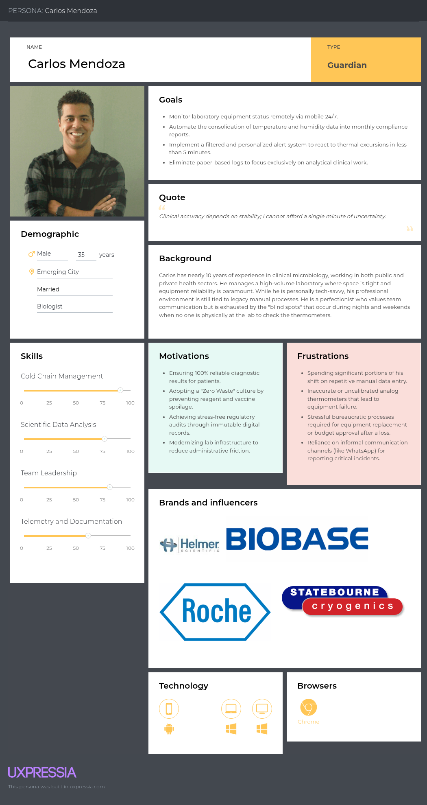
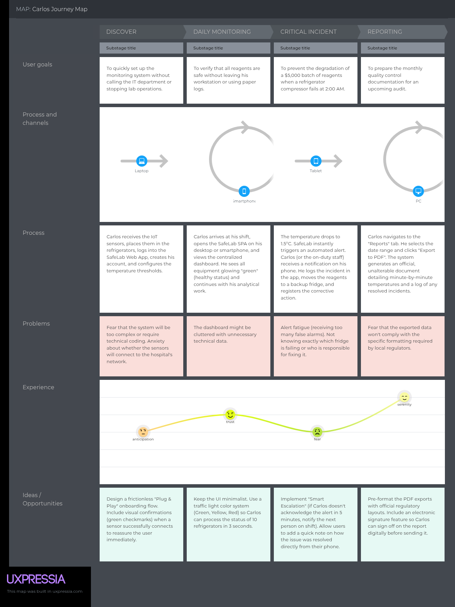
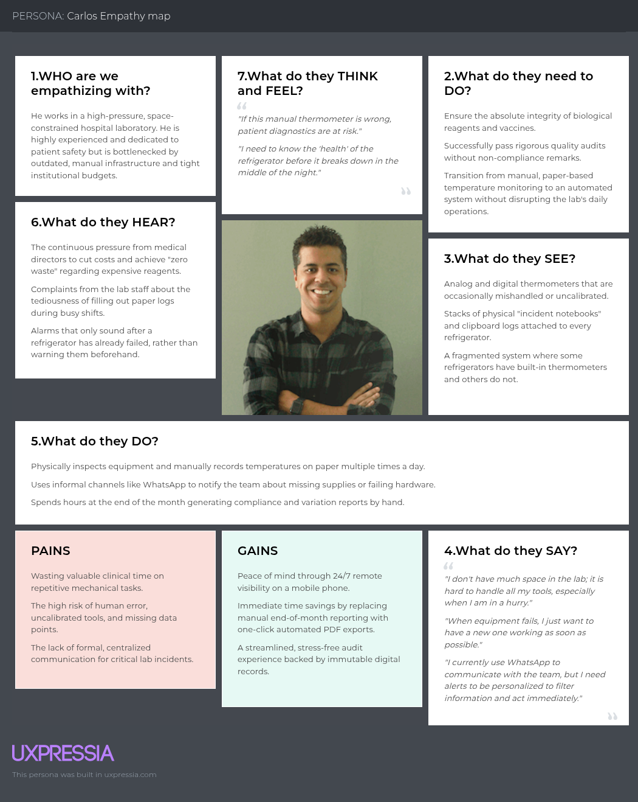

<div align="center">
  

  <p style="text-align: center;">
    Universidad Peruana de Ciencias Aplicadas
  </p>

  <p style="text-align: center;">
    Facultad de Ingeniería
  </p>

  <p style="text-align: center;">
    Ingeniería de Software
  </p>

  <p style="text-align: center;">
    Ciclo: 202620
  </p>

  <p style="text-align: center;">
    Código del curso
: 1ASI0730
  </p>

  <p style="text-align: center;">
    Nombre del curso
: Aplicaciones Web
  </p>

  <p style="text-align: center;">
    NRC: 8137
  </p>

  <p style="text-align: center;">
    Docente: Hugo Allan Mori Paiva
  </p>

  <p style="text-align: center;">
    AV1
  </p>

  <p style="text-align: center;">
    Startup Name: TeamTrack
  </p>
  
  <p style="text-align: center;">
    Product Name: FleetCare 
  </p>

  <table>
    <thead>
      <tr>
        <th style="
        text-align: center;
        background-color: #333;
        color: #fff;">
          Apellidos y Nombres
        </th>
        <th style="
        text-align: center;
        background-color: #333;
        color: #fff;">
          Código de estudiante
        </th>
      </tr>
    </thead>
    <tbody>
      <tr>
        <td>
          Diaz Vargas, Fernanda Ysabella 
        </td>
        <td style="text-align: center;">
          U...
        </td>
      </tr>
      <tr>
        <td>
          Echevarria Lizana, Santiago Israel 
        </td>
        <td style="text-align: center;">
          U...
        </td>
      </tr>
      <tr>
        <td>
          Espiritu Silvestre, Fernando Carlos 
        </td>
        <td style="text-align: center;">
          U...
        </td>
      </tr>
      <tr>
        <td>
          Romero Veliz, Matthias Alonso 
        </td>
        <td style="text-align: center;">
          U...
        </td>
      </tr>
      <tr>
        <td>
          Orosco Ttamiña, Juan Carlos
        </td>
        <td style="text-align: center;">
          U202414840
        </td>
      </tr>
    </tbody>
  </table>

  <p style="text-align: center;">
    Setiembre 2026
  </p>
</div>

# **Report Version Log**

<table style="width: 100%; border-collapse: collapse; margin: auto; table-layout: fixed; width: 100%;">
  <!-- ROW 0 -->
  <tr>
    <th style="text-align: center;">
      Version
    </th>
    <th style="text-align: center;">
      Date
    </th>
    <th style="text-align: center;">
      Author
    </th>
    <th style="text-align: center;" width="50%">
      Description of modification
    </th>
  </tr>
  <!-- ROW 1 -->
  <tr>
    <td style="text-align: center;">
      1.0.1
    </td>
    <td style="text-align: center;">
      10/09/2026
    </td>
    <td style="text-align: center;">
      Fernanda Ysabella Diaz Vargas
    </td>
    <td style="text-align: justify;">
      Se completaron la arquitectura orientada al dominio, los diagramas de clases UML, el diseño de la base de datos, la organización del repositorio, la coordinación del equipo y el desarrollo de la base de la página de aterrizaje.
    </td>
  </tr>
  <!-- ROW 2 -->
  <tr>
    <td style="text-align: center;">
      1.0.2
    </td>
    <td style="text-align: center;">
      10/09/2026
    </td>
    <td style="text-align: center;">
      Santiago Israel Echevarria Lizana
    </td>
    <td style="text-align: justify;">
      Sistema de diseño UI/UX completo, que incluye esquemas de estructura (*wireframes*), maquetas de alta fidelidad (versiones para escritorio y móviles) y diagramas de flujo (*wireflows* y flujos de usuario) para las 11 vistas de la aplicación: Panel de control, Perfiles de usuario, Facturación, Inventario, Sensores, Cumplimiento normativo, Alertas, Control remoto, Informes, Gestión de identidades y Auditoría y trazabilidad.
    </td>
  </tr>
  <!-- ROW 3 -->
  <tr>
    <td style="text-align: center;">
      1.0.3
    </td>
    <td style="text-align: center;">
      10/09/2026
    </td>
    <td style="text-align: center;">
      Fernando Carlos Espiritu Silvestre
    </td>
    <td style="text-align: justify;">
      Descripción completa de la startup, perfil de la solución, segmento objetivo, competidores, entrevistas e identificación de necesidades.
    </td>
 <!-- ROW 4 -->
<tr>
  <td style="text-align: center;">
    1.0.5
  </td>
  <td style="text-align: center;">
    10/09/2026
  </td>
  <td style="text-align: center;">
    Matthias Alonso Romero Veliz
  </td>
  <td style="text-align: justify;">
    Se desarrolló el Capítulo V: Implementación, validación y despliegue del producto. Esta sección documentó la configuración del entorno, el control de versiones, las convenciones de codificación y el despliegue. Asimismo, se integraron evidencias del desarrollo (confirmaciones de cambios o *commits*, repositorio) y el despliegue de la página de aterrizaje (*landing page*).
  </td>
</tr>
  <!-- ROW 5 -->
  <tr>
    <td style="text-align: center;">
      1.3.0
    </td>
    <td style="text-align: center;">
      10/09/2026
    </td>
    <td style="text-align: center;">
      Orosco Ttamiña, Juan Carlos
    </td>
    <td style="text-align: justify;">
      Requirements Specification. In this section, user stories were defined to represent the main functionalities based on user needs. Impact mapping was also created to connect business goals with users and system features. Finally, the Product Backlog was organized, prioritized, and estimated using the Fibonacci scale to support the development process.
    </td>
  </tr>
  <!-- ROW 6 -->

  <!-- ROW 7 -->

  <!-- ROW 8 -->

  <!-- ROW 9 -->

  <!-- ROW 10 -->

</table>

# **Project Report Collaboration Insights**

<p align="center">
  
</p>

<p align="center">
  
</p>

<p align="center">
  
</p>

<p align="center">
  
</p>

<p align="center">
  
</p>

<p align="center">
  
</p>

# **Content**
## **Table of Contents**

- [**Cover**](00-cover.md)
- [**Report Version Log**](01-logs.md#report-version-log)
- [**Project Report Collaboration Insights**](02-insights.md#project-report-collaboration-insights)
- [**Content**](03-content.md#content)
  - [Table of Contents](03-content.md#table-of-contents)
- [**Student Outcome**](04-outcome.md#student-outcome)
- [**Chapter I: Introduction**](05-chapter-1.md#chapter-i-introduction)
  - [1.1. Startup Profile](05-chapter-1.md#11-startup-profile)
    - [1.1.1. Startup Description](05-chapter-1.md#111-startup-description)
    - [1.1.2. Team Member Profiles](05-chapter-1.md#112-team-member-profiles)
  - [1.2. Solution Profile](05-chapter-1.md#12-solution-profile)
    - [1.2.1 Background and Problem Statement](05-chapter-1.md#121-background-and-problem-statement)
    - [1.2.2 Lean UX Process](05-chapter-1.md#122-lean-ux-process)
      - [1.2.2.1. Lean UX Problem Statements](05-chapter-1.md#1221-lean-ux-problem-statements)
      - [1.2.2.2. Lean UX Assumptions](05-chapter-1.md#1222-lean-ux-assumptions)
      - [1.2.2.3. Lean UX Hypothesis Statements](05-chapter-1.md#1223-lean-ux-hypothesis-statements)
      - [1.2.2.4. Lean UX Canvas](05-chapter-1.md#1224-lean-ux-canvas)
  - [1.3. Target Segments](05-chapter-1.md#13-target-segments)
- [**Chapter II: Requirements Elicitation & Analysis**](06-chapter-2.md#chapter-ii-requirements-elicitation--analysis)
  - [2.1. Competitors](06-chapter-2.md#21-competitors)
    - [2.1.1. Competitive Analysis](06-chapter-2.md#211-competitive-analysis)
    - [2.1.2. Strategies and Tactics Against Competitors](06-chapter-2.md#212-strategies-and-tactics-against-competitors)
  - [2.2. Interviews](06-chapter-2.md#22-interviews)
    - [2.2.1. Interview Design](06-chapter-2.md#221-interview-design)
    - [2.2.2. Interview Recording](06-chapter-2.md#222-interview-recording)
    - [2.2.3. Interview Analysis](06-chapter-2.md#223-interview-analysis)
  - [2.3. Needfinding](06-chapter-2.md#23-needfinding)
    - [2.3.1. User Personas](06-chapter-2.md#231-user-personas)
    - [2.3.2. User Task Matrix](06-chapter-2.md#232-user-task-matrix)
    - [2.3.3. User Journey Mapping](06-chapter-2.md#233-user-journey-mapping)
    - [2.3.4. Empathy Mapping](06-chapter-2.md#234-empathy-mapping)
  - [2.4. Big Picture Event Storming](06-chapter-2.md#24-big-picture-event-storming)
  - [2.5. Ubiquitous Language](06-chapter-2.md#25-ubiquitous-language)
- [**Chapter III: Requirements Specification**](07-chapter-3.md#chapter-iii-requirements-specification)
  - [3.1. User Stories](07-chapter-3.md#31-user-stories)
  - [3.2. Impact Mapping](07-chapter-3.md#32-impact-mapping)
  - [3.3. Product Backlog](07-chapter-3.md#33-product-backlog)
- [**Chapter IV: Product Design**](08-chapter-4.md#chapter-iv-product-design)
  - [4.1. Style Guidelines](08-chapter-4.md#41-style-guidelines)
    - [4.1.1. General Style Guidelines](08-chapter-4.md#411-general-style-guidelines)
    - [4.1.2. Web Style Guidelines](08-chapter-4.md#412-web-style-guidelines)
  - [4.2. Information Architecture](08-chapter-4.md#42-information-architecture)
    - [4.2.1. Organization Systems](08-chapter-4.md#421-organization-systems)
    - [4.2.2. Labeling Systems](08-chapter-4.md#422-labeling-systems)
    - [4.2.3. SEO Tags and Meta Tags](08-chapter-4.md#423-seo-tags-and-meta-tags)
    - [4.2.4. Searching Systems](08-chapter-4.md#424-searching-systems)
    - [4.2.5. Navigation Systems](08-chapter-4.md#425-navigation-systems)
  - [4.3. Landing Page UI Design](08-chapter-4.md#43-landing-page-ui-design)
    - [4.3.1. Landing Page Wireframe](08-chapter-4.md#431-landing-page-wireframe)
    - [4.3.2. Landing Page Mockup](08-chapter-4.md#432-landing-page-mockup)
  - [4.4. Web Applications UX/UI Design](08-chapter-4.md#44-web-applications-uxui-design)
    - [4.4.1. Web Applications Wireframes](08-chapter-4.md#441-web-applications-wireframes)
    - [4.4.2. Web Applications Wireflow Diagrams](08-chapter-4.md#442-web-applications-wireflow-diagrams)
    - [4.4.3. Web Applications Mock-ups](08-chapter-4.md#443-web-applications-mock-ups)
    - [4.4.4. Web Applications User Flow Diagrams](08-chapter-4.md#444-web-applications-user-flow-diagrams)
  - [4.5. Web Applications Prototyping](08-chapter-4.md#45-web-applications-prototyping)
  - [4.6. Domain-Driven Software Architecture](08-chapter-4.md#46-domain-driven-software-architecture)
    - [4.6.1. Design-Level EventStorming](08-chapter-4.md#461-design-level-eventstorming)
    - [4.6.2. Software Architecture Context Diagram](08-chapter-4.md#462-software-architecture-context-diagram)
    - [4.6.3. Software Architecture Container Diagrams](08-chapter-4.md#463-software-architecture-container-diagrams)
    - [4.6.4. Software Architecture Components Diagrams](08-chapter-4.md#464-software-architecture-components-diagrams)
  - [4.7. Object-Oriented Design Software](08-chapter-4.md#47-object-oriented-design-software)
    - [4.7.1. Class Diagrams](08-chapter-4.md#471-class-diagrams)
  - [4.8. Database Design](08-chapter-4.md#48-database-design)
    - [4.8.1. Database Diagrams](08-chapter-4.md#481-database-diagrams)
- [**Chapter V: Product Implementation, Validation & Deployment**](09-chapter-5.md#chapter-v-product-implementation-validation--deployment)
  - [5.1. Configuration Management Software](09-chapter-5.md#51-configuration-management-software)
    - [5.1.1. Software Development Environment Configuration](09-chapter-5.md#511-software-development-environment-configuration)
    - [5.1.2. Source Code Management](09-chapter-5.md#512-source-code-management)
    - [5.1.3. Source Code Style Guide & Conventions](09-chapter-5.md#513-source-code-style-guide--conventions)
    - [5.1.4. Software Deployment Configuration](09-chapter-5.md#514-software-deployment-configuration)
  - [5.2. Landing Page, Services & Applications Implementation](09-chapter-5.md#52-landing-page-services--applications-implementation)
    - [5.2.X. Sprint n](09-chapter-5.md#52x-sprint-n)
      - [5.2.X.1. Sprint Planning n](09-chapter-5.md#52x1-sprint-planning-n)
      - [5.2.X.2. Aspect Leaders and Collaborators](09-chapter-5.md#52x2-aspect-leaders-and-collaborators)
      - [5.2.X.3. Sprint Backlog n](09-chapter-5.md#52x3-sprint-backlog-n)
      - [5.2.X.4. Development Evidence for Sprint Review](09-chapter-5.md#52x4-development-evidence-for-sprint-review)
      - [5.2.X.5. Execution Evidence for Sprint Review](09-chapter-5.md#52x5-execution-evidence-for-sprint-review)
      - [5.2.X.6. Services Documentation Evidence for Sprint Review](09-chapter-5.md#52x6-services-documentation-evidence-for-sprint-review)
      - [5.2.X.7. Software Deployment Evidence for Sprint Review](09-chapter-5.md#52x7-software-deployment-evidence-for-sprint-review)
      - [5.2.X.8. Team Collaboration Insights during Sprint](09-chapter-5.md#52x8-team-collaboration-insights-during-sprint)
  - [5.3. Validation Interviews](09-chapter-5.md#53-validation-interviews)
    - [5.3.1. Interview Design](09-chapter-5.md#531-interview-design)
    - [5.3.2. Interview Recording](09-chapter-5.md#532-interview-recording)
    - [5.3.3. Evaluations Based on Heuristics](09-chapter-5.md#533-evaluations-based-on-heuristics)
  - [5.4. About-the-Product Video](09-chapter-5.md#54-about-the-product-video)
- [**Conclusions**](10-conclusions.md#conclusions)
  - [Conclusions and recommendations](10-conclusions.md#conclusions-and-recommendations)
  - [Video About-the-Team](10-conclusions.md#video-about-the-team)
- [**Bibliography**](11-bibliography.md#bibliography)
- [**Annexes**](12-annexes.md#annexes)

# **Student Outcome**

<p style="text-align: justify;">
  This course contributes to the achievement of ABET Student Outcome 5:
</p>

<p style="text-align: justify;">
  <b>ABET – EAC - Student Outcome 5</b>
  Criterion: The ability to function effectively in a team whose members together provide leadership, create a collaborative and inclusive environment, set goals, plan tasks, and achieve objectives.
</p>

<table style="width: 100%; border-collapse: collapse;">
  <!-- ROW 0 -->
  <tr>
    <th style="text-align: center;">Specific Criterion</th>
    <th style="text-align: center;">Actions Performed</th>
    <th style="text-align: center;">Conclusions</th>
  </tr>
  
  <!-- ROW 1 -->
  <tr>
    <td style="text-align: justify; vertical-align: top;">
      <b>
        Works as a team to provide joint leadership
      </b>
    </td>
    <td style="text-align: justify;">
      <b>
        Fernanda Ysabella Diaz Vargas
      </b>
      <br><br>
      <b><i>
        AV1
      </i></b>
      <br>
        (replace content)
      <br><br>
        ------------------------------------
      <br><br>
      <b>
        Santiago Israel Echevarria Lizana
      </b>
      <br><br>
      <b><i>
        AV1
      </i></b>
      <br>
        (replace content)
      <br><br>
        ------------------------------------
      <br><br>
        <b>
          Fernando Carlos Espiritu Silvestre
        </b>
      <br><br>
      <b><i>
        AV1
      </i></b>
      <br>
        (replace content)
      <br><br>
        ------------------------------------
      <br><br>
      <b>
        Matthias Alonso Romero Veliz
      </b>
      <br><br>
      <b><i>
        AV1
      </i></b>
      <br>
         (replace content)
      <br><br>
        ------------------------------------
      <br><br>
      <b>
        Orosco Ttamiña, Juan Carlos
      </b>
      <br><br>
      <b><i>
        AV1
      </i></b>
      <br>
        (replace content)
      <br><br>
        ------------------------------------
    </td>
    <td style="text-align: justify; vertical-align: top;">
      <b><i>
        AV1
      </i></b>
      <br>
        Durante la fase AV1, el equipo demostró un liderazgo compartido al distribuir las responsabilidades según las fortalezas de cada integrante y coordinar esfuerzos en las áreas estratégica, técnica y de diseño del proyecto. Este liderazgo se reflejó en la gestión del repositorio, la planificación de tareas, el desarrollo de la arquitectura, la dirección de UI/UX, la coordinación de la implementación del producto y la definición de requisitos mediante *epics* e historias de usuario. Cada miembro contribuyó de manera proactiva dentro de su ámbito asignado, manteniendo la comunicación y la colaboración, lo que permitió al equipo avanzar con eficiencia y alcanzar los objetivos planificados para la primera entrega.
      <br><br>
        ------------------------------------
    </td>
  </tr>
  
  <!-- ROW 2 -->
  <tr>
    <td style="text-align: justify; vertical-align: top;">
      <b>
        Creates a collaborative & inclusive environment, sets goals, plans tasks, and meets objectives
      </b>
    </td>
    <td style="text-align: justify;">
      <b>
        Fernanda Ysabella Diaz Vargas
      </b>
      <br><br>
      <b><i>
        AV1
      </i></b>
      <br>
        (replace content)
      <br><br>
        ------------------------------------
      <br><br>
      <b>
        Santiago Israel Echevarria Lizana
      </b>
      <br><br>
      <b><i>
        AV1
      </i></b>
      <br>
        (replace content)
      <br><br>
        ------------------------------------
      <br><br>
        <b>
          Fernando Carlos Espiritu Silvestre
        </b>
      <br><br>
      <b><i>
        AV1
      </i></b>
      <br>
        (replace content)
      <br><br>
        ------------------------------------
      <br><br>
      <b>
        Matthias Alonso Romero Veliz
      </b>
      <br><br>
      <b><i>
        AV1
      </i></b>
      <br>
        (replace content)
      <br><br>
        ------------------------------------
      <br><br>
      <b>
        Orosco Ttamiña, Juan Carlos
      </b>
      <br><br>
      <b><i>
        AV1
      </i></b>
      <br>
        Durante esta fase, mantuvimos un entorno de trabajo colaborativo e inclusivo, utilizando WhatsApp y Discord para coordinar reuniones y GitHub para trabajar en paralelo. Definimos objetivos desde el principio, organizamos las tareas y trabajamos en equipo para alcanzarlas. Además, mi contribución y apoyo en el proceso de elaboración de informes ayudaron a que todo fluyera mejor y a mantener al equipo coordinado.
      <br><br>
        ------------------------------------
        ------------------------------------
    </td>
    <td style="text-align: justify; vertical-align: top;">
      <b><i>
        AV1
      </i></b>
      <br>
        Durante la fase AV1, el equipo fomentó un entorno colaborativo e inclusivo mediante una comunicación constante, el intercambio de retroalimentación y la coordinación de tareas a través de herramientas digitales como GitHub, Trello, WhatsApp y Discord. Los miembros del equipo definieron objetivos e hitos claros para las actividades de diseño, arquitectura, documentación e investigación, asignando las responsabilidades en función de las fortalezas individuales. Esta planificación organizada y el flujo de trabajo cooperativo permitieron al equipo integrar eficazmente todos los entregables y cumplir con los objetivos establecidos para el primer hito del proyecto.
      <br><br>
        ------------------------------------
    </td>
  </tr>
</table>

# **Chapter I: Introduction**
## **1.1. Startup Profile**
### **1.1.1. Startup Description**

<p style="text-align: justify;">

  TeamTrack es una startup tecnológica orientada al desarrollo de soluciones digitales para mejorar la gestión y operación de pequeñas empresas de transporte y logística. La iniciativa surge ante la necesidad de facilitar el control de flotas de carga ligera, donde la información relacionada con vehículos, kilometraje, mantenimiento e incidencias suele encontrarse dispersa o registrarse mediante procesos manuales. Como primer producto, TeamTrack desarrolla FleetCare, una plataforma enfocada en centralizar esta información y facilitar el seguimiento del estado operativo de los vehículos.

</p>

<p style="text-align: justify;">

  La propuesta de valor de TeamTrack se centra en brindar a las pequeñas empresas de transporte una herramienta que les permita gestionar sus vehículos de manera preventiva y organizada. A través de FleetCare, los jefes de flota pueden consultar el estado de sus unidades, supervisar mantenimientos, controlar el consumo de combustible y revisar incidencias reportadas. Asimismo, conductores y mecánicos pueden registrar kilometraje, completar listas de cotejo antes de iniciar una ruta y reportar fallas detectadas. De esta manera, la solución busca facilitar la detección temprana de problemas y reducir la dependencia de registros manuales o información distribuida en diferentes medios.

</p>

<p style="text-align: justify;">

  Desde una perspectiva comercial y operativa, TeamTrack plantea FleetCare bajo un modelo B2B (Business-to-Business) soportado por un esquema SaaS (Software as a Service). Este enfoque permite ofrecer a pequeñas empresas de transporte una solución accesible mediante suscripción y adaptable al crecimiento de sus flotas. A largo plazo, TeamTrack busca consolidar FleetCare como una herramienta que contribuya a reducir fallas inesperadas, mejorar la planificación del mantenimiento y proporcionar información útil para la toma de decisiones, promoviendo una gestión de flotas más preventiva, organizada y eficiente.

</p>

<div style="page-break-after: always;"></div>

### **1.1.2. Team Member Profiles**

<table style="width: 100%;">
  <!-- MEMBER 1 -->
  <tr>
    <td style="text-align: center; width: 40%; vertical-align: center;">
      
    </td>
    <td style="text-align: justify; width: 60%; vertical-align: top;">
      <h3>Estudiante XXX</h3>
      <p>
        <b>Código de estudiante:</b> UXXX
      </p>
      <p>
        <b>Edad:</b> 21
      </p>
      <p>
        <b>Carrera:</b> Software engineering
      </p>
      <p>
        <b>Acerca de:</b> Mi nombre es...
      </p>
    </td>
  </tr>

  <!-- MEMBER 2 -->
  <tr>
    <td style="text-align: center; width: 40%; vertical-align: center;">
      
    </td>
    <td style="text-align: justify; width: 60%; vertical-align: top;">
      <h3>Estudiante XXX</h3>
      <p>
        <b>Código de estudiante:</b> UXXX
      </p>
      <p>
        <b>Edad:</b> 21
      </p>
      <p>
        <b>Carrera:</b> Software engineering
      </p>
      <p>
        <b>Acerca de:</b> Mi nombre es...
      </p>
    </td>
  </tr>

  <!-- MEMBER 3 -->
  <tr>
    <td style="text-align: center; width: 40%; vertical-align: center;">
      
    </td>
    <td style="text-align: justify; width: 60%; vertical-align: top;">
      <h3>Estudiante XXX</h3>
      <p>
        <b>Código de estudiante:</b> UXXX
      </p>
      <p>
        <b>Edad:</b> 24
      </p>
      <p>
        <b>Carrera:</b> Software engineering
      </p>
      <p>
        <b>Acerca de:</b> Mi nombre es...
      </p>
    </td>
  </tr>

  <!-- MEMBER 4 -->
  <tr>
    <td style="text-align: center; width: 40%; vertical-align: center;">
      
    </td>
    <td style="text-align: justify; width: 60%; vertical-align: top;">
      <h3>Estudiante XXX</h3>
      <p>
        <b>Código de estudiante:</b> UXXX
      </p>
      <p>
        <b>Edad:</b> 31
      </p>
      <p>
        <b>Carrera:</b> Software engineering
      </p>
      <p>
        <b>Acerca de:</b> Mi nombre es...
      </p>
    </td>
  </tr>

  <!-- MEMBER 5 -->
  <tr>
    <td style="text-align: center; width: 40%; vertical-align: center;">
      
    </td>
    <td style="text-align: justify; width: 60%; vertical-align: top;">
      <h3>Juan Carlos Orosco Ttamiña</h3>
      <p>
        <b>Código de estudiante:</b> UXXX
      </p>
      <p>
        <b>Edad:</b> 31
      <p>
        <b>Carrera:</b> Software engineering
      </p>
      <p>
        <b>Acerca de:</b> 
Soy estudiante de Ingeniería de Software, interesado en crear aplicaciones y desarrollar soluciones tecnológicas. Me motiva afrontar nuevos desafíos técnicos que me permitan seguir aprendiendo.
      </p>
    </td>
  </tr>
</table>

<div style="page-break-after: always;"></div>

## **1.2. Solution Profile**
### **1.2.1 Background and Problem Statement**

<p style="text-align: justify;">

  La gestión de flotas de transporte de carga ligera representa un desafío importante para pequeñas empresas de logística que dependen diariamente de la disponibilidad y buen funcionamiento de sus vehículos. Cuando no existe un control adecuado del kilometraje, el mantenimiento preventivo y las condiciones de las unidades, pueden presentarse fallas mecánicas inesperadas durante las rutas. Estas situaciones generan interrupciones en las operaciones, retrasos en las entregas y mayores gastos asociados a reparaciones que podrían haberse prevenido mediante un seguimiento oportuno.

</p>

<p style="text-align: justify;">

  Esta problemática también tiene un impacto económico y operativo para las empresas. La falta de información centralizada sobre el estado de los vehículos dificulta determinar cuándo corresponde realizar actividades como cambios de aceite, revisión de frenos, inspecciones técnicas u otros mantenimientos preventivos. Asimismo, llevar estos controles mediante registros manuales, hojas de cálculo o información dispersa puede provocar que mantenimientos importantes sean realizados fuera del momento adecuado, incrementando el riesgo de averías y reduciendo la disponibilidad de las unidades.

</p>

<p style="text-align: justify;">

  El problema se relaciona principalmente con la falta de seguimiento continuo y organización de la información de la flota. Los jefes de flota necesitan conocer el estado general de sus vehículos, identificar próximos mantenimientos, controlar el consumo de combustible y supervisar las incidencias reportadas. Al mismo tiempo, conductores y mecánicos necesitan mecanismos sencillos para registrar información operativa como el kilometraje, completar listas de cotejo antes de iniciar una ruta y reportar fallas detectadas. Cuando esta información no se encuentra centralizada, resulta más difícil detectar problemas de manera anticipada y tomar decisiones oportunas sobre cada vehículo.

</p>

<p style="text-align: justify;">

  Frente a esta situación, FleetCare propone una plataforma SaaS orientada al monitoreo y gestión preventiva de flotas de transporte de carga ligera. La solución busca centralizar la información de los vehículos, facilitar el registro de kilometraje e incidencias, gestionar inspecciones mediante checklists y generar alertas relacionadas con próximos mantenimientos. De esta manera, se busca ayudar a las pequeñas empresas de transporte a reducir fallas inesperadas, mejorar la disponibilidad de sus unidades y contar con información que facilite la toma de decisiones sobre su flota.

</p>

<p style="text-align: justify;">

  Para definir el problema de manera estructurada, se aplicó la técnica de las 5 W's y 2 H's:

</p>

<ul style="text-align: justify;">

  <li>
    <b>Who:</b> Jefes de flota y dueños de pequeñas empresas de transporte de carga ligera, así como conductores y mecánicos responsables de la operación, inspección y mantenimiento de los vehículos.
  </li>

  <li>
    <b>What:</b> Dificultad para controlar de manera centralizada el estado de los vehículos, los mantenimientos preventivos, el kilometraje, el consumo de combustible y las fallas reportadas, incrementando el riesgo de averías inesperadas y retrasos en las operaciones.
  </li>

  <li>
    <b>Where:</b> En pequeñas empresas de transporte y logística que operan flotas de vehículos de carga ligera y requieren supervisar continuamente el estado de sus unidades.
  </li>

  <li>
    <b>When:</b> El problema se presenta durante la operación diaria de la flota, especialmente cuando no se realizan inspecciones o mantenimientos en el momento adecuado, o cuando una falla mecánica ocurre durante una ruta.
  </li>

  <li>
    <b>Why:</b> Debido a la falta de una herramienta centralizada que permita registrar y consultar información sobre los vehículos, controlar los mantenimientos preventivos y detectar oportunamente posibles problemas en las unidades.
  </li>

  <li>
    <b>How:</b> Los responsables de la flota realizan controles utilizando registros manuales, hojas de cálculo u otros medios separados. Esto dificulta mantener actualizada la información de cada vehículo y realizar un seguimiento oportuno de mantenimientos, inspecciones e incidencias.
  </li>

  <li>
    <b>How Much:</b> Las fallas no detectadas oportunamente pueden generar gastos adicionales por reparaciones, pérdida de disponibilidad de los vehículos y retrasos en las entregas, afectando la eficiencia operativa y los costos de las pequeñas empresas de transporte.
  </li>

</ul>

<div style="page-break-after: always;"></div>

### **1.2.2 Lean UX Process**
#### **1.2.2.1. Lean UX Problem Statements**

<ul style="text-align: justify;">

  <li>
    <b>Context:</b> Las pequeñas empresas de transporte y logística dependen de la disponibilidad de sus vehículos de carga ligera para cumplir con sus operaciones y entregas. Para mantener la continuidad de sus actividades, necesitan controlar información como el kilometraje, el estado de los vehículos, los mantenimientos preventivos, el consumo de combustible y las incidencias detectadas durante la operación.
  </li>

  <li>
    <b>Problem observation:</b> Se ha identificado que la gestión de estas flotas suele realizarse mediante registros manuales, hojas de cálculo o información distribuida en diferentes medios. Esto dificulta que los jefes de flota conozcan oportunamente el estado de cada vehículo y planifiquen sus mantenimientos. Asimismo, conductores y mecánicos no siempre cuentan con un medio centralizado para registrar kilometraje, completar inspecciones o reportar fallas, lo que puede ocasionar que determinados problemas sean detectados cuando ya afectan la operación.
  </li>

  <li>
    <b>Impact:</b> La falta de seguimiento y mantenimiento preventivo puede ocasionar fallas mecánicas inesperadas, vehículos fuera de servicio, retrasos en las entregas y mayores gastos de reparación. Además, la información dispersa dificulta el control del consumo de combustible, la planificación de mantenimientos y la toma de decisiones por parte de los responsables de la flota, afectando la eficiencia operativa de las pequeñas empresas de transporte.
  </li>

</ul>

#### **1.2.2.2. Lean UX Assumptions**

- **User Assumptions:**

  <ul style="text-align: justify;">

    <li>
      Creemos que nuestros principales usuarios son jefes de flota, dueños de pequeñas empresas de transporte, conductores y mecánicos que necesitan gestionar y mantener operativos los vehículos de carga ligera.
    </li>

    <li>
      Creemos que los jefes de flota y dueños de empresas valoran contar con información centralizada y actualizada sobre el estado de sus vehículos para facilitar la toma de decisiones.
    </li>

    <li>
      Creemos que los conductores y mecánicos necesitan una forma sencilla de registrar kilometraje, inspecciones, mantenimientos e incidencias sin depender de registros manuales o información dispersa.
    </li>

    <li>
      Creemos que los usuarios cuentan con conocimientos básicos para utilizar una aplicación web, siempre que la interfaz sea sencilla y no requiera un proceso de capacitación complejo.
    </li>

    <li>
      Creemos que evitar fallas inesperadas, retrasos en las rutas y gastos de reparación innecesarios representa una de las principales preocupaciones de los responsables de una flota.
    </li>

  </ul>

- **User Outcome Assumptions:**

  <ul style="text-align: justify;">

    <li>
      Creemos que los jefes de flota podrán tener una mejor visibilidad del estado general de sus vehículos desde una plataforma centralizada.
    </li>

    <li>
      Creemos que centralizar la información permitirá reducir la dependencia de registros manuales, hojas de cálculo y otros medios separados para gestionar la flota.
    </li>

    <li>
      Creemos que las alertas de mantenimiento permitirán a los responsables de la flota actuar de manera preventiva antes de que determinados problemas afecten la operación de los vehículos.
    </li>

    <li>
      Creemos que los conductores y mecánicos podrán registrar información operativa de manera rápida mediante formularios, checklists y reportes de incidencias.
    </li>

    <li>
      Creemos que disponer de información histórica sobre kilometraje, mantenimientos, consumo de combustible e incidencias facilitará la toma de decisiones relacionadas con cada vehículo.
    </li>

  </ul>

<div style="page-break-after: always;"></div>

- **Business Assumptions:**

  <ul style="text-align: justify;">

    <li>
      Creemos que los costos asociados a fallas mecánicas inesperadas, reparaciones y vehículos fuera de servicio justifican la inversión en una herramienta orientada al mantenimiento preventivo.
    </li>

    <li>
      Creemos que las pequeñas empresas de transporte estarán dispuestas a utilizar un modelo B2B basado en SaaS si la plataforma les permite mejorar el control de sus vehículos y reducir problemas durante sus operaciones.
    </li>

    <li>
      Creemos que la facilidad de uso de FleetCare será importante para favorecer su adopción entre jefes de flota, conductores y mecánicos con diferentes niveles de experiencia tecnológica.
    </li>

    <li>
      Creemos que la necesidad de reducir costos operativos y mejorar la disponibilidad de los vehículos favorecerá el interés de las empresas por soluciones digitales de gestión de flotas.
    </li>

    <li>
      Creemos que la propuesta de TeamTrack podrá fortalecerse a medida que FleetCare demuestre mejoras en la organización y seguimiento preventivo de las flotas que utilicen la plataforma.
    </li>

  </ul>

- **Business Outcome Assumptions:**

  <ul style="text-align: justify;">

    <li>
      Creemos que FleetCare contribuirá a reducir la cantidad de mantenimientos preventivos realizados fuera del momento planificado.
    </li>

    <li>
      Creemos que una experiencia de uso sencilla y el valor generado por la centralización de información favorecerán la permanencia de las empresas usuarias en la plataforma.
    </li>

    <li>
      Creemos que el seguimiento preventivo permitirá reducir costos asociados a fallas que podrían haberse identificado mediante inspecciones y mantenimientos oportunos.
    </li>

    <li>
      Creemos que una interfaz intuitiva permitirá disminuir el tiempo necesario para que jefes de flota, conductores y mecánicos aprendan a utilizar las principales funcionalidades de FleetCare.
    </li>

    <li>
      Creemos que la acumulación de información histórica sobre vehículos permitirá ampliar posteriormente FleetCare con nuevas funcionalidades de análisis y apoyo a la toma de decisiones.
    </li>

  </ul>

- **Feature Assumptions:**

  <ul style="text-align: justify;">

    <li>
      Creemos que un dashboard centralizado permitirá a los jefes de flota visualizar de manera eficiente el estado general de sus vehículos, mantenimientos e incidencias.
    </li>

    <li>
      Creemos que un sistema de alertas permitirá informar oportunamente sobre próximos mantenimientos y situaciones que requieran la atención de los responsables de la flota.
    </li>

    <li>
      Creemos que el registro de kilometraje, consumo de combustible e historial de mantenimiento permitirá realizar un mejor seguimiento de cada vehículo.
    </li>

    <li>
      Creemos que el uso de checklists facilitará a los conductores y mecánicos realizar y registrar inspecciones de los vehículos antes de iniciar una ruta.
    </li>

    <li>
      Creemos que permitir el reporte de fallas acompañado de fotografías facilitará la documentación y posterior revisión de las incidencias detectadas en los vehículos.
    </li>

  </ul>

<div style="page-break-after: always;"></div>

#### **1.2.2.3. Lean UX Hypothesis Statements**

<ul style="text-align: justify;">

  <li>
    <b>We believe that</b> podremos reducir la ocurrencia de fallas mecánicas inesperadas mediante una mejor planificación del mantenimiento preventivo<br>
    <b>If</b> los jefes de flota y dueños de pequeñas empresas de transporte<br>
    <b>Obtain</b> información oportuna sobre el estado y las necesidades de mantenimiento de sus vehículos<br>
    <b>With</b> un sistema de alertas de mantenimiento basado en el kilometraje y la información registrada de cada vehículo.
  </li>

  <li>
    <b>We believe that</b> podremos mejorar el control y organización de la información operativa de la flota<br>
    <b>If</b> los jefes de flota, conductores y mecánicos<br>
    <b>Obtain</b> un medio centralizado para registrar y consultar información sobre los vehículos<br>
    <b>With</b> módulos para el registro de kilometraje, consumo de combustible, mantenimientos e incidencias.
  </li>

  <li>
    <b>We believe that</b> podremos detectar con mayor anticipación posibles problemas en los vehículos<br>
    <b>If</b> los conductores y mecánicos<br>
    <b>Obtain</b> una forma sencilla de inspeccionar las unidades y registrar las condiciones encontradas antes de iniciar una ruta<br>
    <b>With</b> checklists de inspección y funcionalidades para reportar fallas acompañadas de fotografías.
  </li>

  <li>
    <b>We believe that</b> podremos mejorar la toma de decisiones relacionada con la operación y mantenimiento de la flota<br>
    <b>If</b> los jefes de flota y dueños de pequeñas empresas de transporte<br>
    <b>Obtain</b> una visión general y actualizada del estado de sus vehículos<br>
    <b>With</b> un dashboard que centralice indicadores sobre kilometraje, mantenimientos, consumo de combustible e incidencias.
  </li>

  <li>
    <b>We believe that</b> podremos facilitar el seguimiento del historial y desempeño de cada vehículo<br>
    <b>If</b> los responsables de la gestión de la flota<br>
    <b>Obtain</b> acceso a información histórica organizada sobre la operación y mantenimiento de las unidades<br>
    <b>With</b> registros centralizados de kilometraje, consumo de combustible, inspecciones, mantenimientos e incidencias.
  </li>

</ul>

#### **1.2.2.4. Lean UX Canvas**

<p align="center">
  
</p>

<div style="page-break-after: always;"></div>

## **1.3. Target Segments**

- **Jefes de flota y dueños de pequeñas empresas de transporte de carga ligera**

  <p style="text-align: justify;">

  El principal segmento objetivo de FleetCare está conformado por jefes de flota y dueños de pequeñas empresas dedicadas al transporte y distribución de carga ligera. Estas empresas dependen directamente de la disponibilidad de sus vehículos para cumplir con sus rutas y entregas, pero suelen contar con recursos limitados para implementar soluciones complejas de gestión de flotas. En muchos casos, el seguimiento del kilometraje, mantenimientos, consumo de combustible e incidencias se realiza mediante hojas de cálculo, documentos físicos o diferentes medios que dificultan mantener la información centralizada y actualizada.

  </p>

  <p style="text-align: justify;">

  Dentro de la organización, estos usuarios son responsables de supervisar el funcionamiento general de la flota y tomar decisiones relacionadas con la disponibilidad y mantenimiento de los vehículos. Necesitan conocer qué unidades se encuentran operativas, cuáles requieren mantenimiento, qué incidencias se encuentran pendientes y cómo se comportan indicadores como el kilometraje y el consumo de combustible. Asimismo, debido al tamaño de estas empresas, una misma persona puede asumir diferentes responsabilidades administrativas y operativas, por lo que requiere acceder rápidamente a información que facilite la planificación de las actividades de la flota.

  </p>

  <p style="text-align: justify;">

  Desde una perspectiva conductual, este segmento busca mantener los vehículos disponibles y reducir situaciones que puedan afectar las operaciones, como averías inesperadas o mantenimientos realizados fuera del momento adecuado. Una de sus principales dificultades es no contar con información suficientemente organizada para anticipar estas situaciones. Por ello, valoran herramientas que les permitan visualizar el estado general de la flota, recibir alertas sobre próximos mantenimientos y consultar información histórica que facilite la toma de decisiones sobre cada vehículo.

  </p>

  <p style="text-align: justify;">

  En cuanto a su perfil tecnológico, estos usuarios utilizan computadoras y dispositivos móviles para realizar diferentes actividades administrativas y de coordinación. Sin embargo, al tratarse principalmente de pequeñas empresas, no necesariamente disponen de personal especializado en tecnologías de información ni de infraestructura tecnológica avanzada. Por esta razón, FleetCare debe ofrecer una aplicación web intuitiva, accesible desde un navegador y que no requiera instalaciones o configuraciones complejas para realizar las principales actividades de gestión de la flota.

  </p>

- **Conductores y mecánicos de flotas de carga ligera**

  <p style="text-align: justify;">

  El segundo segmento objetivo de FleetCare está conformado por conductores y mecánicos que participan directamente en la operación y mantenimiento diario de los vehículos. Estos usuarios tienen contacto frecuente con las unidades y son quienes pueden identificar tempranamente condiciones anormales, fallas mecánicas o necesidades de mantenimiento durante las inspecciones y recorridos. Por esta razón, representan una fuente importante de información para mantener actualizado el estado de cada vehículo dentro de la plataforma.

  </p>

  <p style="text-align: justify;">

  Sus principales actividades incluyen registrar el kilometraje de las unidades, realizar inspecciones antes de iniciar una ruta, completar listas de cotejo, reportar fallas detectadas y registrar información relacionada con los mantenimientos realizados. Estas tareas requieren mecanismos de registro rápidos y sencillos, debido a que forman parte de una jornada principalmente operativa y no deberían representar una carga administrativa adicional para el usuario.

  </p>

  <p style="text-align: justify;">

  Desde una perspectiva conductual, estos usuarios priorizan la rapidez y facilidad de uso. Necesitan registrar información mientras realizan inspecciones, mantenimientos o actividades relacionadas con la operación del vehículo. Por ello, FleetCare debe reducir la cantidad de pasos necesarios para completar estas acciones y facilitar el reporte de incidencias, incluyendo la posibilidad de adjuntar fotografías que permitan documentar visualmente las fallas encontradas.

  </p>

  <p style="text-align: justify;">

  En cuanto a su perfil tecnológico, los conductores y mecánicos pueden utilizar principalmente dispositivos móviles durante sus actividades diarias, mientras que el acceso a una computadora puede ser menos frecuente. Por esta razón, la interfaz de FleetCare debe adaptarse a diferentes tamaños de pantalla y permitir que las principales operaciones de registro puedan realizarse de manera sencilla desde un navegador web, facilitando su utilización tanto durante las inspecciones como en las actividades de mantenimiento de los vehículos.

  </p>

<div style="page-break-after: always;"></div>

# **Chapter II: Requirements Elicitation & Analysis**
## **2.1. Competitors**

### **2.1.1. Competitive Analysis**

**Why conduct this analysis?**

<p style="text-align: justify;">

  Identificar las principales barreras de entrada y las capacidades ofrecidas por soluciones de gestión de flotas y mantenimiento con presencia o alcance en el mercado peruano, como Wisetrack, Fracttal y Fleetio. Este análisis permitirá reconocer oportunidades dentro del segmento de pequeñas empresas de transporte de carga ligera y posicionar a FleetCare como una alternativa especializada, de fácil adopción y enfocada en centralizar el control de vehículos, mantenimiento preventivo, kilometraje, combustible e incidencias.

</p>

<table style="text-align: justify;" border="1">
  <thead>
    <tr>
      <th style="text-align: center;">
        Attribute
      </th>
      <th style="text-align: center;">
        FleetCare
      </th>
      <th style="text-align: center;">
        Wisetrack
      </th>
      <th style="text-align: center;">
        Fracttal
      </th>
      <th style="text-align: center;">
        Fleetio
      </th>
    </tr>
  </thead>
  <tbody>
    <tr>
      <td style="text-align: center;">
        <b>Overview</b>
      </td>
      <td style="vertical-align: top;">
        Plataforma SaaS B2B desarrollada por TeamTrack para centralizar la gestión y el mantenimiento preventivo de flotas de transporte de carga ligera.
      </td>
      <td style="vertical-align: top;">
        Plataforma de gestión y monitoreo de flotas con presencia en Perú, orientada al control de vehículos, telemetría, planificación de viajes y seguimiento de operaciones logísticas.
      </td>
      <td style="vertical-align: top;">
        Plataforma de gestión inteligente del mantenimiento de activos que permite administrar vehículos, mantenimientos, órdenes de trabajo e incidencias desde la nube.
      </td>
      <td style="vertical-align: top;">
        Plataforma SaaS especializada en administración y mantenimiento de flotas que centraliza vehículos, conductores, combustible, inspecciones, mantenimiento y costos operativos.
      </td>
    </tr>
    <tr>
      <td style="text-align: center;">
        <b>Competitive Advantage</b>
      </td>
      <td style="vertical-align: top;">
        Solución enfocada específicamente en pequeñas empresas de transporte de carga ligera, buscando integrar mantenimiento preventivo, kilometraje, combustible, inspecciones e incidencias mediante una experiencia sencilla.
      </td>
      <td style="vertical-align: top;">
        Amplia capacidad de monitoreo mediante GPS y telemetría, acompañada de herramientas para planificación de viajes, seguimiento logístico, control de combustible y análisis de conducción.
      </td>
      <td style="vertical-align: top;">
        Especialización en mantenimiento preventivo y predictivo, con gestión detallada de activos, órdenes de trabajo, historial de mantenimiento y posibilidades de integración con tecnologías IoT.
      </td>
      <td style="vertical-align: top;">
        Amplio conjunto de funcionalidades específicas para flotas dentro de una plataforma cloud, incluyendo mantenimiento, inspecciones, combustible, costos, vehículos y aplicaciones móviles.
      </td>
    </tr>
    <tr>
      <td style="text-align: center;">
        <b>Target Market</b>
      </td>
      <td style="vertical-align: top;">
        Pequeñas empresas de transporte y logística que operan flotas de vehículos de carga ligera.
      </td>
      <td style="vertical-align: top;">
        Empresas de transporte, logística y otras organizaciones que requieren monitoreo, telemetría, seguridad y control operativo de sus flotas.
      </td>
      <td style="vertical-align: top;">
        Empresas de diferentes industrias que necesitan administrar el mantenimiento de vehículos, maquinaria, instalaciones y otros activos.
      </td>
      <td style="vertical-align: top;">
        Empresas con flotas de diferentes tamaños que requieren centralizar la gestión de vehículos, mantenimiento y operaciones relacionadas.
      </td>
    </tr>
    <tr>
      <td style="text-align: center;">
        <b>Marketing Strategies</b>
      </td>
      <td style="vertical-align: top;">
        Estrategia B2B orientada a pequeñas empresas de transporte, destacando la reducción de fallas inesperadas, la organización del mantenimiento y la facilidad de adopción de la plataforma.
      </td>
      <td style="vertical-align: top;">
        Venta B2B basada en soluciones especializadas por industria, destacando eficiencia operativa, seguridad, telemetría y reducción de costos logísticos.
      </td>
      <td style="vertical-align: top;">
        Marketing B2B apoyado en contenido especializado sobre mantenimiento, webinars, guías técnicas, demostraciones del producto y casos de éxito.
      </td>
      <td style="vertical-align: top;">
        Marketing digital B2B basado en demostraciones, pruebas del producto, contenido especializado sobre gestión de flotas y comparación de soluciones.
      </td>
    </tr>
    <tr>
      <td style="text-align: center;">
        <b>Products and Services</b>
      </td>
      <td style="vertical-align: top;">
        Aplicación web para gestión de vehículos, registro de kilometraje, mantenimiento preventivo, consumo de combustible, checklists de inspección, reporte de incidencias, alertas y dashboard de gestión.
      </td>
      <td style="vertical-align: top;">
        Plataforma FLEET, telemetría, Dispatcher para planificación y seguimiento de viajes, aplicaciones móviles, GPS y diferentes soluciones de monitoreo y seguridad.
      </td>
      <td style="vertical-align: top;">
        Fracttal One para gestión de activos, planes de mantenimiento, órdenes de trabajo, incidencias, checklists, historial de mantenimiento, monitoreo e integraciones IoT.
      </td>
      <td style="vertical-align: top;">
        Plataforma web Fleetio y aplicación Fleetio Go para mantenimiento, inspecciones, registro de combustible, vehículos, órdenes de trabajo, incidencias, costos y otros procesos de gestión de flotas.
      </td>
    </tr>
    <tr>
      <td style="text-align: center;">
        <b>Prices and Costs</b>
      </td>
      <td style="vertical-align: top;">
        Se plantea un modelo SaaS mediante suscripción, orientado a mantener un costo accesible para pequeñas empresas y adaptable al tamaño de la flota.
      </td>
      <td style="vertical-align: top;">
        Precio sujeto a cotización según las soluciones, dispositivos y características requeridas por cada operación.
      </td>
      <td style="vertical-align: top;">
        Precio sujeto al plan y a las necesidades de la organización, con contratación comercial de acuerdo con las funcionalidades requeridas.
      </td>
      <td style="vertical-align: top;">
        Modelo SaaS basado en planes y tamaño de la flota, con diferentes niveles de funcionalidades de acuerdo con las necesidades de cada organización.
      </td>
    </tr>
    <tr>
      <td style="text-align: center;">
        <b>Distribution Channels</b>
      </td>
      <td style="vertical-align: top;">
        Aplicación web SaaS y comercialización directa B2B dirigida a pequeñas empresas de transporte y logística.
      </td>
      <td style="vertical-align: top;">
        Venta directa B2B, plataforma web, aplicaciones móviles y presencia comercial local, incluyendo operaciones en Perú.
      </td>
      <td style="vertical-align: top;">
        Plataforma cloud y aplicación móvil, acompañadas de venta consultiva, demostraciones y atención comercial especializada.
      </td>
      <td style="vertical-align: top;">
        Plataforma web SaaS, aplicación móvil Fleetio Go, demostraciones comerciales y prueba del producto.
      </td>
    </tr>
    <tr>
      <td style="text-align: center;">
        <b>Strengths</b>
      </td>
      <td style="vertical-align: top;">
        Enfoque específico en pequeñas flotas de carga ligera, alcance funcional acotado y una propuesta orientada a simplificar las actividades principales de jefes de flota, conductores y mecánicos.
      </td>
      <td style="vertical-align: top;">
        Presencia en el mercado peruano, experiencia en operaciones logísticas y amplio conjunto de tecnologías para telemetría, GPS, seguridad y monitoreo en tiempo real.
      </td>
      <td style="vertical-align: top;">
        Alto nivel de especialización en mantenimiento, gestión de activos, automatización de tareas, trazabilidad e integración con otros sistemas y dispositivos IoT.
      </td>
      <td style="vertical-align: top;">
        Plataforma madura y especializada en flotas, con numerosas funcionalidades, aplicaciones móviles, integraciones y capacidad de adaptarse a flotas de diferentes tamaños.
      </td>
    </tr>
    <tr>
      <td style="text-align: center;">
        <b>Opportunities</b>
      </td>
      <td style="vertical-align: top;">
        Atender a pequeñas empresas de transporte que todavía administran sus vehículos mediante procesos manuales o herramientas dispersas y que necesitan una solución más sencilla y accesible.
      </td>
      <td style="vertical-align: top;">
        Incrementar la adopción de telemetría y análisis de datos en empresas peruanas que buscan optimizar combustible, seguridad y eficiencia de sus operaciones.
      </td>
      <td style="vertical-align: top;">
        Expandir el uso del mantenimiento basado en datos, automatización, inteligencia artificial e IoT en empresas de transporte y otros sectores.
      </td>
      <td style="vertical-align: top;">
        Continuar ampliando integraciones con sistemas de telemática, combustible y datos de fabricantes para ofrecer una visión cada vez más completa de las operaciones de una flota.
      </td>
    </tr>
    <tr>
      <td style="text-align: center;">
        <b>Weaknesses</b>
      </td>
      <td style="vertical-align: top;">
        Producto en etapa inicial, sin reconocimiento de marca y con menor cantidad de funcionalidades e integraciones que las plataformas consolidadas del mercado.
      </td>
      <td style="vertical-align: top;">
        Su propuesta incorpora tecnologías y servicios de monitoreo más amplios que pueden resultar innecesarios para pequeñas empresas que únicamente buscan una gestión básica de mantenimiento.
      </td>
      <td style="vertical-align: top;">
        Su enfoque general de gestión de activos y mantenimiento puede incluir funcionalidades más complejas de las necesarias para una pequeña empresa que únicamente administra vehículos de carga ligera.
      </td>
      <td style="vertical-align: top;">
        Su amplitud funcional puede superar las necesidades de pequeñas flotas que buscan una herramienta sencilla; además, algunas funcionalidades y servicios asociados presentan disponibilidad condicionada por mercado.
      </td>
    </tr>
    <tr>
      <td style="text-align: center;">
        <b>Threats</b>
      </td>
      <td style="vertical-align: top;">
        Competencia de plataformas consolidadas de gestión de flotas, GPS y mantenimiento, además de la resistencia de pequeñas empresas a reemplazar procesos manuales por una nueva plataforma.
      </td>
      <td style="vertical-align: top;">
        Aparición de soluciones SaaS más simples y económicas que permitan a pequeñas empresas gestionar sus flotas sin adquirir infraestructura avanzada de telemetría.
      </td>
      <td style="vertical-align: top;">
        Crecimiento de plataformas especializadas exclusivamente en flotas que puedan ofrecer una experiencia más adaptada a conductores y empresas de transporte.
      </td>
      <td style="vertical-align: top;">
        Competencia de proveedores regionales con soporte local y soluciones adaptadas a las necesidades, regulaciones y condiciones comerciales de mercados específicos como Perú.
      </td>
    </tr>
  </tbody>
</table>

<div style="page-break-after: always;"></div>

### **2.1.2. Strategies and Tactics Against Competitors**

**Offensive Strategies**

<p style="text-align: justify;">
  <i>Penetración mediante especialización y accesibilidad</i><br>
  Aprovechando el enfoque de FleetCare en pequeñas empresas de transporte y logística, la estrategia ofensiva se orientará a ofrecer una solución SaaS accesible y enfocada en las necesidades operativas de este segmento. Mientras otras alternativas pueden incorporar funcionalidades complejas o estar orientadas a flotas de mayor tamaño, FleetCare buscará facilitar la gestión de vehículos, mantenimientos, inspecciones, incidencias, kilometraje y combustible desde una plataforma centralizada. La táctica será ofrecer una solución sencilla de adoptar que permita a estas empresas digitalizar progresivamente la gestión de su flota sin requerir infraestructura tecnológica compleja.
</p>

**Adaptive Strategies**

<p style="text-align: justify;">
  <i>Adaptación a las necesidades operativas de pequeñas flotas</i><br>
  Para enfrentar la baja presencia inicial de la marca y adaptarse a un mercado donde muchas pequeñas empresas todavía gestionan sus vehículos mediante registros manuales o herramientas dispersas, FleetCare buscará acercarse directamente a empresas de transporte y logística para comprender sus procesos y validar la solución. La táctica será realizar pruebas piloto con potenciales usuarios, recopilar retroalimentación y ajustar progresivamente las funcionalidades de la plataforma de acuerdo con las necesidades identificadas, priorizando aquellas relacionadas con mantenimiento preventivo, inspecciones y control operativo de los vehículos.
</p>

**Defensive Strategies**

<p style="text-align: justify;">
  <i>Diferenciación mediante facilidad de uso y enfoque en la gestión preventiva</i><br>
  Frente a competidores con mayor reconocimiento o plataformas de gestión de flotas con un alcance funcional más amplio, FleetCare buscará diferenciarse mediante una experiencia sencilla y orientada a las actividades cotidianas de pequeñas flotas. La táctica será mantener procesos claros para registrar vehículos, realizar inspecciones preoperacionales, reportar incidencias, programar mantenimientos y registrar kilometraje y combustible. De esta manera, la facilidad de uso y el enfoque en la prevención de fallas se convierten en elementos de diferenciación frente a soluciones más complejas.
</p>

**Survival Strategies**<br>

<p style="text-align: justify;">
  <i>Validación temprana y desarrollo progresivo del producto</i><br>
  La combinación de ser una solución nueva y competir con herramientas ya establecidas representa uno de los principales riesgos para FleetCare. Para reducir este riesgo, la estrategia será validar tempranamente la propuesta con pequeñas empresas de transporte y logística antes de ampliar significativamente el alcance del producto. La táctica será desarrollar inicialmente las funcionalidades principales, realizar pruebas con usuarios potenciales y utilizar la información obtenida para mejorar la plataforma de manera progresiva. Esto permitirá concentrar los recursos en necesidades reales del mercado y generar evidencia sobre la utilidad de FleetCare antes de realizar una expansión mayor.
</p>

<div style="page-break-after: always;"></div>

## **2.2. Interviews**

### **2.2.1. Interview Design**

**Segment 1: Jefes de flota y dueños de pequeñas empresas de transporte de carga ligera**

<ol style="text-align: justify;">

  <li>
    ¿Podrías indicarnos tu nombre, edad, distrito o ciudad donde resides y contarnos brevemente sobre ti?
  </li>

  <li>
    ¿Cuál es tu puesto o responsabilidad dentro de la empresa y cuánto tiempo llevas trabajando en el sector de transporte o logística?
  </li>

  <li>
    ¿Cuántos vehículos aproximadamente gestionan actualmente y qué tipo de operaciones de transporte realizan?
  </li>

  <li>
    En tu trabajo diario, ¿qué dispositivos y herramientas tecnológicas utilizas con mayor frecuencia para gestionar la operación de la flota?
  </li>

  <li>
    ¿Cómo realizan actualmente el seguimiento del estado de los vehículos, kilometraje, mantenimientos y consumo de combustible?
  </li>

  <li>
    ¿Cómo determinan cuándo un vehículo necesita mantenimiento preventivo y qué dificultades encuentran en este proceso?
  </li>

  <li>
    Cuéntanos sobre la última vez que uno de sus vehículos presentó una falla inesperada durante una operación. ¿Qué ocurrió y cómo afectó al servicio?
  </li>

  <li>
    ¿Cómo registran y hacen seguimiento a las fallas o incidencias reportadas por conductores y mecánicos?
  </li>

  <li>
    ¿Qué información sobre la flota consideras más importante tener disponible para tomar decisiones rápidamente?
  </li>

  <li>
    Si contaras con una plataforma que centralice la información de tus vehículos, ¿qué funcionalidades considerarías indispensables?
  </li>

  <li>
    ¿Qué tipo de alertas te resultarían más útiles, por ejemplo, próximos mantenimientos, kilometraje alcanzado, fallas reportadas o consumo de combustible?
  </li>

  <li>
    ¿Qué tendría que ofrecer una plataforma de gestión de flotas para que consideres utilizarla regularmente en tu empresa?
  </li>

</ol>


**Segment 2: Conductores y mecánicos de flotas de carga ligera**

<ol style="text-align: justify;">

  <li>
    ¿Podrías indicarnos tu nombre, edad, distrito o ciudad donde resides y contarnos brevemente sobre ti?
  </li>

  <li>
    ¿Cuál es tu función actual y cuánto tiempo llevas trabajando como conductor, mecánico o en actividades relacionadas con vehículos de transporte?
  </li>

  <li>
    ¿Qué dispositivos tecnológicos utilizas normalmente durante tu jornada de trabajo, como smartphone, tablet o computadora?
  </li>

  <li>
    Antes de utilizar un vehículo o iniciar una ruta, ¿qué revisiones o inspecciones realizas normalmente?
  </li>

  <li>
    ¿Cómo registras actualmente información como kilometraje, estado del vehículo, inspecciones o mantenimientos realizados?
  </li>

  <li>
    Cuando detectas una falla o problema en un vehículo, ¿cómo lo reportas actualmente y a quién se lo comunicas?
  </li>

  <li>
    Cuéntanos sobre alguna ocasión en la que hayas detectado una falla durante una inspección o mientras utilizabas un vehículo. ¿Cómo se gestionó?
  </li>

  <li>
    ¿Qué dificultades encuentras al momento de registrar o comunicar problemas relacionados con los vehículos?
  </li>

  <li>
    ¿Consideras útil utilizar un checklist digital para realizar las inspecciones de los vehículos? ¿Qué información debería incluir?
  </li>

  <li>
    ¿Te resultaría útil poder adjuntar fotografías al momento de reportar una falla? ¿En qué situaciones lo utilizarías?
  </li>

  <li>
    Si utilizaras una aplicación para registrar estas actividades, ¿qué características debería tener para que puedas utilizarla rápidamente durante tu jornada?
  </li>

  <li>
    ¿Hay algún otro problema relacionado con la operación o mantenimiento de los vehículos que consideres importante mencionar?
  </li>

</ol>

<div style="page-break-after: always;"></div>


### **2.2.2. Interview Recording**

**Segment 1: Jefes de flota y dueños de pequeñas empresas de transporte de carga ligera**

> **Link:** [Segment 1 - Interviews](https://upcedupe-my.sharepoint.com/:v:/g/)

<ul style="text-align: justify;">

  <li>
    <b>Interview 1:</b> Carlos Mendoza
    <ul>
      <li>
        <b>Starts at:</b> 00:00
      </li>
      <li>
        <b>Length:</b> 08:45
      </li>
      <li>
        <b>Screenshot:</b><br>
        <div style="text-align: center;">
          
        </div>
      </li>
      <li>
        <b>Summary:</b> Carlos Mendoza tiene 42 años, reside en Lima y trabaja como jefe de flota en una pequeña empresa dedicada al transporte y distribución de mercadería. Cuenta con aproximadamente ocho años de experiencia en operaciones logísticas y actualmente supervisa una flota de 12 vehículos de carga ligera utilizados principalmente para entregas dentro de Lima Metropolitana.<br><br>
        Para gestionar los vehículos utiliza principalmente Excel, WhatsApp y documentos compartidos. El kilometraje es comunicado por los conductores y posteriormente registrado de forma manual, mientras que los mantenimientos se coordinan de acuerdo con el kilometraje acumulado o cuando un conductor informa algún problema. Carlos comenta que una de sus principales dificultades es mantener la información actualizada, ya que los datos se encuentran distribuidos entre mensajes, archivos y documentos físicos.<br><br>
        Recuerda una ocasión en la que uno de los vehículos presentó una falla mecánica durante una entrega, generando retrasos y la necesidad de utilizar otra unidad para completar el servicio. Considera que contar con alertas de próximos mantenimientos y un historial centralizado de cada vehículo ayudaría a prevenir este tipo de situaciones. También considera importante visualizar rápidamente qué vehículos tienen incidencias pendientes, su kilometraje actual y los últimos mantenimientos realizados. Estaría dispuesto a utilizar una plataforma de gestión siempre que sea sencilla, accesible desde una computadora o celular y no requiera un proceso complejo de implementación.
      </li>
    </ul>
  </li>

  <div style="page-break-after: always;"></div>

  <li>
    <b>Interview 2:</b> Patricia Salazar
    <ul>
      <li>
        <b>Starts at:</b> 08:46
      </li>
      <li>
        <b>Length:</b> 09:15
      </li>
      <li>
        <b>Screenshot:</b><br>
        <div style="text-align: center;">
          
        </div>
      </li>
      <li>
        <b>Summary:</b> Patricia Salazar tiene 38 años, reside en Lima y administra junto con su familia una pequeña empresa dedicada al transporte de productos y distribución local. Dentro de sus responsabilidades se encuentra coordinar las operaciones de una flota de 8 vehículos, revisar los gastos asociados y asegurar que las unidades se encuentren disponibles para las entregas programadas.<br><br>
        Actualmente utiliza hojas de cálculo para registrar mantenimientos y gastos, mientras que los conductores reportan problemas principalmente mediante llamadas y WhatsApp. Patricia señala que no siempre recibe la información en el momento adecuado y que, en algunas ocasiones, un mantenimiento se realiza después de la fecha o kilometraje recomendado. Además, le resulta difícil revisar rápidamente cuánto se ha gastado en mantenimiento o combustible para cada vehículo porque la información debe consolidarse desde diferentes registros.<br><br>
        Considera que una plataforma centralizada debería permitir visualizar el estado general de la flota, recibir alertas de mantenimiento y consultar el historial de cada unidad. También le resultaría útil que los conductores pudieran reportar incidencias directamente desde sus celulares y adjuntar fotografías. Para adoptar una nueva herramienta considera especialmente importantes la facilidad de uso, el acceso desde distintos dispositivos y que el sistema no agregue trabajo administrativo innecesario.
      </li>
    </ul>
  </li>
</ul>

<div style="page-break-after: always;"></div>


**Segment 2: Conductores y mecánicos de flotas de carga ligera**

> **Link:** [Segment 2 - Interviews](https://upcedupe-my.sharepoint.com/:v:/g/personal/u201919096_upc_edu_pe/IQAuZLuadZQQSr_vJx2yVLziASK5lLgG74-kih5DpGcV-pc)

<ul style="text-align: justify;">

  <li>
    <b>Interview 1:</b> Luis Ramírez
    <ul>
      <li>
        <b>Starts at:</b> 00:00
      </li>
      <li>
        <b>Length:</b> 08:30
      </li>
      <li>
        <b>Screenshot:</b><br>
        <div style="text-align: center;">
          
        </div>
      </li>
      <li>
        <b>Summary:</b> Luis Ramírez tiene 34 años, reside en Lima y trabaja desde hace seis años como conductor de vehículos de carga ligera. Utiliza diariamente su smartphone para comunicarse con el encargado de operaciones, consultar ubicaciones y coordinar entregas. Antes de comenzar una ruta realiza una revisión general del vehículo, verificando principalmente neumáticos, luces, niveles de fluidos y posibles señales visibles de alguna falla.<br><br>
        El kilometraje y los problemas encontrados durante la jornada son comunicados principalmente mediante WhatsApp. Cuando detecta una falla, normalmente envía un mensaje o fotografía al encargado de la flota y espera indicaciones sobre si puede continuar utilizando el vehículo o debe llevarlo a revisión. Indica que esta forma de trabajo es rápida, pero que posteriormente puede resultar difícil encontrar un reporte anterior entre todos los mensajes enviados.<br><br>
        Luis considera útil contar con un checklist desde el celular que le permita completar rápidamente las verificaciones antes de iniciar una ruta. También considera importante poder registrar una incidencia adjuntando fotografías y una breve descripción. Para él, una aplicación de este tipo debe tener pocos pasos, ser fácil de entender y permitir realizar los registros rápidamente, ya que durante su jornada no dispone de mucho tiempo para completar formularios extensos.
      </li>
    </ul>
  </li>

  <div style="page-break-after: always;"></div>

  <li>
    <b>Interview 2:</b> Miguel Torres
    <ul>
      <li>
        <b>Starts at:</b> 08:31
      </li>
      <li>
        <b>Length:</b> 09:05
      </li>
      <li>
        <b>Screenshot:</b><br>
        <div style="text-align: center;">
          
        </div>
      </li>
      <li>
        <b>Summary:</b> Miguel Torres tiene 45 años, reside en Lima y trabaja como mecánico encargado del mantenimiento de vehículos utilizados para transporte y distribución. Cuenta con más de diez años de experiencia realizando mantenimientos preventivos y correctivos. Entre sus principales actividades se encuentran cambios de aceite, revisión de frenos, neumáticos, suspensión y atención de fallas reportadas por los conductores.<br><br>
        Explica que la información sobre los últimos trabajos realizados no siempre se encuentra centralizada. En algunos casos consulta documentos físicos, mensajes o pregunta directamente al responsable de la flota para conocer cuándo se realizó el último mantenimiento. Esto puede dificultar la identificación de trabajos anteriores o de componentes que deben revisarse nuevamente. Considera que disponer del kilometraje actualizado y del historial de mantenimiento de cada vehículo facilitaría la planificación de su trabajo.<br><br>
        Miguel considera útil que los conductores puedan registrar incidencias antes de llevar el vehículo al taller, especialmente si pueden incluir fotografías y una descripción del problema. También considera importante poder registrar qué mantenimiento se realizó, la fecha, el kilometraje y alguna observación sobre el estado de la unidad. Para utilizar una aplicación durante su trabajo, señala que debería ser sencilla y permitir consultar rápidamente el historial del vehículo sin tener que navegar por múltiples pantallas.
      </li>
    </ul>
  </li>

</ul>

<div style="page-break-after: always;"></div>


### **2.2.3. Interview Analysis**

**Segment 1: Jefes de flota y dueños de pequeñas empresas de transporte de carga ligera**

<ul>

  <li>
    <b>Characteristics</b>
    <ul style="text-align: justify;">
      <li>
        <b>Age:</b> Entre 38 y 42 años.
      </li>
      <li>
        <b>Location:</b> Lima, Perú.
      </li>
      <li>
        <b>Roles:</b> Jefes de flota, administradores o dueños de pequeñas empresas de transporte y distribución.
      </li>
      <li>
        <b>Fleet Size:</b> Aproximadamente entre 8 y 12 vehículos de carga ligera.
      </li>
      <li>
        <b>Devices:</b> Smartphone y computadora.
      </li>
      <li>
        <b>Digital Tools:</b> Excel, WhatsApp, documentos compartidos y herramientas básicas para organizar información.
      </li>
      <li>
        <b>Technology Usage:</b> Utilizan herramientas digitales diariamente, pero gran parte de la información relacionada con la flota continúa siendo registrada y consolidada manualmente.
      </li>
    </ul>
  </li>

  <li>
    <b>Common Goals</b>
    <ul style="text-align: justify;">
      <li>
        Mantener los vehículos disponibles y en condiciones adecuadas para cumplir con las operaciones programadas.
      </li>
      <li>
        Centralizar la información de kilometraje, mantenimientos, combustible e incidencias de cada vehículo.
      </li>
      <li>
        Realizar los mantenimientos preventivos en el momento correspondiente y evitar retrasos en su programación.
      </li>
      <li>
        Identificar rápidamente los vehículos que presentan fallas o incidencias pendientes.
      </li>
      <li>
        Consultar el historial de cada vehículo para tomar mejores decisiones sobre su mantenimiento y operación.
      </li>
    </ul>

  </li>

  <li>
    <b>Common Motivations</b>
    <ul style="text-align: justify;">
      <li>
        Reducir la posibilidad de fallas inesperadas durante las operaciones de transporte.
      </li>
      <li>
        Evitar retrasos en entregas ocasionados por vehículos que no se encuentran disponibles.
      </li>
      <li>
        Tener mayor control sobre los mantenimientos y gastos asociados a cada vehículo.
      </li>
      <li>
        Recibir información y alertas que permitan anticiparse a los próximos mantenimientos.
      </li>
      <li>
        Disponer de una visión general de la flota sin tener que revisar múltiples archivos, mensajes o documentos.
      </li>
    </ul>

  </li>

  <li>
    <b>Common Frustrations</b>
    <ul style="text-align: justify;">
      <li>
        Información distribuida entre hojas de cálculo, mensajes de WhatsApp y documentos físicos.
      </li>
      <li>
        Dificultad para mantener actualizado el kilometraje y estado de todos los vehículos.
      </li>
      <li>
        Mantenimientos que pueden realizarse después de la fecha o kilometraje recomendado.
      </li>
      <li>
        Dificultad para consultar rápidamente los gastos, incidencias e historial de mantenimiento de un vehículo.
      </li>
      <li>
        Fallas inesperadas que pueden generar retrasos y obligar a reorganizar las operaciones.
      </li>
    </ul>
  </li>
</ul>

<div style="page-break-after: always;"></div>


**Segment 2: Conductores y mecánicos de flotas de carga ligera**

<ul>

  <li>
    <b>Characteristics</b>
    <ul style="text-align: justify;">
      <li>
        <b>Age:</b> Entre 34 y 45 años.
      </li>
      <li>
        <b>Location:</b> Lima, Perú.
      </li>
      <li>
        <b>Roles:</b> Conductores y mecánicos vinculados directamente con la operación y mantenimiento de vehículos de carga ligera.
      </li>
      <li>
        <b>Experience:</b> Experiencia práctica en conducción, inspección y mantenimiento de vehículos.
      </li>
      <li>
        <b>Devices:</b> Principalmente smartphone durante la jornada de trabajo.
      </li>
      <li>
        <b>Digital Tools:</b> WhatsApp, aplicaciones de ubicación y otras herramientas móviles utilizadas durante las operaciones.
      </li>
      <li>
        <b>Technology Usage:</b> Utilizan herramientas móviles con frecuencia y necesitan realizar registros de manera rápida debido a las características de su trabajo.
      </li>
    </ul>

  </li>

  <li>
    <b>Common Goals</b>
    <ul style="text-align: justify;">
      <li>
        Mantener los vehículos en condiciones adecuadas y detectar posibles problemas antes de iniciar una ruta.
      </li>
      <li>
        Registrar rápidamente el kilometraje, las inspecciones y las incidencias encontradas.
      </li>
      <li>
        Comunicar de manera clara las fallas detectadas al responsable de la flota.
      </li>
      <li>
        Consultar información sobre mantenimientos o problemas anteriores de un vehículo cuando sea necesario.
      </li>
      <li>
        Contar con un proceso sencillo para registrar las actividades realizadas sobre cada unidad.
      </li>
    </ul>

  </li>

  <li>
    <b>Common Motivations</b>
    <ul style="text-align: justify;">
      <li>
        Detectar problemas mecánicos antes de que generen una falla durante una operación.
      </li>
      <li>
        Realizar inspecciones mediante checklists sencillos que permitan verificar los principales componentes del vehículo.
      </li>
      <li>
        Reportar incidencias utilizando fotografías y descripciones que faciliten la evaluación del problema.
      </li>
      <li>
        Tener acceso al historial del vehículo para conocer los trabajos realizados anteriormente.
      </li>
      <li>
        Utilizar una herramienta que pueda ser operada rápidamente desde un smartphone durante la jornada laboral.
      </li>
    </ul>
  </li>

  <li>
    <b>Common Frustrations</b>
    <ul style="text-align: justify;">
      <li>
        Reportes de fallas e incidencias que quedan dispersos entre diferentes conversaciones de WhatsApp.
      </li>
      <li>
        Dificultad para consultar posteriormente fotografías, observaciones o reportes realizados anteriormente.
      </li>
      <li>
        Falta de un historial centralizado sobre los mantenimientos realizados a cada vehículo.
      </li>
      <li>
        Necesidad de consultar documentos, mensajes o preguntar a otras personas para conocer trabajos anteriores.
      </li>
      <li>
        Formularios o procesos extensos que podrían dificultar el registro de información durante una jornada de trabajo.
      </li>
    </ul>
  </li>

</ul>

<div style="page-break-after: always;"></div>

## **2.3. Needfinding**
### **2.3.1. User Personas**
**Segment 1: Jefes de flota y dueños de pequeñas empresas de transporte de carga ligera**
<div style="text-align: center;">
  
</div>
<div style="page-break-after: always;"></div>

**Segment 2: Conductores y mecánicos de flotas de carga ligera**
<div style="text-align: center;">
  
</div>
<div style="page-break-after: always;"></div>

### **2.3.2. User Task Matrix**
**Segment 1: Jefes de flota y dueños de pequeñas empresas de transporte de carga ligera**
<table style="margin: auto;">
  <thead>
    <tr>
      <th style="text-align: center;">#</th>
      <th style="text-align: center;">Task</th>
      <th style="text-align: center;">Frequency</th>
      <th style="text-align: center;">Importance</th>
    </tr>
  </thead>
  <tbody>
    <tr>
      <td style="text-align: center;">1</td>
      <td style="text-align: justify;">Supervisar el estado general y disponibilidad de los vehículos</td>
      <td style="text-align: center;">High</td>
      <td style="text-align: center;">Critical</td>
    </tr>
    <tr>
      <td style="text-align: center;">2</td>
      <td style="text-align: justify;">Revisar el kilometraje y programar los próximos mantenimientos preventivos</td>
      <td style="text-align: center;">High</td>
      <td style="text-align: center;">High</td>
    </tr>
    <tr>
      <td style="text-align: center;">3</td>
      <td style="text-align: justify;">Revisar y dar seguimiento a fallas e incidencias reportadas</td>
      <td style="text-align: center;">Medium</td>
      <td style="text-align: center;">Critical</td>
    </tr>
    <tr>
      <td style="text-align: center;">4</td>
      <td style="text-align: justify;">Controlar el consumo y los gastos de combustible de los vehículos</td>
      <td style="text-align: center;">Medium</td>
      <td style="text-align: center;">High</td>
    </tr>
    <tr>
      <td style="text-align: center;">5</td>
      <td style="text-align: justify;">Consultar el historial de mantenimiento e incidencias de cada vehículo</td>
      <td style="text-align: center;">Medium</td>
      <td style="text-align: center;">High</td>
    </tr>
    <tr>
      <td style="text-align: center;">6</td>
      <td style="text-align: justify;">Coordinar la atención de vehículos que requieren mantenimiento o reparación</td>
      <td style="text-align: center;">Medium</td>
      <td style="text-align: center;">Critical</td>
    </tr>
  </tbody>
</table>
<div style="page-break-after: always;"></div>

**Segment 2: Conductores y mecánicos de flotas de carga ligera**
<table style="margin: auto;">
  <thead>
    <tr>
      <th style="text-align: center;">#</th>
      <th style="text-align: center;">Task</th>
      <th style="text-align: center;">Frequency</th>
      <th style="text-align: center;">Importance</th>
    </tr>
  </thead>
  <tbody>
    <tr>
      <td style="text-align: center;">1</td>
      <td style="text-align: justify;">Realizar la inspección del vehículo antes de iniciar una operación</td>
      <td style="text-align: center;">High</td>
      <td style="text-align: center;">Critical</td>
    </tr>
    <tr>
      <td style="text-align: center;">2</td>
      <td style="text-align: justify;">Registrar el kilometraje actualizado del vehículo</td>
      <td style="text-align: center;">High</td>
      <td style="text-align: center;">High</td>
    </tr>
    <tr>
      <td style="text-align: center;">3</td>
      <td style="text-align: justify;">Reportar fallas o incidencias detectadas en el vehículo</td>
      <td style="text-align: center;">Medium</td>
      <td style="text-align: center;">Critical</td>
    </tr>
    <tr>
      <td style="text-align: center;">4</td>
      <td style="text-align: justify;">Adjuntar fotografías y observaciones de las fallas encontradas</td>
      <td style="text-align: center;">Medium</td>
      <td style="text-align: center;">High</td>
    </tr>
    <tr>
      <td style="text-align: center;">5</td>
      <td style="text-align: justify;">Registrar los mantenimientos o reparaciones realizadas al vehículo</td>
      <td style="text-align: center;">Medium</td>
      <td style="text-align: center;">High</td>
    </tr>
    <tr>
      <td style="text-align: center;">6</td>
      <td style="text-align: justify;">Consultar el historial de mantenimiento y fallas del vehículo</td>
      <td style="text-align: center;">Medium</td>
      <td style="text-align: center;">Medium</td>
    </tr>
  </tbody>
</table>
<div style="page-break-after: always;"></div>

### **2.3.3. User Journey Mapping**
**Segment 1: Jefes de flota y dueños de pequeñas empresas de transporte de carga ligera**
<div style="text-align: center;">
  
</div>
<div style="page-break-after: always;"></div>

**Segment 2: Conductores y mecánicos de flotas de carga ligera**
<div style="text-align: center;">
  
</div>
<div style="page-break-after: always;"></div>

### **2.3.4. Empathy Mapping**
**Segment 1: Jefes de flota y dueños de pequeñas empresas de transporte de carga ligera**
<div style="text-align: center;">
  
</div>
<div style="page-break-after: always;"></div>

**Segment 2: Conductores y mecánicos de flotas de carga ligera**
<div style="text-align: center;">
  
</div>
<div style="page-break-after: always;"></div>

## **2.4. Big Picture Event Storming**

## **2.5. Ubiquitous Language**
<table style="margin: auto;">
  <thead>
    <tr>
      <th style="text-align: center;">Ubiquitous Term</th>
      <th style="text-align: center;">Definition</th>
    </tr>
  </thead>
  <tbody>
    <tr>
      <td style="text-align: center;">Flota</td>
      <td style="text-align: justify;">Conjunto de vehículos de carga ligera administrados por una empresa de transporte o logística y registrados en FleetCare.</td>
    </tr>
    <tr>
      <td style="text-align: center;">Vehículo</td>
      <td style="text-align: justify;">Unidad de transporte perteneciente a una flota sobre la cual se registran datos como kilometraje, estado, mantenimientos, consumo de combustible e incidencias.</td>
    </tr>
    <tr>
      <td style="text-align: center;">Jefe de Flota</td>
      <td style="text-align: justify;">Usuario responsable de supervisar los vehículos de la flota, revisar su estado, controlar los mantenimientos y dar seguimiento a las incidencias reportadas.</td>
    </tr>
    <tr>
      <td style="text-align: center;">Conductor</td>
      <td style="text-align: justify;">Usuario encargado de operar un vehículo y registrar información relacionada con su uso, como kilometraje, inspecciones e incidencias detectadas durante la operación.</td>
    </tr>
    <tr>
      <td style="text-align: center;">Mecánico</td>
      <td style="text-align: justify;">Usuario encargado de realizar y registrar actividades de mantenimiento o reparación sobre los vehículos de la flota.</td>
    </tr>
    <tr>
      <td style="text-align: center;">Kilometraje</td>
      <td style="text-align: justify;">Distancia acumulada recorrida por un vehículo, utilizada como referencia para controlar su nivel de uso y determinar la proximidad de determinados mantenimientos preventivos.</td>
    </tr>
    <tr>
      <td style="text-align: center;">Inspección Vehicular</td>
      <td style="text-align: justify;">Revisión realizada sobre un vehículo para verificar su condición antes o durante su operación e identificar posibles problemas que requieran atención.</td>
    </tr>
    <tr>
      <td style="text-align: center;">Lista de Verificación</td>
      <td style="text-align: justify;">Conjunto estructurado de verificaciones que permite al conductor o responsable revisar elementos importantes del vehículo y registrar el resultado de una inspección.</td>
    </tr>
    <tr>
      <td style="text-align: center;">Incidencia</td>
      <td style="text-align: justify;">Falla, anomalía o problema detectado en un vehículo que debe ser registrado para su evaluación, atención y seguimiento.</td>
    </tr>
    <tr>
      <td style="text-align: center;">Reporte de Incidencia</td>
      <td style="text-align: justify;">Registro de una incidencia detectada en un vehículo que puede incluir una descripción del problema, fotografías, fecha y observaciones proporcionadas por el usuario.</td>
    </tr>
    <tr>
      <td style="text-align: center;">Mantenimiento Preventivo</td>
      <td style="text-align: justify;">Mantenimiento programado de acuerdo con criterios como kilometraje o fecha, realizado para conservar el vehículo en condiciones adecuadas de operación y reducir la posibilidad de fallas.</td>
    </tr>
    <tr>
      <td style="text-align: center;">Mantenimiento Correctivo</td>
      <td style="text-align: justify;">Mantenimiento realizado para corregir una falla o problema identificado en un vehículo y recuperar sus condiciones adecuadas de operación.</td>
    </tr>
    <tr>
      <td style="text-align: center;">Registro de Mantenimiento</td>
      <td style="text-align: justify;">Registro de una actividad de mantenimiento realizada sobre un vehículo, incluyendo información como fecha, kilometraje, tipo de mantenimiento y observaciones.</td>
    </tr>
    <tr>
      <td style="text-align: center;">Historial de Mantenimiento</td>
      <td style="text-align: justify;">Conjunto cronológico de los mantenimientos y reparaciones registrados para un vehículo, utilizado para consultar trabajos anteriores y apoyar la planificación de futuras intervenciones.</td>
    </tr>
    <tr>
      <td style="text-align: center;">Alerta de Mantenimiento</td>
      <td style="text-align: justify;">Notificación generada para informar que un vehículo se aproxima o ha alcanzado una condición definida para realizar un mantenimiento preventivo.</td>
    </tr>
    <tr>
      <td style="text-align: center;">Registro de Combustible</td>
      <td style="text-align: justify;">Registro asociado al abastecimiento de combustible de un vehículo, utilizado para mantener información sobre su consumo y los gastos relacionados.</td>
    </tr>
    <tr>
      <td style="text-align: center;">Estado del Vehículo</td>
      <td style="text-align: justify;">Condición operativa actual de un vehículo que permite identificar si se encuentra disponible, requiere atención o está en mantenimiento.</td>
    </tr>
  </tbody>
</table>
<div style="page-break-after: always;"></div>

# **Chapter III: Requirements Specification**
## **3.1 User Stories**

<p style="text-align: justify;">
  In this section, the system’s functional requirements are presented, defined through User Stories and grouped into Epics based on the analysis carried out in Chapter II.
</p>

<table style="margin: auto;">
  <thead>
    <tr>
      <th style="text-align: center;" colspan="3">
        EPICS
      </th>
    </tr>
    <tr>
      <th style="text-align: center;">
        ID
      </th>
      <th style="text-align: center;">
        Title
      </th>
      <th style="text-align: center;">
        Description
      </th>
    </tr>
  </thead>
  <tbody>
    <tr>
      <td style="text-align: center;">
        EP01
      </td>
      <td style="text-align: center;">
        Fleet Management
      </td>
      <td style="text-align: justify;">
        Permite al jefe de flota registrar y administrar los vehículos de su flota, manteniendo centralizada su identificación, información técnica y estado operativo.
      </td>
    </tr>
    <tr>
      <td style="text-align: center;">
        EP02
      </td>
      <td style="text-align: center;">
        Inspection Management
      </td>
      <td style="text-align: justify;">
        Permite a conductores y mecánicos realizar inspecciones de los vehículos mediante listas de verificación, registrando el estado de los elementos revisados y las observaciones encontradas.
      </td>
    </tr>
    <tr>
      <td style="text-align: center;">
        EP03
      </td>
      <td style="text-align: center;">
        Incident Management
      </td>
      <td style="text-align: justify;">
        Permite a conductores y mecánicos reportar fallas de los vehículos con su descripción y evidencia fotográfica, mientras que el jefe de flota puede consultar y realizar seguimiento a las incidencias reportadas.
      </td>
    </tr>
    <tr>
      <td style="text-align: center;">
        EP04
      </td>
      <td style="text-align: center;">
        Maintenance Management
      </td>
      <td style="text-align: justify;">
        Permite al jefe de flota programar mantenimientos preventivos por fecha o kilometraje y al mecánico registrar los trabajos realizados, manteniendo un historial de mantenimiento por vehículo.
      </td>
    </tr>
    <tr>
      <td style="text-align: center;">
        EP05
      </td>
      <td style="text-align: center;">
        Vehicle Operations Management
      </td>
      <td style="text-align: justify;">
        Permite al conductor registrar el kilometraje y los abastecimientos de combustible de los vehículos, y al jefe de flota consultar su uso, consumo y rendimiento de combustible.
      </td>
    </tr>
    <tr>
      <td style="text-align: center;">
        EP06
      </td>
      <td style="text-align: center;">
        User Access and Roles
      </td>
      <td style="text-align: justify;">
        Permite a los usuarios acceder de forma segura a FleetCare y utilizar las funcionalidades correspondientes a su rol como jefe de flota, conductor o mecánico.
      </td>
    </tr>
  </tbody>
</table>

<div style="page-break-after: always;"></div>

<table style="margin: auto;">
<thead>
<tr><th style="text-align: center;" colspan="4">USER STORIES</th></tr>
<tr><th style="text-align: center;">ID</th><th style="text-align: center;">Title</th><th style="text-align: center;">Description</th><th style="text-align: center;">Epic</th></tr>
</thead>
<tbody>
<!-- EP01 - Fleet Management -->
<tr><td style="text-align: center;">US01</td><td style="text-align: center;">Registrar vehículo</td><td style="text-align: justify;">Como jefe de flota, deseo registrar un vehículo indicando placa, marca, modelo, año y tipo de combustible para incorporarlo a la flota que administro.</td><td style="text-align: center;">EP01</td></tr>
<tr><td style="text-align: center;">US02</td><td style="text-align: center;">Consultar vehículos de la flota</td><td style="text-align: justify;">Como jefe de flota, deseo consultar los vehículos registrados con su placa, marca, modelo y estado operativo para conocer las unidades que conforman mi flota.</td><td style="text-align: center;">EP01</td></tr>
<tr><td style="text-align: center;">US03</td><td style="text-align: center;">Consultar detalle del vehículo</td><td style="text-align: justify;">Como jefe de flota, deseo consultar la ficha de un vehículo con sus datos técnicos y estado operativo para conocer su información actual.</td><td style="text-align: center;">EP01</td></tr>
<tr><td style="text-align: center;">US04</td><td style="text-align: center;">Actualizar información del vehículo</td><td style="text-align: justify;">Como jefe de flota, deseo actualizar los datos técnicos y administrativos de un vehículo para mantener vigente la información de la unidad.</td><td style="text-align: center;">EP01</td></tr>
<tr><td style="text-align: center;">US05</td><td style="text-align: center;">Actualizar estado operativo del vehículo</td><td style="text-align: justify;">Como jefe de flota, deseo cambiar el estado de un vehículo entre disponible, requiere atención y fuera de servicio para reflejar su disponibilidad operativa.</td><td style="text-align: center;">EP01</td></tr>
<tr><td style="text-align: center;">US06</td><td style="text-align: center;">Buscar vehículo por placa</td><td style="text-align: justify;">Como jefe de flota, deseo buscar un vehículo mediante su placa para localizar rápidamente una unidad específica.</td><td style="text-align: center;">EP01</td></tr>
<tr><td style="text-align: center;">US07</td><td style="text-align: center;">Filtrar vehículos por estado operativo</td><td style="text-align: justify;">Como jefe de flota, deseo filtrar los vehículos según su estado operativo para identificar las unidades disponibles o aquellas que requieren atención.</td><td style="text-align: center;">EP01</td></tr>
<!-- EP02 - Inspection Management -->
<tr><td style="text-align: center;">US08</td><td style="text-align: center;">Iniciar inspección preoperacional</td><td style="text-align: justify;">Como conductor, deseo iniciar una inspección preoperacional del vehículo que utilizaré para verificar sus condiciones antes de salir a ruta.</td><td style="text-align: center;">EP02</td></tr>
<tr><td style="text-align: center;">US09</td><td style="text-align: center;">Completar lista de verificación</td><td style="text-align: justify;">Como conductor, deseo registrar como conforme o no conforme el estado de frenos, neumáticos, luces, fluidos y otros elementos del checklist para dejar constancia de los componentes revisados.</td><td style="text-align: center;">EP02</td></tr>
<tr><td style="text-align: center;">US10</td><td style="text-align: center;">Registrar observación de inspección</td><td style="text-align: justify;">Como conductor, deseo registrar una observación sobre un elemento no conforme para describir el problema encontrado durante la inspección.</td><td style="text-align: center;">EP02</td></tr>
<tr><td style="text-align: center;">US11</td><td style="text-align: center;">Adjuntar evidencia de inspección</td><td style="text-align: justify;">Como conductor, deseo adjuntar fotografías a un elemento no conforme para dejar evidencia visual de la condición encontrada durante la inspección.</td><td style="text-align: center;">EP02</td></tr>
<tr><td style="text-align: center;">US12</td><td style="text-align: center;">Finalizar inspección preoperacional</td><td style="text-align: justify;">Como conductor, deseo finalizar una inspección para registrar su fecha, vehículo, elementos revisados y resultado obtenido antes de iniciar la operación.</td><td style="text-align: center;">EP02</td></tr>
<tr><td style="text-align: center;">US13</td><td style="text-align: center;">Consultar historial de inspecciones</td><td style="text-align: justify;">Como jefe de flota, deseo consultar las inspecciones realizadas a un vehículo ordenadas por fecha para conocer los resultados de sus revisiones anteriores.</td><td style="text-align: center;">EP02</td></tr>
<tr><td style="text-align: center;">US14</td><td style="text-align: center;">Consultar detalle de inspección</td><td style="text-align: justify;">Como jefe de flota, deseo consultar los elementos revisados, resultados, observaciones y evidencias de una inspección para conocer las condiciones reportadas.</td><td style="text-align: center;">EP02</td></tr>
<tr><td style="text-align: center;">US15</td><td style="text-align: center;">Consultar inspecciones con observaciones</td><td style="text-align: justify;">Como jefe de flota, deseo consultar las inspecciones que presentan elementos no conformes para identificar vehículos que requieren atención.</td><td style="text-align: center;">EP02</td></tr>
<!-- EP03 - Incident Management -->
<tr><td style="text-align: center;">US16</td><td style="text-align: center;">Reportar incidencia del vehículo</td><td style="text-align: justify;">Como conductor, deseo reportar una falla indicando vehículo, tipo de problema, severidad y descripción para informar al jefe de flota sobre un problema detectado durante la operación.</td><td style="text-align: center;">EP03</td></tr>
<tr><td style="text-align: center;">US17</td><td style="text-align: center;">Adjuntar evidencia de incidencia</td><td style="text-align: justify;">Como conductor, deseo adjuntar fotografías a una incidencia para proporcionar evidencia visual de la falla detectada en el vehículo.</td><td style="text-align: center;">EP03</td></tr>
<tr><td style="text-align: center;">US18</td><td style="text-align: center;">Registrar ubicación de incidencia</td><td style="text-align: justify;">Como conductor, deseo registrar mi ubicación al reportar una incidencia para indicar dónde se encuentra el vehículo afectado.</td><td style="text-align: center;">EP03</td></tr>
<tr><td style="text-align: center;">US19</td><td style="text-align: center;">Consultar incidencias activas</td><td style="text-align: justify;">Como jefe de flota, deseo consultar las incidencias pendientes con su vehículo, severidad, estado y fecha de reporte para identificar las fallas que requieren atención.</td><td style="text-align: center;">EP03</td></tr>
<tr><td style="text-align: center;">US20</td><td style="text-align: center;">Consultar detalle de incidencia</td><td style="text-align: justify;">Como jefe de flota, deseo consultar la descripción, severidad, fotografías, ubicación y estado de una incidencia para evaluar el problema reportado.</td><td style="text-align: center;">EP03</td></tr>
<tr><td style="text-align: center;">US21</td><td style="text-align: center;">Actualizar estado de incidencia</td><td style="text-align: justify;">Como jefe de flota, deseo cambiar una incidencia entre reportada, en atención y resuelta para mantener actualizado el seguimiento de la falla.</td><td style="text-align: center;">EP03</td></tr>
<tr><td style="text-align: center;">US22</td><td style="text-align: center;">Registrar resolución de incidencia</td><td style="text-align: justify;">Como jefe de flota, deseo registrar la solución aplicada al resolver una incidencia para dejar constancia de cómo fue atendida la falla.</td><td style="text-align: center;">EP03</td></tr>
<tr><td style="text-align: center;">US23</td><td style="text-align: center;">Consultar historial de incidencias</td><td style="text-align: justify;">Como jefe de flota, deseo consultar las incidencias anteriores de un vehículo con su tipo, severidad y resolución para identificar problemas que se hayan presentado previamente.</td><td style="text-align: center;">EP03</td></tr>
<!-- EP04 - Maintenance Management -->
<tr><td style="text-align: center;">US24</td><td style="text-align: center;">Programar mantenimiento por fecha</td><td style="text-align: justify;">Como jefe de flota, deseo programar un mantenimiento indicando vehículo, tipo de servicio y fecha objetivo para controlar cuándo debe realizarse.</td><td style="text-align: center;">EP04</td></tr>
<tr><td style="text-align: center;">US25</td><td style="text-align: center;">Programar mantenimiento por kilometraje</td><td style="text-align: justify;">Como jefe de flota, deseo programar un mantenimiento indicando vehículo, tipo de servicio y kilometraje objetivo para controlar servicios que dependen del uso de la unidad.</td><td style="text-align: center;">EP04</td></tr>
<tr><td style="text-align: center;">US26</td><td style="text-align: center;">Consultar mantenimientos próximos</td><td style="text-align: justify;">Como jefe de flota, deseo consultar los mantenimientos próximos con su vehículo, tipo y fecha o kilometraje objetivo para organizar su atención.</td><td style="text-align: center;">EP04</td></tr>
<tr><td style="text-align: center;">US27</td><td style="text-align: center;">Identificar mantenimientos vencidos</td><td style="text-align: justify;">Como jefe de flota, deseo identificar los mantenimientos que superaron su fecha o kilometraje objetivo para priorizar las unidades que requieren servicio.</td><td style="text-align: center;">EP04</td></tr>
<tr><td style="text-align: center;">US28</td><td style="text-align: center;">Registrar mantenimiento realizado</td><td style="text-align: justify;">Como mecánico, deseo registrar un mantenimiento realizado indicando vehículo, tipo de servicio, fecha y kilometraje para dejar constancia de la intervención.</td><td style="text-align: center;">EP04</td></tr>
<tr><td style="text-align: center;">US29</td><td style="text-align: center;">Registrar trabajos de mantenimiento</td><td style="text-align: justify;">Como mecánico, deseo registrar los trabajos efectuados durante un mantenimiento para detallar las intervenciones realizadas al vehículo.</td><td style="text-align: center;">EP04</td></tr>
<tr><td style="text-align: center;">US30</td><td style="text-align: center;">Registrar repuestos utilizados</td><td style="text-align: justify;">Como mecánico, deseo registrar los repuestos reemplazados durante un mantenimiento para conservar el detalle de los componentes utilizados.</td><td style="text-align: center;">EP04</td></tr>
<tr><td style="text-align: center;">US31</td><td style="text-align: center;">Registrar costo de mantenimiento</td><td style="text-align: justify;">Como jefe de flota, deseo registrar el costo de un mantenimiento realizado para mantener un historial de gastos de mantenimiento del vehículo.</td><td style="text-align: center;">EP04</td></tr>
<tr><td style="text-align: center;">US32</td><td style="text-align: center;">Consultar historial de mantenimientos</td><td style="text-align: justify;">Como jefe de flota, deseo consultar los mantenimientos realizados a un vehículo con su fecha, kilometraje, tipo y costo para conocer sus intervenciones anteriores.</td><td style="text-align: center;">EP04</td></tr>
<tr><td style="text-align: center;">US33</td><td style="text-align: center;">Consultar detalle de mantenimiento</td><td style="text-align: justify;">Como mecánico, deseo consultar los trabajos, repuestos, observaciones y costos registrados en un mantenimiento para conocer el detalle de las intervenciones realizadas al vehículo.</td><td style="text-align: center;">EP04</td></tr>
<!-- EP05 - Vehicle Operations Management -->
<tr><td style="text-align: center;">US34</td><td style="text-align: center;">Registrar kilometraje diario</td><td style="text-align: justify;">Como conductor, deseo registrar el kilometraje actual del vehículo al finalizar mi jornada para mantener actualizado su recorrido acumulado.</td><td style="text-align: center;">EP05</td></tr>
<tr><td style="text-align: center;">US35</td><td style="text-align: center;">Consultar historial de kilometraje</td><td style="text-align: justify;">Como jefe de flota, deseo consultar los registros de kilometraje de un vehículo ordenados por fecha para conocer la evolución de su uso.</td><td style="text-align: center;">EP05</td></tr>
<tr><td style="text-align: center;">US36</td><td style="text-align: center;">Consultar distancia recorrida</td><td style="text-align: justify;">Como jefe de flota, deseo consultar la distancia recorrida por un vehículo durante un periodo a partir de sus registros de kilometraje para conocer su nivel de utilización.</td><td style="text-align: center;">EP05</td></tr>
<tr><td style="text-align: center;">US37</td><td style="text-align: center;">Registrar abastecimiento de combustible</td><td style="text-align: justify;">Como conductor, deseo registrar un abastecimiento indicando vehículo, fecha, litros, costo y kilometraje para mantener el historial de combustible de la unidad.</td><td style="text-align: center;">EP05</td></tr>
<tr><td style="text-align: center;">US38</td><td style="text-align: center;">Consultar historial de abastecimientos</td><td style="text-align: justify;">Como jefe de flota, deseo consultar los abastecimientos de un vehículo con su fecha, litros, costo y kilometraje para controlar sus registros de combustible.</td><td style="text-align: center;">EP05</td></tr>
<tr><td style="text-align: center;">US39</td><td style="text-align: center;">Consultar consumo de combustible</td><td style="text-align: justify;">Como jefe de flota, deseo consultar los litros abastecidos a un vehículo durante un periodo para conocer su consumo de combustible.</td><td style="text-align: center;">EP05</td></tr>
<tr><td style="text-align: center;">US40</td><td style="text-align: center;">Consultar gasto de combustible</td><td style="text-align: justify;">Como jefe de flota, deseo consultar el costo acumulado de los abastecimientos de un vehículo durante un periodo para controlar sus gastos de combustible.</td><td style="text-align: center;">EP05</td></tr>
<tr><td style="text-align: center;">US41</td><td style="text-align: center;">Consultar rendimiento de combustible</td><td style="text-align: justify;">Como jefe de flota, deseo consultar el rendimiento de un vehículo en kilómetros por litro a partir de sus registros de kilometraje y abastecimiento para evaluar su eficiencia de combustible.</td><td style="text-align: center;">EP05</td></tr>
<tr><td style="text-align: center;">US42</td><td style="text-align: center;">Comparar rendimiento de vehículos</td><td style="text-align: justify;">Como jefe de flota, deseo comparar el rendimiento de combustible de los vehículos de mi flota para identificar las unidades que presentan mayor consumo.</td><td style="text-align: center;">EP05</td></tr>
<tr><td style="text-align: center;">US43</td><td style="text-align: center;">Consultar resumen operativo del vehículo</td><td style="text-align: justify;">Como jefe de flota, deseo consultar el kilometraje recorrido, combustible abastecido y gasto de combustible de un vehículo durante un periodo para revisar su nivel de uso y costo operativo.</td><td style="text-align: center;">EP05</td></tr>
<!-- EP06 - User Access and Roles -->
<tr><td style="text-align: center;">US44</td><td style="text-align: center;">Registrar cuenta de jefe de flota</td><td style="text-align: justify;">Como jefe de flota, deseo crear una cuenta proporcionando mis datos y credenciales para acceder a FleetCare y comenzar a gestionar mi flota.</td><td style="text-align: center;">EP06</td></tr>
<tr><td style="text-align: center;">US45</td><td style="text-align: center;">Iniciar sesión</td><td style="text-align: justify;">Como usuario registrado, deseo iniciar sesión mediante mi correo electrónico y contraseña para acceder de forma segura a FleetCare.</td><td style="text-align: center;">EP06</td></tr>
<tr><td style="text-align: center;">US46</td><td style="text-align: center;">Recuperar contraseña</td><td style="text-align: justify;">Como usuario registrado, deseo solicitar la recuperación de mi contraseña mediante mi correo electrónico para recuperar el acceso a mi cuenta.</td><td style="text-align: center;">EP06</td></tr>
<tr><td style="text-align: center;">US47</td><td style="text-align: center;">Restablecer contraseña</td><td style="text-align: justify;">Como usuario que solicitó recuperar su cuenta, deseo establecer una nueva contraseña mediante un enlace de recuperación válido para volver a acceder a FleetCare.</td><td style="text-align: center;">EP06</td></tr>
<tr><td style="text-align: center;">US48</td><td style="text-align: center;">Cerrar sesión</td><td style="text-align: justify;">Como usuario autenticado, deseo cerrar mi sesión para impedir que otras personas accedan a FleetCare utilizando mi sesión actual.</td><td style="text-align: center;">EP06</td></tr>
<tr><td style="text-align: center;">US49</td><td style="text-align: center;">Registrar miembro de la flota</td><td style="text-align: justify;">Como jefe de flota, deseo registrar a un conductor o mecánico con sus datos y rol para incorporarlo como usuario autorizado de mi flota.</td><td style="text-align: center;">EP06</td></tr>
<tr><td style="text-align: center;">US50</td><td style="text-align: center;">Acceder según rol de usuario</td><td style="text-align: justify;">Como usuario autenticado, deseo acceder únicamente a las funcionalidades correspondientes a mi rol de jefe de flota, conductor o mecánico para utilizar FleetCare de acuerdo con mis responsabilidades.</td><td style="text-align: center;">EP06</td></tr>
<!-- EP07 - Landing Page -->
<tr><td style="text-align: center;">US51</td><td style="text-align: center;">Conocer la propuesta de FleetCare</td><td style="text-align: justify;">Como visitante, deseo consultar en la página de inicio la propuesta de FleetCare y sus principales funcionalidades para comprender cómo puede ayudar en la gestión de una flota de transporte.</td><td style="text-align: center;">EP07</td></tr>
<tr><td style="text-align: center;">US52</td><td style="text-align: center;">Acceder a FleetCare desde la página de inicio</td><td style="text-align: justify;">Como visitante, deseo acceder desde la página de inicio a las opciones de registro e inicio de sesión para comenzar a utilizar FleetCare.</td><td style="text-align: center;">EP07</td></tr>
</tbody>
</table>
<div style="page-break-after: always;"></div>

<!-- ===================== HU01 ===================== -->
<!-- ===================== US01 ===================== -->
<table style="margin: auto; table-layout: fixed; width: 80%;">
<tr style="background-color: #d9d9d9;"><td><b>Number:</b></td><td style="text-align: center;">US01</td><td><b>User:</b></td><td style="text-align: center;">Jefe de flota</td></tr>
<tr><td><b>Story Name:</b></td><td style="text-align: center;" colspan="3">Registrar vehículo</td></tr>
<tr><td><b>Business Priority:</b></td><td colspan="3">High</td></tr>
<tr><td><b>Developer:</b></td><td colspan="3">To be defined</td></tr>
<tr><td><b>Description:</b></td><td style="text-align: justify;" colspan="3"><i>Como</i> jefe de flota, <i>deseo</i> registrar un vehículo indicando placa, marca, modelo, año y tipo de combustible <i>para</i> incorporarlo a la flota que administro.</td></tr>
<tr><td><b>Acceptance Criteria:</b></td><td style="text-align: justify;" colspan="3">
<div style="text-align: center;"><b>Escenario 1: Registro exitoso del vehículo</b></div>
<b>Given</b> el jefe de flota proporciona una placa no registrada, marca, modelo, año y tipo de combustible válidos
<br><b>When</b> solicita registrar el vehículo
<br><b>Then</b> el sistema registra el vehículo y lo incorpora a su flota
<br><br>
<div style="text-align: center;"><b>Escenario 2: Datos obligatorios incompletos</b></div>
<b>Given</b> el jefe de flota no proporciona la placa, marca, modelo, año o tipo de combustible
<br><b>When</b> solicita registrar el vehículo
<br><b>Then</b> el sistema rechaza el registro e indica que existen datos obligatorios pendientes
<br><br>
<div style="text-align: center;"><b>Escenario 3: Placa duplicada</b></div>
<b>Given</b> existe un vehículo registrado con la misma placa
<br><b>When</b> el jefe de flota solicita registrar el vehículo
<br><b>Then</b> el sistema rechaza el registro e informa que la placa ya se encuentra registrada
<br><br>
<div style="text-align: center;"><b>Escenario 4: Año del vehículo inválido</b></div>
<b>Given</b> el jefe de flota proporciona un año de vehículo que no cumple con las reglas de validación
<br><b>When</b> solicita registrar el vehículo
<br><b>Then</b> el sistema rechaza el registro e informa que el año ingresado no es válido
</td></tr>
</table>

<br><br>

<!-- ===================== US02 ===================== -->
<table style="margin: auto; table-layout: fixed; width: 80%;">
<tr style="background-color: #d9d9d9;"><td><b>Number:</b></td><td style="text-align: center;">US02</td><td><b>User:</b></td><td style="text-align: center;">Jefe de flota</td></tr>
<tr><td><b>Story Name:</b></td><td style="text-align: center;" colspan="3">Consultar vehículos de la flota</td></tr>
<tr><td><b>Business Priority:</b></td><td colspan="3">High</td></tr>
<tr><td><b>Developer:</b></td><td colspan="3">To be defined</td></tr>
<tr><td><b>Description:</b></td><td style="text-align: justify;" colspan="3"><i>Como</i> jefe de flota, <i>deseo</i> consultar los vehículos registrados con su placa, marca, modelo y estado operativo <i>para</i> conocer las unidades que conforman mi flota.</td></tr>
<tr><td><b>Acceptance Criteria:</b></td><td style="text-align: justify;" colspan="3">
<div style="text-align: center;"><b>Escenario 1: Consulta de vehículos registrados</b></div>
<b>Given</b> el jefe de flota tiene uno o más vehículos registrados
<br><b>When</b> consulta los vehículos de su flota
<br><b>Then</b> el sistema muestra cada vehículo con su placa, marca, modelo y estado operativo
<br><br>
<div style="text-align: center;"><b>Escenario 2: Flota sin vehículos registrados</b></div>
<b>Given</b> el jefe de flota no tiene vehículos registrados
<br><b>When</b> consulta los vehículos de su flota
<br><b>Then</b> el sistema informa que no existen vehículos registrados
<br><br>
<div style="text-align: center;"><b>Escenario 3: Consulta de vehículos de la flota correspondiente</b></div>
<b>Given</b> existen vehículos registrados en diferentes flotas
<br><b>When</b> el jefe de flota consulta los vehículos de su flota
<br><b>Then</b> el sistema muestra únicamente los vehículos pertenecientes a la flota que administra
</td></tr>
</table>

<div style="page-break-after: always;"></div>

<!-- ===================== US03 ===================== -->
<table style="margin: auto; table-layout: fixed; width: 80%;">
<tr style="background-color: #d9d9d9;"><td><b>Number:</b></td><td style="text-align: center;">US03</td><td><b>User:</b></td><td style="text-align: center;">Jefe de flota</td></tr>
<tr><td><b>Story Name:</b></td><td style="text-align: center;" colspan="3">Consultar detalle del vehículo</td></tr>
<tr><td><b>Business Priority:</b></td><td colspan="3">High</td></tr>
<tr><td><b>Developer:</b></td><td colspan="3">To be defined</td></tr>
<tr><td><b>Description:</b></td><td style="text-align: justify;" colspan="3"><i>Como</i> jefe de flota, <i>deseo</i> consultar la ficha de un vehículo con su placa, marca, modelo, año, tipo de combustible y estado operativo <i>para</i> conocer la información actual de una unidad específica de mi flota.</td></tr>
<tr><td><b>Acceptance Criteria:</b></td><td style="text-align: justify;" colspan="3">
<div style="text-align: center;"><b>Escenario 1: Consulta exitosa del detalle del vehículo</b></div>
<b>Given</b> existe un vehículo registrado que pertenece a la flota administrada por el jefe de flota
<br><b>When</b> solicita consultar el detalle del vehículo
<br><b>Then</b> el sistema muestra su placa, marca, modelo, año, tipo de combustible y estado operativo
<br><br>
<div style="text-align: center;"><b>Escenario 2: Vehículo inexistente</b></div>
<b>Given</b> el vehículo solicitado no se encuentra registrado
<br><b>When</b> el jefe de flota solicita consultar su detalle
<br><b>Then</b> el sistema informa que el vehículo no fue encontrado
<br><br>
<div style="text-align: center;"><b>Escenario 3: Vehículo perteneciente a otra flota</b></div>
<b>Given</b> el vehículo solicitado pertenece a una flota diferente a la administrada por el jefe de flota
<br><b>When</b> solicita consultar el detalle del vehículo
<br><b>Then</b> el sistema impide el acceso a la información del vehículo
</td></tr>
</table>


<div style="page-break-after: always;"></div>

## **3.2. Impact Mapping**

<p style="text-align: justify;">
  El Impact Mapping ha sido elaborado utilizando la herramienta Miro. El tablero puede ser consultado en el siguiente enlace:
</p>

> **Link:** [Impact Mapping Board](https://miro.com/app/board/uXjVGhw33Ew=/?share_link_id=265067473734)

<p style="text-align: justify;">
  Los siguientes Impact Maps muestran cómo los objetivos de FleetCare se relacionan con las necesidades de sus dos principales segmentos de usuario: jefes de flota y conductores. Cada mapa permite identificar los impactos esperados en cada segmento y las funcionalidades e historias de usuario que contribuyen a mejorar la gestión de los vehículos, el mantenimiento preventivo, las inspecciones, el reporte de incidencias y el control operativo de la flota.
</p>

- **Jefe de flota:**

  <div style="text-align: center;">
    
  </div>

<br>

- **Conductor:**

  <div style="text-align: center;">
    
  </div>

<div style="page-break-after: always;"></div>

## **3.3. Product Backlog**

<p style="text-align: justify;">
  El Product Backlog de FleetCare se presenta a continuación. Las User Stories han sido priorizadas considerando el valor que aportan a los principales usuarios del producto y las dependencias funcionales necesarias para construir progresivamente la solución. La estimación del esfuerzo se realiza mediante Story Points utilizando la escala de Fibonacci de 1, 2, 3, 5 y 8 puntos.
</p>

<table style="margin: auto;">
<thead>
<tr>
<th style="text-align: center;"># Orden</th>
<th style="text-align: center;">User Story ID</th>
<th style="text-align: center;">Título</th>
<th style="text-align: center;">Descripción</th>
<th style="text-align: center;">Story Points</th>
</tr>
</thead>
<tbody>
<tr><td style="text-align: center;">01</td><td style="text-align: center;">US51</td><td style="text-align: center;">Conocer la propuesta de FleetCare</td><td style="text-align: justify;">Como visitante, deseo consultar en la página de inicio la propuesta de FleetCare y sus principales funcionalidades para comprender cómo puede ayudar en la gestión de una flota de transporte.</td><td style="text-align: center;">2</td></tr>
<tr><td style="text-align: center;">02</td><td style="text-align: center;">US52</td><td style="text-align: center;">Acceder a FleetCare desde la página de inicio</td><td style="text-align: justify;">Como visitante, deseo acceder desde la página de inicio a las opciones de registro e inicio de sesión para comenzar a utilizar FleetCare.</td><td style="text-align: center;">1</td></tr>
<tr><td style="text-align: center;">03</td><td style="text-align: center;">US44</td><td style="text-align: center;">Registrar cuenta de jefe de flota</td><td style="text-align: justify;">Como jefe de flota, deseo crear una cuenta proporcionando mis datos y credenciales para acceder a FleetCare y comenzar a gestionar mi flota.</td><td style="text-align: center;">5</td></tr>
<tr><td style="text-align: center;">04</td><td style="text-align: center;">US45</td><td style="text-align: center;">Iniciar sesión</td><td style="text-align: justify;">Como usuario registrado, deseo iniciar sesión mediante mi correo electrónico y contraseña para acceder de forma segura a FleetCare.</td><td style="text-align: center;">3</td></tr>
<tr><td style="text-align: center;">05</td><td style="text-align: center;">US01</td><td style="text-align: center;">Registrar vehículo</td><td style="text-align: justify;">Como jefe de flota, deseo registrar un vehículo indicando placa, marca, modelo, año y tipo de combustible para incorporarlo a la flota que administro.</td><td style="text-align: center;">3</td></tr>
<tr><td style="text-align: center;">06</td><td style="text-align: center;">US02</td><td style="text-align: center;">Consultar vehículos de la flota</td><td style="text-align: justify;">Como jefe de flota, deseo consultar los vehículos registrados con su placa, marca, modelo y estado operativo para conocer las unidades que conforman mi flota.</td><td style="text-align: center;">3</td></tr>
<tr><td style="text-align: center;">07</td><td style="text-align: center;">US03</td><td style="text-align: center;">Consultar detalle del vehículo</td><td style="text-align: justify;">Como jefe de flota, deseo consultar la ficha de un vehículo con sus datos técnicos y estado operativo para conocer su información actual.</td><td style="text-align: center;">2</td></tr>
<tr><td style="text-align: center;">08</td><td style="text-align: center;">US08</td><td style="text-align: center;">Iniciar inspección preoperacional</td><td style="text-align: justify;">Como conductor, deseo iniciar una inspección preoperacional del vehículo que utilizaré para verificar sus condiciones antes de salir a ruta.</td><td style="text-align: center;">3</td></tr>
<tr><td style="text-align: center;">09</td><td style="text-align: center;">US09</td><td style="text-align: center;">Completar lista de verificación</td><td style="text-align: justify;">Como conductor, deseo registrar como conforme o no conforme el estado de frenos, neumáticos, luces, fluidos y otros elementos del checklist para dejar constancia de los componentes revisados.</td><td style="text-align: center;">5</td></tr>
<tr><td style="text-align: center;">10</td><td style="text-align: center;">US12</td><td style="text-align: center;">Finalizar inspección preoperacional</td><td style="text-align: justify;">Como conductor, deseo finalizar una inspección para registrar su fecha, vehículo, elementos revisados y resultado obtenido antes de iniciar la operación.</td><td style="text-align: center;">3</td></tr>
<tr><td style="text-align: center;">11</td><td style="text-align: center;">US16</td><td style="text-align: center;">Reportar incidencia del vehículo</td><td style="text-align: justify;">Como conductor, deseo reportar una falla indicando vehículo, tipo de problema, severidad y descripción para informar al jefe de flota sobre un problema detectado durante la operación.</td><td style="text-align: center;">5</td></tr>
<tr><td style="text-align: center;">12</td><td style="text-align: center;">US19</td><td style="text-align: center;">Consultar incidencias activas</td><td style="text-align: justify;">Como jefe de flota, deseo consultar las incidencias pendientes con su vehículo, severidad, estado y fecha de reporte para identificar las fallas que requieren atención.</td><td style="text-align: center;">3</td></tr>
<tr><td style="text-align: center;">13</td><td style="text-align: center;">US20</td><td style="text-align: center;">Consultar detalle de incidencia</td><td style="text-align: justify;">Como jefe de flota, deseo consultar la descripción, severidad, fotografías, ubicación y estado de una incidencia para evaluar el problema reportado.</td><td style="text-align: center;">3</td></tr>
<tr><td style="text-align: center;">14</td><td style="text-align: center;">US21</td><td style="text-align: center;">Actualizar estado de incidencia</td><td style="text-align: justify;">Como jefe de flota, deseo cambiar una incidencia entre reportada, en atención y resuelta para mantener actualizado el seguimiento de la falla.</td><td style="text-align: center;">3</td></tr>
<tr><td style="text-align: center;">15</td><td style="text-align: center;">US24</td><td style="text-align: center;">Programar mantenimiento por fecha</td><td style="text-align: justify;">Como jefe de flota, deseo programar un mantenimiento indicando vehículo, tipo de servicio y fecha objetivo para controlar cuándo debe realizarse.</td><td style="text-align: center;">3</td></tr>
<tr><td style="text-align: center;">16</td><td style="text-align: center;">US25</td><td style="text-align: center;">Programar mantenimiento por kilometraje</td><td style="text-align: justify;">Como jefe de flota, deseo programar un mantenimiento indicando vehículo, tipo de servicio y kilometraje objetivo para controlar servicios que dependen del uso de la unidad.</td><td style="text-align: center;">5</td></tr>
<tr><td style="text-align: center;">17</td><td style="text-align: center;">US26</td><td style="text-align: center;">Consultar mantenimientos próximos</td><td style="text-align: justify;">Como jefe de flota, deseo consultar los mantenimientos próximos con su vehículo, tipo y fecha o kilometraje objetivo para organizar su atención.</td><td style="text-align: center;">3</td></tr>
<tr><td style="text-align: center;">18</td><td style="text-align: center;">US28</td><td style="text-align: center;">Registrar mantenimiento realizado</td><td style="text-align: justify;">Como mecánico, deseo registrar un mantenimiento realizado indicando vehículo, tipo de servicio, fecha y kilometraje para dejar constancia de la intervención.</td><td style="text-align: center;">5</td></tr>
<tr><td style="text-align: center;">19</td><td style="text-align: center;">US34</td><td style="text-align: center;">Registrar kilometraje diario</td><td style="text-align: justify;">Como conductor, deseo registrar el kilometraje actual del vehículo al finalizar mi jornada para mantener actualizado su recorrido acumulado.</td><td style="text-align: center;">3</td></tr>
<tr><td style="text-align: center;">20</td><td style="text-align: center;">US37</td><td style="text-align: center;">Registrar abastecimiento de combustible</td><td style="text-align: justify;">Como conductor, deseo registrar un abastecimiento indicando vehículo, fecha, litros, costo y kilometraje para mantener el historial de combustible de la unidad.</td><td style="text-align: center;">3</td></tr>
<tr><td style="text-align: center;">21</td><td style="text-align: center;">US35</td><td style="text-align: center;">Consultar historial de kilometraje</td><td style="text-align: justify;">Como jefe de flota, deseo consultar los registros de kilometraje de un vehículo ordenados por fecha para conocer la evolución de su uso.</td><td style="text-align: center;">2</td></tr>
<tr><td style="text-align: center;">22</td><td style="text-align: center;">US38</td><td style="text-align: center;">Consultar historial de abastecimientos</td><td style="text-align: justify;">Como jefe de flota, deseo consultar los abastecimientos de un vehículo con su fecha, litros, costo y kilometraje para controlar sus registros de combustible.</td><td style="text-align: center;">2</td></tr>
<tr><td style="text-align: center;">23</td><td style="text-align: center;">US04</td><td style="text-align: center;">Actualizar información del vehículo</td><td style="text-align: justify;">Como jefe de flota, deseo actualizar los datos técnicos y administrativos de un vehículo para mantener vigente la información de la unidad.</td><td style="text-align: center;">3</td></tr>
<tr><td style="text-align: center;">24</td><td style="text-align: center;">US05</td><td style="text-align: center;">Actualizar estado operativo del vehículo</td><td style="text-align: justify;">Como jefe de flota, deseo cambiar el estado de un vehículo entre disponible, requiere atención y fuera de servicio para reflejar su disponibilidad operativa.</td><td style="text-align: center;">2</td></tr>
<tr><td style="text-align: center;">25</td><td style="text-align: center;">US06</td><td style="text-align: center;">Buscar vehículo por placa</td><td style="text-align: justify;">Como jefe de flota, deseo buscar un vehículo mediante su placa para localizar rápidamente una unidad específica.</td><td style="text-align: center;">2</td></tr>
<tr><td style="text-align: center;">26</td><td style="text-align: center;">US07</td><td style="text-align: center;">Filtrar vehículos por estado operativo</td><td style="text-align: justify;">Como jefe de flota, deseo filtrar los vehículos según su estado operativo para identificar las unidades disponibles o aquellas que requieren atención.</td><td style="text-align: center;">2</td></tr>
<tr><td style="text-align: center;">27</td><td style="text-align: center;">US10</td><td style="text-align: center;">Registrar observación de inspección</td><td style="text-align: justify;">Como conductor, deseo registrar una observación sobre un elemento no conforme para describir el problema encontrado durante la inspección.</td><td style="text-align: center;">2</td></tr>
<tr><td style="text-align: center;">28</td><td style="text-align: center;">US11</td><td style="text-align: center;">Adjuntar evidencia de inspección</td><td style="text-align: justify;">Como conductor, deseo adjuntar fotografías a un elemento no conforme para dejar evidencia visual de la condición encontrada durante la inspección.</td><td style="text-align: center;">5</td></tr>
<tr><td style="text-align: center;">29</td><td style="text-align: center;">US13</td><td style="text-align: center;">Consultar historial de inspecciones</td><td style="text-align: justify;">Como jefe de flota, deseo consultar las inspecciones realizadas a un vehículo ordenadas por fecha para conocer los resultados de sus revisiones anteriores.</td><td style="text-align: center;">3</td></tr>
<tr><td style="text-align: center;">30</td><td style="text-align: center;">US14</td><td style="text-align: center;">Consultar detalle de inspección</td><td style="text-align: justify;">Como jefe de flota, deseo consultar los elementos revisados, resultados, observaciones y evidencias de una inspección para conocer las condiciones reportadas.</td><td style="text-align: center;">3</td></tr>
<tr><td style="text-align: center;">31</td><td style="text-align: center;">US15</td><td style="text-align: center;">Consultar inspecciones con observaciones</td><td style="text-align: justify;">Como jefe de flota, deseo consultar las inspecciones que presentan elementos no conformes para identificar vehículos que requieren atención.</td><td style="text-align: center;">3</td></tr>
<tr><td style="text-align: center;">32</td><td style="text-align: center;">US17</td><td style="text-align: center;">Adjuntar evidencia de incidencia</td><td style="text-align: justify;">Como conductor, deseo adjuntar fotografías a una incidencia para proporcionar evidencia visual de la falla detectada en el vehículo.</td><td style="text-align: center;">5</td></tr>
<tr><td style="text-align: center;">33</td><td style="text-align: center;">US18</td><td style="text-align: center;">Registrar ubicación de incidencia</td><td style="text-align: justify;">Como conductor, deseo registrar mi ubicación al reportar una incidencia para indicar dónde se encuentra el vehículo afectado.</td><td style="text-align: center;">5</td></tr>
<tr><td style="text-align: center;">34</td><td style="text-align: center;">US22</td><td style="text-align: center;">Registrar resolución de incidencia</td><td style="text-align: justify;">Como jefe de flota, deseo registrar la solución aplicada al resolver una incidencia para dejar constancia de cómo fue atendida la falla.</td><td style="text-align: center;">3</td></tr>
<tr><td style="text-align: center;">35</td><td style="text-align: center;">US23</td><td style="text-align: center;">Consultar historial de incidencias</td><td style="text-align: justify;">Como jefe de flota, deseo consultar las incidencias anteriores de un vehículo con su tipo, severidad y resolución para identificar problemas que se hayan presentado previamente.</td><td style="text-align: center;">3</td></tr>
<tr><td style="text-align: center;">36</td><td style="text-align: center;">US27</td><td style="text-align: center;">Identificar mantenimientos vencidos</td><td style="text-align: justify;">Como jefe de flota, deseo identificar los mantenimientos que superaron su fecha o kilometraje objetivo para priorizar las unidades que requieren servicio.</td><td style="text-align: center;">5</td></tr>
<tr><td style="text-align: center;">37</td><td style="text-align: center;">US29</td><td style="text-align: center;">Registrar trabajos de mantenimiento</td><td style="text-align: justify;">Como mecánico, deseo registrar los trabajos efectuados durante un mantenimiento para detallar las intervenciones realizadas al vehículo.</td><td style="text-align: center;">3</td></tr>
<tr><td style="text-align: center;">38</td><td style="text-align: center;">US30</td><td style="text-align: center;">Registrar repuestos utilizados</td><td style="text-align: justify;">Como mecánico, deseo registrar los repuestos reemplazados durante un mantenimiento para conservar el detalle de los componentes utilizados.</td><td style="text-align: center;">3</td></tr>
<tr><td style="text-align: center;">39</td><td style="text-align: center;">US31</td><td style="text-align: center;">Registrar costo de mantenimiento</td><td style="text-align: justify;">Como jefe de flota, deseo registrar el costo de un mantenimiento realizado para mantener un historial de gastos de mantenimiento del vehículo.</td><td style="text-align: center;">2</td></tr>
<tr><td style="text-align: center;">40</td><td style="text-align: center;">US32</td><td style="text-align: center;">Consultar historial de mantenimientos</td><td style="text-align: justify;">Como jefe de flota, deseo consultar los mantenimientos realizados a un vehículo con su fecha, kilometraje, tipo y costo para conocer sus intervenciones anteriores.</td><td style="text-align: center;">3</td></tr>
<tr><td style="text-align: center;">41</td><td style="text-align: center;">US33</td><td style="text-align: center;">Consultar detalle de mantenimiento</td><td style="text-align: justify;">Como mecánico, deseo consultar los trabajos, repuestos, observaciones y costos registrados en un mantenimiento para conocer el detalle de las intervenciones realizadas al vehículo.</td><td style="text-align: center;">3</td></tr>
<tr><td style="text-align: center;">42</td><td style="text-align: center;">US36</td><td style="text-align: center;">Consultar distancia recorrida</td><td style="text-align: justify;">Como jefe de flota, deseo consultar la distancia recorrida por un vehículo durante un periodo a partir de sus registros de kilometraje para conocer su nivel de utilización.</td><td style="text-align: center;">3</td></tr>
<tr><td style="text-align: center;">43</td><td style="text-align: center;">US39</td><td style="text-align: center;">Consultar consumo de combustible</td><td style="text-align: justify;">Como jefe de flota, deseo consultar los litros abastecidos a un vehículo durante un periodo para conocer su consumo de combustible.</td><td style="text-align: center;">3</td></tr>
<tr><td style="text-align: center;">44</td><td style="text-align: center;">US40</td><td style="text-align: center;">Consultar gasto de combustible</td><td style="text-align: justify;">Como jefe de flota, deseo consultar el costo acumulado de los abastecimientos de un vehículo durante un periodo para controlar sus gastos de combustible.</td><td style="text-align: center;">3</td></tr>
<tr><td style="text-align: center;">45</td><td style="text-align: center;">US41</td><td style="text-align: center;">Consultar rendimiento de combustible</td><td style="text-align: justify;">Como jefe de flota, deseo consultar el rendimiento de un vehículo en kilómetros por litro a partir de sus registros de kilometraje y abastecimiento para evaluar su eficiencia de combustible.</td><td style="text-align: center;">5</td></tr>
<tr><td style="text-align: center;">46</td><td style="text-align: center;">US42</td><td style="text-align: center;">Comparar rendimiento de vehículos</td><td style="text-align: justify;">Como jefe de flota, deseo comparar el rendimiento de combustible de los vehículos de mi flota para identificar las unidades que presentan mayor consumo.</td><td style="text-align: center;">5</td></tr>
<tr><td style="text-align: center;">47</td><td style="text-align: center;">US43</td><td style="text-align: center;">Consultar resumen operativo del vehículo</td><td style="text-align: justify;">Como jefe de flota, deseo consultar el kilometraje recorrido, combustible abastecido y gasto de combustible de un vehículo durante un periodo para revisar su nivel de uso y costo operativo.</td><td style="text-align: center;">5</td></tr>
<tr><td style="text-align: center;">48</td><td style="text-align: center;">US49</td><td style="text-align: center;">Registrar miembro de la flota</td><td style="text-align: justify;">Como jefe de flota, deseo registrar a un conductor o mecánico con sus datos y rol para incorporarlo como usuario autorizado de mi flota.</td><td style="text-align: center;">5</td></tr>
<tr><td style="text-align: center;">49</td><td style="text-align: center;">US50</td><td style="text-align: center;">Acceder según rol de usuario</td><td style="text-align: justify;">Como usuario autenticado, deseo acceder únicamente a las funcionalidades correspondientes a mi rol de jefe de flota, conductor o mecánico para utilizar FleetCare de acuerdo con mis responsabilidades.</td><td style="text-align: center;">5</td></tr>
<tr><td style="text-align: center;">50</td><td style="text-align: center;">US46</td><td style="text-align: center;">Recuperar contraseña</td><td style="text-align: justify;">Como usuario registrado, deseo solicitar la recuperación de mi contraseña mediante mi correo electrónico para recuperar el acceso a mi cuenta.</td><td style="text-align: center;">3</td></tr>
<tr><td style="text-align: center;">51</td><td style="text-align: center;">US47</td><td style="text-align: center;">Restablecer contraseña</td><td style="text-align: justify;">Como usuario que solicitó recuperar su cuenta, deseo establecer una nueva contraseña mediante un enlace de recuperación válido para volver a acceder a FleetCare.</td><td style="text-align: center;">3</td></tr>
<tr><td style="text-align: center;">52</td><td style="text-align: center;">US48</td><td style="text-align: center;">Cerrar sesión</td><td style="text-align: justify;">Como usuario autenticado, deseo cerrar mi sesión para impedir que otras personas accedan a FleetCare utilizando mi sesión actual.</td><td style="text-align: center;">1</td></tr>
</tbody>
</table>

<div style="page-break-after: always;"></div>

# **Chapter IV: Product Design**
## **4.1. Style Guidelines**

### **4.1.1. General Style Guidelines**
### **4.1.2. Web Style Guidelines**

## **4.2. Information Architecture**
### **4.2.1. Organization Systems**

<p style="text-align: justify;">
  La arquitectura de información de FleetCare sigue una <b>organización jerárquica</b> con una <b>navegación basada en tareas</b>, orientada a facilitar la gestión de la flota, las inspecciones de vehículos, la gestión de incidencias, las actividades de mantenimiento y el control de las operaciones de los vehículos.
</p>

**Primary Organization Structure:**

**I. Hierarchical Organization (Main Structure)**

```text
FleetCare Platform
│
├── Fleet Management
│   ├── Dashboard (Resumen de la flota)
│   ├── Vehicles (Catálogo de vehículos)
│   └── Vehicle Details (Información técnica y estado operativo)
│
├── Inspection Management
│   ├── Pre-operational Inspections
│   ├── Checklists
│   ├── Inspection Details
│   └── Inspection History
│
├── Incident Management
│   ├── Report Incident
│   ├── Active Incidents
│   ├── Incident Details
│   └── Incident History
│
├── Maintenance Management
│   ├── Scheduled Maintenance
│   ├── Upcoming Maintenance
│   ├── Overdue Maintenance
│   ├── Maintenance Records
│   └── Maintenance History
│
├── Vehicle Operations Management
│   ├── Mileage Records
│   ├── Fuel Records
│   ├── Fuel Consumption
│   ├── Fuel Expenses
│   └── Vehicle Performance
│
└── User Access and Roles
    ├── User Profile
    ├── Fleet Members
    ├── Roles & Permissions
    └── Account Access
```

**II. Chronological Organization**

Aplicada a la información que depende del tiempo y que requiere ser consultada según su fecha de registro:

- **Inspections:** Las inspecciones más recientes se muestran primero y pueden consultarse considerando la fecha y el vehículo asociado.

- **Incidents:** Las incidencias se organizan desde las más recientes, permitiendo diferenciar aquellas que continúan activas de las que ya fueron resueltas.

- **Maintenance Records:** Los mantenimientos se organizan considerando la fecha programada, el kilometraje objetivo y la fecha en la que fueron realizados.

- **Mileage Records:** Los registros de kilometraje se organizan cronológicamente para consultar la evolución del uso de cada vehículo.

- **Fuel Records:** Los registros de abastecimiento de combustible se organizan cronológicamente para consultar el historial de consumo de cada vehículo.

**III. Sequential Organization**

Utilizada en aquellos procesos que requieren que el usuario complete una secuencia definida de actividades:

- **Pre-operational Inspection:** Iniciar inspección → Completar checklist → Registrar observaciones y evidencias → Finalizar inspección

- **Incident Management:** Reportar incidencia → Revisar incidencia → Actualizar estado → Resolver incidencia → Registrar resolución

- **Maintenance Management:** Programar mantenimiento → Controlar fecha o kilometraje objetivo → Realizar mantenimiento → Registrar trabajos y repuestos → Completar registro

- **Vehicle Registration:** Registrar vehículo → Validar información → Incorporar a la flota → Consultar vehículo

- **Account Recovery:** Solicitar recuperación de contraseña → Validar enlace de recuperación → Restablecer contraseña → Acceder a la cuenta

<div style="page-break-after: always;"></div>

**IV. Topic-Based Organization**

El contenido se agrupa de acuerdo con los principales dominios funcionales de FleetCare:

- **Fleet Management:** Comprende el registro y consulta de vehículos, su información técnica, estado operativo y búsqueda dentro de la flota.

- **Inspection Management:** Comprende las inspecciones preoperacionales, checklists, observaciones, evidencias y el historial de inspecciones realizadas.

- **Incident Management:** Comprende el reporte de incidencias de los vehículos, evidencias, ubicación, seguimiento de estados, resolución e historial de incidencias.

- **Maintenance Management:** Comprende la planificación de mantenimientos preventivos y correctivos, mantenimientos próximos o vencidos, trabajos realizados, repuestos utilizados, costos e historial de mantenimiento.

- **Vehicle Operations Management:** Comprende los registros de kilometraje y combustible, así como la consulta del consumo, gastos y rendimiento de los vehículos.

- **User Access and Roles:** Comprende la autenticación de usuarios, miembros de la flota, roles, permisos, recuperación de contraseña y gestión de sesiones.

**Content Categorization:**

- **By User Role:**

  - **Fleet Manager:** Accede al Dashboard y a las funcionalidades relacionadas con Fleet Management, consulta de inspecciones, seguimiento de incidencias, Maintenance Management, Vehicle Operations Management y administración de los miembros de la flota.

  - **Driver:** Accede principalmente a las funcionalidades para realizar inspecciones preoperacionales, reportar incidencias y registrar información de kilometraje y abastecimiento de combustible.

- **By Priority:**

  - **Critical:** Vehículos fuera de servicio, incidencias activas de alta severidad y mantenimientos vencidos que requieren atención prioritaria.

  - **High:** Vehículos que requieren atención, incidencias activas, mantenimientos próximos e inspecciones con elementos no conformes.

  - **Medium:** Registros de kilometraje, abastecimientos de combustible, inspecciones completadas y registros de mantenimiento.

  - **Low:** Información histórica, incidencias resueltas y registros operativos completados utilizados principalmente para consulta.

<div style="page-break-after: always;"></div>

### **4.2.2. Labeling Systems**
### **4.2.3. SEO Tags and Meta Tags**
### **4.2.4. Searching Systems**
### **4.2.5. Navigation Systems**


## **4.3. Landing Page UI Design**
### **4.3.1. Landing Page Wireframe**
### **4.3.2. Landing Page Mockup**


## **4.4. Web Applications UX/UI Design**
### **4.4.1. Web Applications Wireframes**
### **4.4.2. Web Applications Wireflow Diagrams**
### **4.4.3. Web Applications Mock-ups**
### **4.4.4. Web Applications User Flow Diagrams**


## **4.5. Web Applications Prototyping**
## **4.6. Domain-Driven Software Architecture**


### **4.6.1. Design-Level EventStorming**
### **4.6.2. Software Architecture Context Diagram**
### **4.6.3. Software Architecture Container Diagrams**
### **4.6.4. Software Architecture Components Diagrams**


## **4.7. Object-Oriented Design Software**
### **4.7.1. Class Diagrams**

## **4.8. Database Design**
### **4.8.1. Database Diagrams**


# **Chapter V: Product Implementation, Validation &amp; Deployment**
## **5.1. Configuration Management Software**

### **5.1.1. Software Development Environment Configuration**

### **5.1.2. Source Code Management**

### **5.1.3. Source Code Style Guide & Conventions**

### **5.1.4. Software Deployment Configuration**

## **5.2. Landing Page, Services &amp; Applications Implementation**
### **5.2.1. Sprint 1**

#### **5.2.1.1. Sprint Planning 1**

#### **5.2.1.2. Aspect Leaders and Collaborators**

#### **5.2.1.3. Sprint Backlog 1**

#### **5.2.1.4. Development Evidence for Sprint Review**

#### **5.2.1.5. Execution Evidence for Sprint Review**

#### **5.2.1.6. Services Documentation Evidence for Sprint Review**

#### **5.2.1.7. Software Deployment Evidence for Sprint Review**

#### **5.2.1.8. Team Collaboration Insights during Sprint**


# **Conclusions**

## **Conclusions and Recommendations**

**Conclusions**

**Recommendations**

## **Video About-the-Team**

> [**Video About-the-Team**](url.com)

<div style="text-align: center;">
  
</div>

<div style="page-break-after: always;"></div>

# **Bibliography**


# **Annexes**


